In diesem Hilfeartikel erfahren Sie, wie Sie selbst komplexe Dienstpläne schnell
und einfach erstellen können. Wenn Sie Ihren ersten Dienstplan erstellen, werden
Sie feststellen, dass sich Ihnen alles, was hier als Text beschrieben ist, sehr
intuitiv erschließen wird. Lesen Sie bitte trotzdem diesen Artikel und fangen
Sie dann einfach mit dem Schreiben an!

Die Dienstplanansicht in Pentacode zeigt Ihnen immer eine Woche von Montag bis
Sonntag in tabellarischer Ansicht. Abteilungen werden untereinander in der
Reihenfolge dargestellt, die Sie unter [Einstellungen /
Arbeitsbereiche](/hilfe/handbuch/einstellungen/arbeitsbereiche/#reihenfolge-der-abteilungen-ändern)
definiert haben. In den jeweiligen Abteilungen erscheinen jeweils alle
Mitarbeiter, denen mindestens eine Position in dieser Abteilung zugewiesen ist.





## Mitarbeiter Sortieren

Standardmäßig erscheinen Mitarbeiter in der Reihenfolge, in der sie in Pentacode
angelegt wurden. Um die Position eines Mitarbeiters nach oben oder unten zu
verschieben, fahren Sie mit der Maus über Bild/Namen des Mitarbeiters und
klicken Sie den  oder  Pfeil.

## Zeitraum Wechseln

Den Zeitraum wechseln Sie, indem Sie in der Kalenderansicht in der rechten
oberen Ecke die gewünschte Woche anklicken. Alternativ können Sie über die
Tastenkombinationen  +  und
 +  in die vorherige bzw. nächste Woche wechseln.

## Dienstplannotizen hinzufügen

Wollen Sie ihrer Belegschaft weitere Informationen zum Tagesgeschäft, wichtige
Neuerungen oder eine einfache Erinnerung zukommen lassen? All das können Sie
über die Tagesnotizen erledigen. Diese können Sie einfach in der
Dienstplanübersicht erstellen.

1. Fahren Sie mit dem Cursor über einen Tag der ausgewählten Woche.
2. Klicken Sie auf .
3. Geben Sie die Nachricht an ihre Mitarbeiter ein.
4. Wählen Sie den **Zeitraum** aus, in der die Notiz angezeigt werden soll -
   standardmäßig ist das nur der ausgewählte Tag.
5. Wählen Sie die **Abteilungen** aus, welche die Notiz sehen sollen.
6. Mit  wird die Notiz ihren Mitarbeitern
   angezeigt.

### Dienstplannotiz löschen

Um die Notiz eines oder mehrerer Tage zu löschen klicken Sie einfach über die
Notiz in der Dienstplanübersicht. Nun können Sie zum einen die **Notiz
bearbeiten**, durch einen Klick auf den -**Button** können
Sie die Notiz aber auch komplett löschen.

## Dienstplan-Tabs

Mithilfe der Dienstplan-Tabs am oberen Rand des Dienstplans können Sie schnell
zwischen verschiedenen Standorten und [Filtern](#filtern--suchen) wechseln.

> **Beachten Sie:** Die Tableiste verschwindet automatisch, sobald Sie ein Stück
> nach unten scrollen. Um sie wieder sichtbar zu machen, scrollen Sie einfach
> wieder ganz nach oben.

### Tab Bearbeiten

Sie können Ihre vorhandenen Dienstplan-Tabs bearbeiten, indem Sie mit der Maus
über den entsprechenden Tab fahren und den -**Button**
klicken. Es öffnet sich ein Bearbeitungsfenster, in dem Sie den Namen und die
Filter für diesen Tab wählen können (mehr über Dienstplan-Filter erfahren Sie
unter [Filtern & Suchen](#filtern--suchen)). Um den Bearbeitungsvorgang zu
beenden, klicken Sie einfach irgendwo außerhalb des Popovers.

### Neuen Tab Erstellen

Einen neuen Tab erstellen Sie, indem Sie auf den  **-Button**
am rechten Rand der Tab-Leiste klicken. Es wird automatisch ein neuer Tab
hinzugefügt und es öffnet sich das Bearbeitungs-Fenster.

### Tab Löschen

Um einen Tab zu löschen, öffnen Sie das Bearbeitungsfenster und klicken auf den
-**Button** in der rechten oberen Ecke.

> Da immer mindestens ein Tab existieren muss, ist der Löschen-Button
> deaktiviert falls Sie nur ein Tab haben.

## Filtern & Suchen

Beim Arbeiten mit mehreren Abteilungen und Dutzenden von Mitarbeitern kann das
Dienstplan-Schreiben schnell zu einer unübersichtlichen Angelegenheit werden.
Pentacodes Dienstplan-Filter erlauben Ihnen, die Anzeige auf bestimmte
Abteilungen, Eintragsarten und sogar Zeiträume zu beschränken. So behalten Sie
den Überblick und können ohne Ablenkung arbeiten.

Um die Filter-Einstellungen eines Tabs zu bearbeiten, öffnen Sie einfach das
Bearbeitungs-Fenster indem Sie auf den -**Icon** (Siehe
auch [Tab Bearbeiten](#tab-bearbeiten)).

> **Tipp:** Wechseln Sie häufig zwischen mehreren Filter-Einstellungen? Indem
> Sie sich mehrere Dienstplan-Tabs mit verschiedenen Filtern anlegen, können Sie
> schnell zwischen unterschiedlichen Ansichten wechseln!


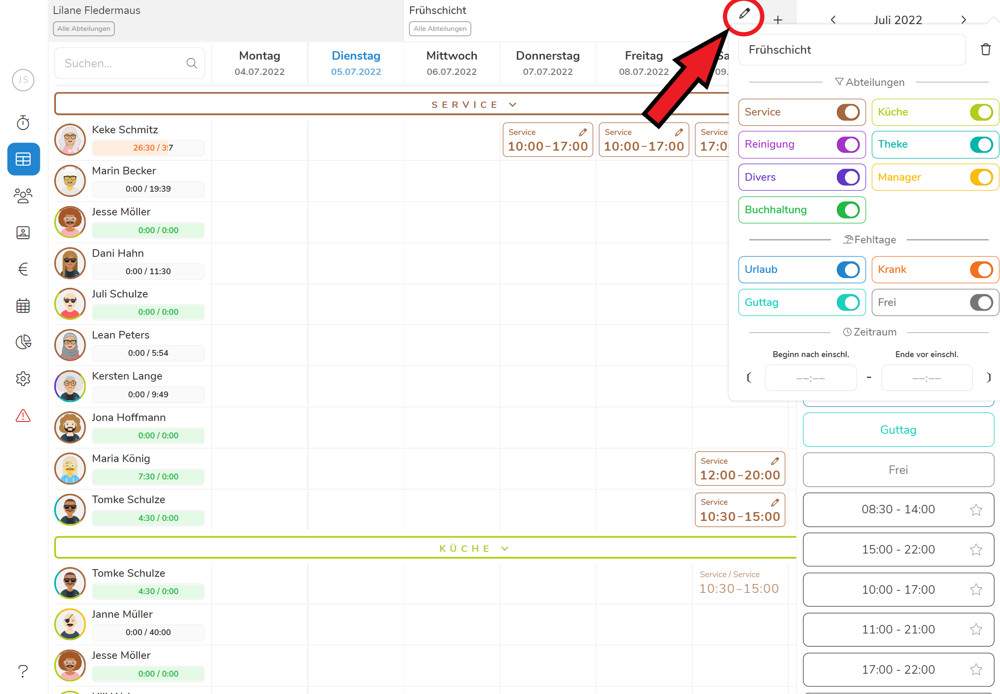


### Mitarbeiter Suchen

Wollen Sie schnell einen bestimmten Mitarbeiter finden? Dann geben Sie einfach
den Namen oder die Personalnummer in das Suchfeld in der linken oberen Ecke des
Dienstplans ein!

## Tagesansicht

Der Klick auf einen vorhanden Dienstplaneintrag oder ein leeres Feld öffnet die
**Tagesansicht** für den entsprechenden Mitarbeiter und Tag. Hier finden Sie
Mitarbeiter-spezifische Informationen sowie verschiedene Optionen zur
Erstellung, Bearbeitung und Löschung von Dienstplaneinträgen (mehr dazu in den
folgenden Kapiteln).

Um zu einem anderen Mitarbeiter oder Tag zu wechseln, klicken Sie einfach in das
entsprechende Feld oder wählen Sie einen Wochentag in der rechten oberen Ecke
der Tagesansicht.

Der  **Zurück** Button am oberen Rand schließt das
Tagesmenü.

> **Tipp**: Mit den Tasten  **(auf)**,  > **(ab)**,  **(links)** und  > **(rechts)** wechseln Sie schnell zwischen Mitarbeitern, Einträgen und Tagen.
> Diese Tasten sind auf Ihrer Tastatur ähnlich angeordnet wie die Pfeiltasten.
> So können Sie einfach Ihre linke Hand auf den Tasten ruhen lassen und "blind"
> zwischen Einträgen, Mitarbeitern und Tagen springen. Über die  -**Taste** schließen sie die Tagesansicht. Probieren Sie es aus!



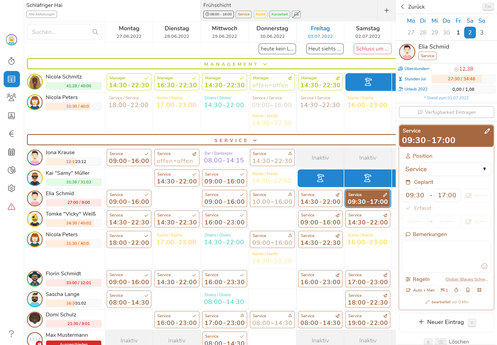



## Dienstzeiten Eintragen

Um manuell einen neue Dienstzeit zu planen, öffnen Sie zunächst das
[Tagesansicht](#tagesansicht) für den gewünschten Mitarbeiter und Tag und
Abteilung (z.B. durch Klicken in das entsprechende Feld). Sollte der
entsprechende Tag noch leer sein, öffnet sich automatisch das Menü zur
Erstellung eines neuen Eintrags. Andernfalls können Sie das Menü öffnen indem
Sie auf den Button **Neuer Eintrag** klicken oder die
-**Taste** auf Ihrer Tastatur drücken. Wählen Sie hier **Neue Schicht**
(Falls ein Mitarbeiter mehrere Positionen in dieser Abteilung einnehmen kann,
können Sie die gewünschte Position aus einer Liste wählen). Es öffnet sich ein
Formular in dem Sie nun die gewünschte Beginn- und Endzeit eintragen können.

## Schichtvorschläge

Die **Schichtvorschläge** in Pentacode sind ein mächtiges Hilfsmittel, das Ihnen
die Erstellung neuer Dienstpläne deutlich erleichtern kann. Das Programm
analysiert automatisch Ihre bereits geschriebenen Dienstpläne auf sich
wiederholende Planungsmuster und kann so häufig sehr genau vorhersagen, wann und
in welcher Position ein Mitarbeiter in einer bestimmten Abteilung und an einem
bestimmten Wochentag eingeteilt werden soll. Es gibt zwei Arten von
Schichtvorschlägen:

### Globale Schichtvorschläge

Auf der rechten Seite des Dienstplans finden Sie die **globalen
Schichtvorschläge**, eine einfache Liste von häufig verwendeten Planzeiten. Um
einen Eintrag aus einer globalen Schichtvorlage zu erstellen, ziehen Sie diese
einfach per **Drag & Drop** in das entsprechende Feld.





#### Schichtvorschläge favorisieren

**Klicken Sie auf den Stern** neben einem globalen Schichtvorschlag, wird dieser
favorisiert. Er wird künftig immer **ganz oben** in der Liste der
Schichtvorschläge angezeigt. So können Sie besonders häufig verwendete Schichten
ohne Scrollen mehrfach in den Dienstplan einfügen. Ein erneutes Klicken auf den
Stern wird diesen ausgrauen und der Schichtvorschlag ist **entfavorisiert**.

### Tages- und MA-spezifische Vorschläge

Die intelligentere Variante von Schichtvorschlägen finden Sie in der
[Tagesansicht](#tagesansicht) im Menü  **Neuer Eintrag**.
Hier werden bis zu 5 Vorschläge angezeigt, basierend auf dem Wochentag, die für
den Mitarbeiter verfügbaren Positionen und den zuvor in dieser Abteilungen
geplanten Dienstzeiten. Klicken Sie auf einen gewünschten Vorschlag um eine neue
Schicht mit den vorgeschlagenen Daten zu erstellen. Anschließend haben Sie
selbstverständlich noch die Möglichkeit, Änderungen vorzunehmen.

> **Tipp:** Am rechten Rand jedes Schichtvorschlags sehen Sie eine Ziffer (z.B.:
> ). Diese deutet an, dass Sie den Vorschlag über die
> entsprechende Ziffer auf Ihrer Tastatur wählen können. In Kombination mit den
> Tasten Mit den Tasten     (siehe [Tagesansicht](#tagesansicht)) können Sie
> nun rasend schnell Arbeiten, ohne die Hände von der Tastatur zu nehmen!

## Nicht zugewiesene Schichten

Wenn Sie Schichten besetzen müssen, diese aber keinen konkreten Mitarbeiter
zuordnen wollen, können Sie auch "nicht zugewiesene Schichten ausschreiben".
Diese werden allen Mitarbeitern als verfügbar angezeigt, die in der gleichen
Abteilung tätig sind. Die Mitarbeiter können sich anschließend **freiwillig für
die Schicht eintragen** und diese somit "vom Markt nehmen". Klicken Sie auf den
-**Button** unter der Kalenderansicht im oberen rechten
Eck, um sich die nicht zugewiesenen Schichten anzeigen zu lassen.

Um eine nicht zugewiesene Schicht auszuschreiben, aktivieren Sie erst die
Anzeige wie oben beschrieben und gehen anschließend wie bei normalen
[Dienstzeiten](#dienstzeiten-eintragen) vor. Sie müssen lediglich statt eines
Mitarbeiter die Zeile "**Nicht zugewiesen**" auswählen.



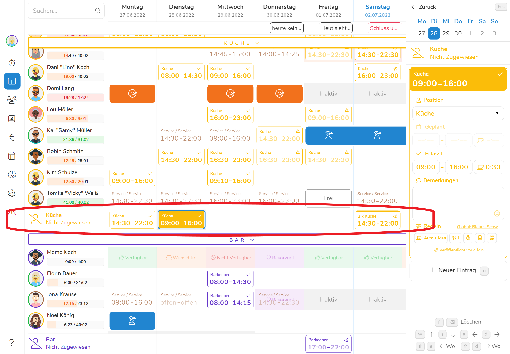



## Fehltage Eintragen

Fehltage wie **Urlaub** und **Krank** können auf zwei verschiedenen Wegen
eingetragen werden.

### Mit Drag & Drop

Im Menü auf der rechten Seite finden Sie eine Liste der im Dienstplan
verfügbaren Fehltage **Urlaub**, **Krank**, **Guttag** und **Frei**. Diese
können Sie einfach per **Drag & Drop** in die gewünschten Felder ziehen.

### Über die Tagesansicht

Fehltage können außerdem über das Tagesmenü eingetragen werden. Hierzu öffnen
Sie zunächst die [Tagesansicht](#tagesansicht) für den gewünschten Mitarbeiter
und Tag, und klicken die gewünschte Art von Fehltag.

> **Tipp:** Fehltage können auch über die Tastaturkürzel  **(Urlaub)**,  **(Krank)**,  **(Guttag)** und  **(Frei)** gewählt werden!

## Einträge Verschieben

Möchten Sie eine Schicht einem neuen Mitarbeiter zuweisen oder in einen anderen
Tag verschieben? Dies funktioniert ganz einfach über **Drag & Drop**. Packen Sie
einfach den gewünschten Eintrag mit der Maus (linke Maustaste gedrückt halten)
und ziehen sie ihn an den gewünschten Ort (linke Maustaste loslassen um den
Vorgang abzuschließen). Pentacode hebt automatisch nur die Mitarbeiter hervor,
denen die entsprechende Position zugewiesen ist.

## Einträge Duplizieren

Das Duplizieren von Einträgen funktioniert fast identisch wie das Verschieben.
Sie packen den gewünschten Eintrag mit der Maus (linke Maustaste gedrückt
halten) und ziehen sie ihn an den gewünschten Ort. Wenn Sie nun zusätzlich die
-**Taste** gedrückt halten wird der Eintrag nicht
verschoben sondern dupliziert, dies heißt, es wird an dem neuen Ort ein Eintrag
mit der gleichen Position und Anfangs- und Endzeit erstellt (oder im Fall von
Fehltagen mit der gleichen Fehltags-Art).

## Einträge Löschen

Um einen Eintrag zu löschen, klicken sie einfach auf das  in
der rechten oberen Ecke des Eintrags. Dies funktioniert sowohl in der
Tabellenansicht als auch in der [Tagesansicht](#tagesansicht).

> **Tip:** Selektierte Einträge können außerdem über das Tastenkürzel  +  gelöscht werden!

## Veröffentlichen & Teilen

Zwar werden alle Änderungen, die Sie im Dienstplan vornehmen, kontinuierlich und
automatisch gespeichert. Aber die Kontrolle, wann Sie diese Änderungen für Ihre
Mitarbeiter öffentlich machen, bleibt bei Ihnen.

> **Achtung:** Für das Veröffentlichen von Dienstplänen wird eine explizite
> [Berechtigung](/hilfe/handbuch/mitarbeiter-einzeln/berechtigungen/) benötigt.

### Änderungen Veröffentlichen

Im Dienstplan-Menü auf der rechten Seite zeigt Ihnen ein orangener Button an,
wie viele Änderungen seit der letzten Veröffentlichung gemacht wurden. Um diese
Änderungen zu veröffentlichen, klicken Sie einfach auf diesen Button. Es öffnet
sich ein Bestätigungs-Dialog, in dem Sie sehen, wie viele betroffene Mitarbeiter
von den Änderungen benachrichtigt werden. Klicken Sie hier auf
**Veröffentlichen** um den Vorgang abzuschließen. Die Änderungen sind nun in der
Mitarbeiter-App und auf der öffentlichen [Dienstplan-Seite](#dienstplan-teilen)
einsehbar. **Von Änderungen betroffene Mitarbeiter werden automatisch per Email
benachrichtigt** und erhalten einen Link zu ihrem persönlichen Dienstplan.

> **Tipp:** Um Mitarbeiter von Änderungen an ihrem persönlichen Dienstplan
> benachrichtigen zu können, wird eine Emailadresse benötigt. Diese können Sie
> in den [Stammdaten](/hilfe/handbuch/mitarbeiter-einzeln/stammdaten/) der
> einzelnen Mitarbeiter hinterlegen.



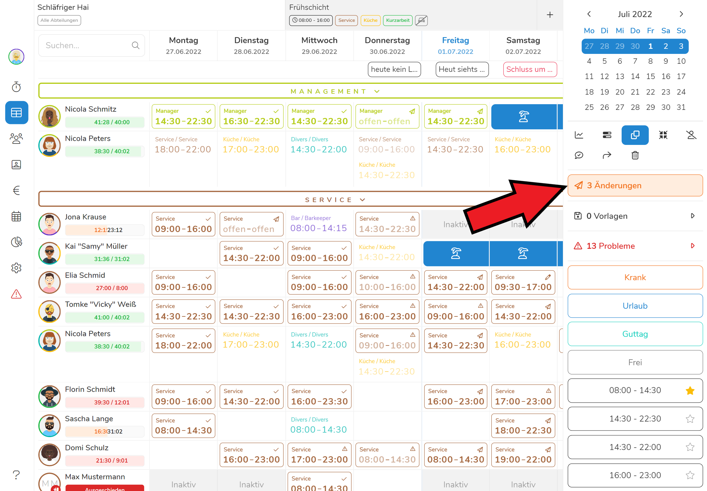 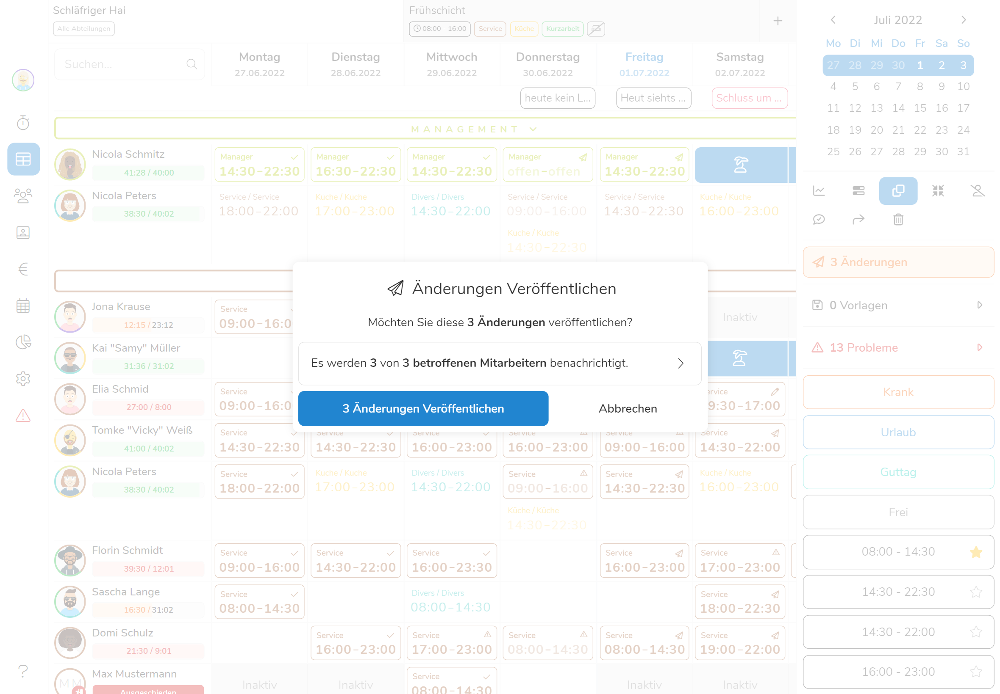



## Dienstplan Teilen

Sie können ihren Dienstplan auch mit Personen teilen, die keinen Zugang zur
Mitarbeiterapp haben. Klicken Sie dazu auf den -**Button**
unter dem Kalenderfenster im rechten oberen Eck. Nun zeigt Ihnen Pentacode einen
**Link** an, über den Externe den Dienstplan einsehen aber **nicht verändern**
können.

- Klicken Sie auf  um den Link an
  anderer Stelle mit  **+**  einzusetzen.
- Klicken Sie auf  um ihrer
  Belegschaft eine Email mit dem Link zum Dienstplan zu schicken.

**Wichtig!** Sie teilen immer nur den Teil des Dienstplans, der Ihnen im Filter
des aktuellen Tabs angezeigt wird und bereits
[veröffentlicht](#änderungen-veröffentlichen) ist (mehr info siehe
[Teil-Dienstpläne](#teil-dienstpläne-veröffentlichen)).

> **Beispiel:** In unserem Tab "Frühschicht" werden Spät- und
> Managementschichten nicht angezeigt, deshalb sind diese auch nicht Teil des
> geteilten Dienstplans. Zusätzlich haben wir einige Änderungen geplant, welche
> wir noch nicht veröffentlicht haben - auch diese werden im geteilten Diensplan
> nicht angezeigt.



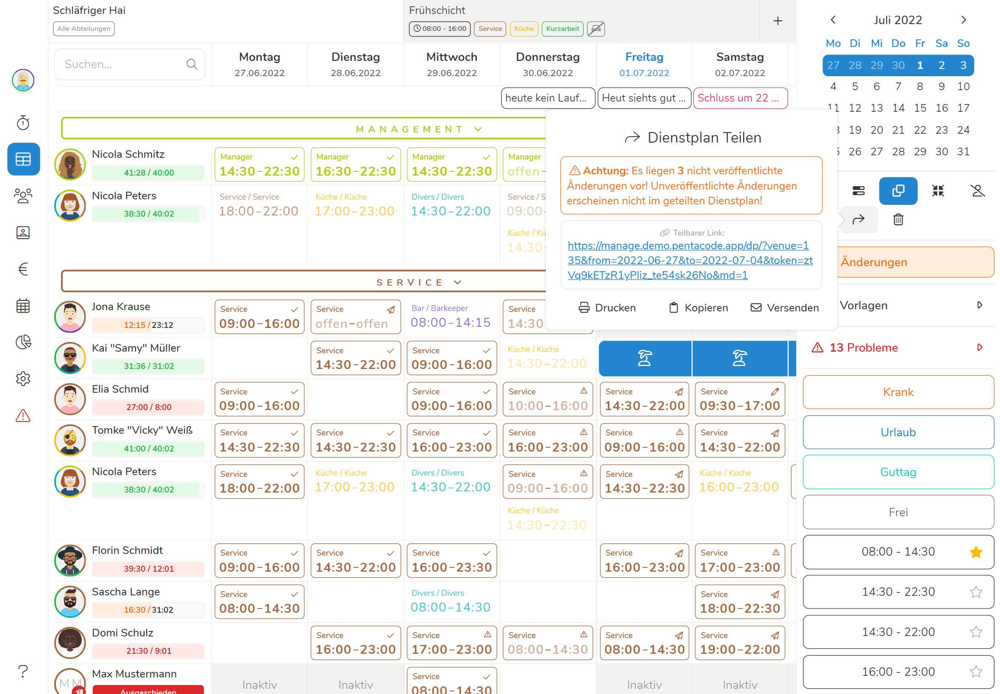 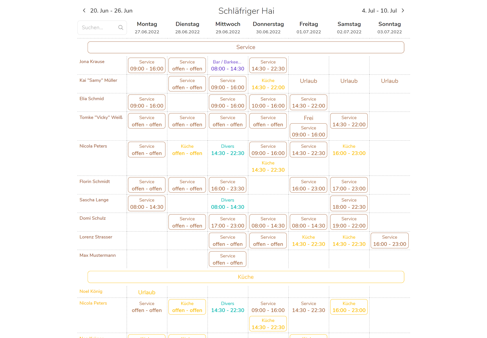



## Dienstplan Drucken

Für die Papiermenschen unter Ihnen gibt es selbstverständlich auch eine
Druckfunktion. Es wird hier zwischen zwei Varianten unterschieden.

### Aktueller Bearbeitungsstatus

Den aktuellen Bearbeitungstatus **inklusive nicht veröffentlicher Änderungen**
können Sie über das Tastenkürzel  
(bzw.   auf MacOS) oder über das
Browser-Menü Drucken.

### Veröffentlichter Dienstplan

Die Druckoption für den "fertigen" bzw. veröffentlichten Dienstplan finden Sie
im gleichen Menü wie [Dienstplan teilen](#dienstplan-teilen). Klicken Sie dazu
erst auf den -**Button** und anschließend auf .

> **Beachten Sie:** Sie drucken stets nur den veröffentlichten Dienstplan.



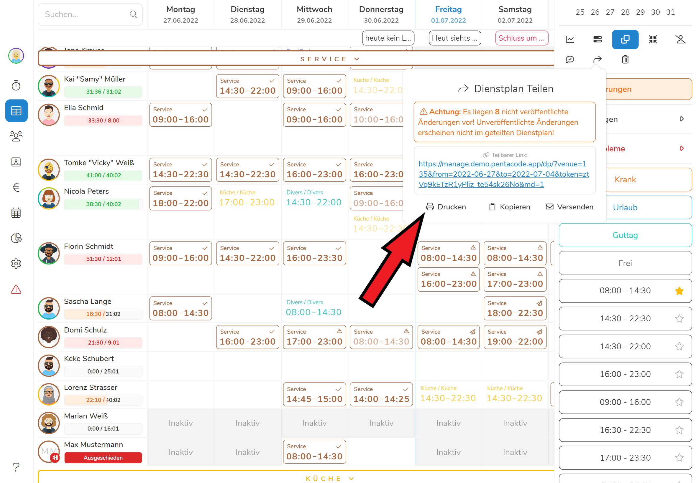



### Teil-Dienstpläne Veröffentlichen

Aktive [Dienstplan-Filter](#filtern--suchen) werden beim
Veröffentlichungsvorgang automatisch berücksichtigt, dies heißt, es werden nur
Einträge veröffentlicht, die den Filterkriterien im aktiven Tab entsprechen.
Wenn Sie nur den Dienstplan für eine bestimmte Abteilung oder einen bestimmten
Zeitraum veröffentlichen wollen, müssen Sie also nur die entsprechenden Filter
setzen, bevor Sie auf **Veröffentlichen** klicken.

## Dienstplan-Vorlagen

Viele Betriebe haben Arbeitsbereiche, in denen sich Arbeitszeiten von Woche zu
Woche kaum oder gar nicht ändern. In diesen Fällen können Dienstplan-Vorlagen
Ihnen eine Menge Arbeit sparen! Das Prinzip ist einfach: Sie schreiben den
Dienstplan für eine Woche und speichern diesen als Vorlage ab, die Sie dann mit
wenigen Klicks in anderen Wochen anwenden können.

### Vorlage Erstellen

Um eine Vorlage zu erstellen, navigieren Sie zunächst in eine "leere" Woche und
tragen die gewünschten Dienstzeiten ein. Falls Sie nur eine bestimmte Abteilung
oder einen bestimmten Zeitraum in Ihrer Vorlage speichern möchten, können Sie
die zu speichernden Schichten einschränken, indem sie die
[Filterkriterien](#filtern--suchen) des aktiven Tabs bearbeiten. Öffnen Sie nun
die Vorlagen-Liste (mit einem Klick auf den Button 
**Vorlagen** und klicken auf den Button  **Neue Vorlage**. In
dem darauffolgenden Dialog müssen Sie der Vorlage nur noch einen Namen geben.
Klicken Sie **Speichern** um den Vorgang abzuschließen. Die Vorlage erscheint
nun in der Liste Ihrer Vorlagen!

> **Achtung:** Wählen Sie für die Erstellung einer Dienstplanvorlage immer eine
> **zukünftige Woche**! Es werden nur Einträge mit vorhandenen **Planzeiten**
> gespeichert. Abgeschlossene Arbeitstage werden bei der Erstellung der Vorlage
> ignoriert.


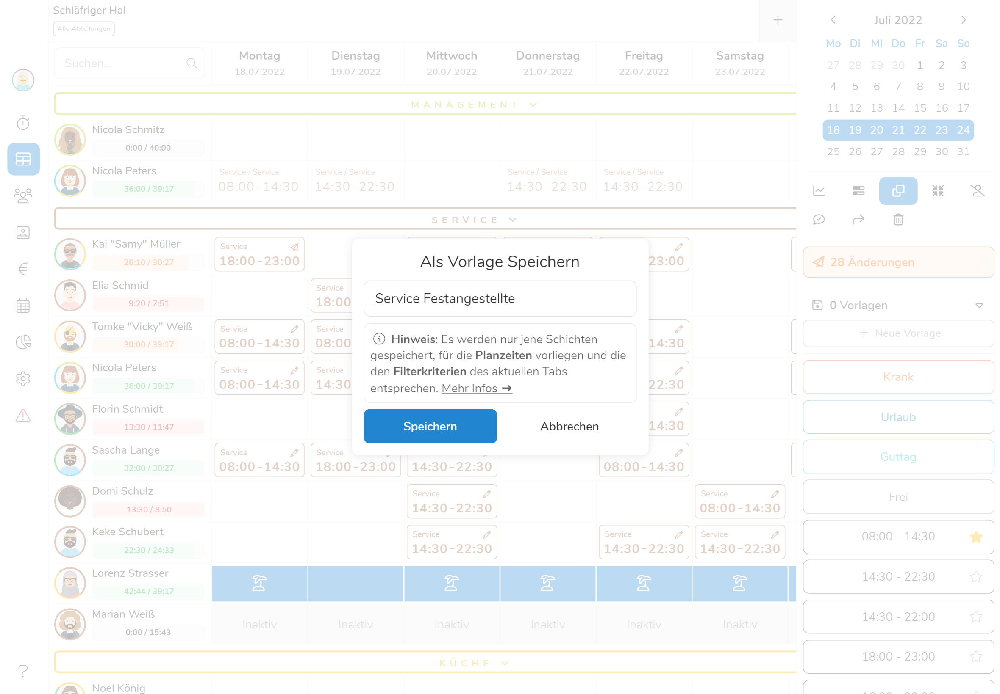


### Vorlage Anwenden

Um eine Vorlage in der aktuellen Woche anzuwenden, ziehen Sie diese einfach aus
Ihrer Vorlagen-Liste per **Drag & Drop** an einen beliebigen Ort im Dienstplan.
Falls die Vorlage mehrere Abteilungen umfasst, können Sie nun wählen, ob Sie die
Einträge von allen Abteilungen einfügen möchten oder nur von bestimmten. Klicken
Sie auf **Vorlage Einfügen** um den Vorgang abzuschließen.

### Vorlage Löschen

Um eine Vorlage zu löschen, öffnen Sie zunächst die Vorlagen-Liste. Fahren Sie
dann mit der Maus über die gewünschte Vorlage und klicken Sie den -**Icon**. Klicken Sie **Entfernen** im darauffolgenden
Bestätigungsdialog um den Vorgang abzuschließen.

## Dienstplan Leeren

Um den gesamten Dienstplan zu leeren, klicken Sie den
-**Icon** im Dienstplanmenü. Es öffnet sich ein
Dialogfenster, in dem Sie die Arten der zu löschenden Einträgen einschränken
können. Klicken Sie auf
**Dienstplan Leeren** um den Vorgang abzuschließen.

> **Beachten Sie:** Es werden nur Schichten gelöscht, die den
> [Filterkriterien](#filtern--suchen) des aktuellen Tabs entsprechen.

## Planungshilfen

Das Schreiben eines "fehlerfreien" Dienstplans ist keine einfache Angelegenheit.
Nicht nur müssen Sie die Verfügbarkeit, Sollstunden und Urlaubstage Ihrer
Mitarbeiter im Auge behalten, auch die gesetzlichen Vorlagen in Ihrer
fürchterlichen Vielfalt dürfen nicht verletzt werden. Pentacode steht Ihnen
deshalb mit einer Vielzahl von intelligenten Planungshilfen zur Seite!

### Problemberichte

Pentacode prüft jede Ihrer Eingaben automatisch auf Fristverletzungen,
Schichtüberlappungen oder andere Probleme. Diese werden Ihnen unmittelbar im
Dienstplan-Menü unter dem Bereich 
**Probleme** dargestellt. Ein Klick auf einen Eintrag in dieser Liste bringt Sie
direkt zum betroffenen Eintrag, wo Sie eventuelle Fehler korrigieren können.



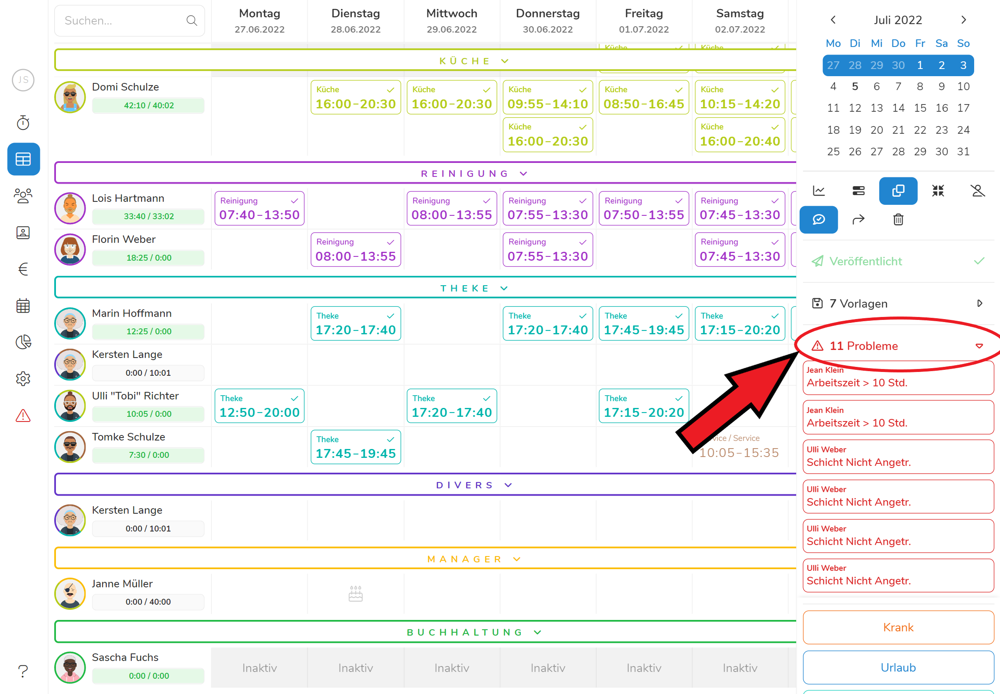



### Schichten Spiegeln

Bei Mitarbeitern, die in mehreren Abteilungen eingesetzt werden, kann es
hilfreich sein, in einer Abteilungen Einträge von anderen Abteilungen zu
"spiegeln". So sehen Sie immer, wenn ein Mitarbeiter bereits in einer anderen
Abteilung eingeteilt ist und können dies in Ihrer Planung berücksichtigen. Die
"Dienstplan Spiegeln"-Funktion kann über den -**Button** im
Dienstplanmenü aktiviert und deaktiviert werden.

### Verfügbarkeiten anzeigen

Um die Wüsche ihrer Mitarbeiter bei der Erarbeitung eines Diensplans zu
berücksichtigen, können Sie sich die Verfügbarkeitsangaben einblenden lassen.
Klicken Sie dazu auf den -**Button** unter der
Kalenderansicht im oberen rechten Eck. Nun werden Ihnen die verschiedenen
Verfügbarkeiten ihrer Mitarbeiter farblich hinterlegt. Die Verfügbarkeiten sind
dabei lediglich zur Orientierung gedacht, **sie beeinflussen ihre Schichtplanung
nicht**.



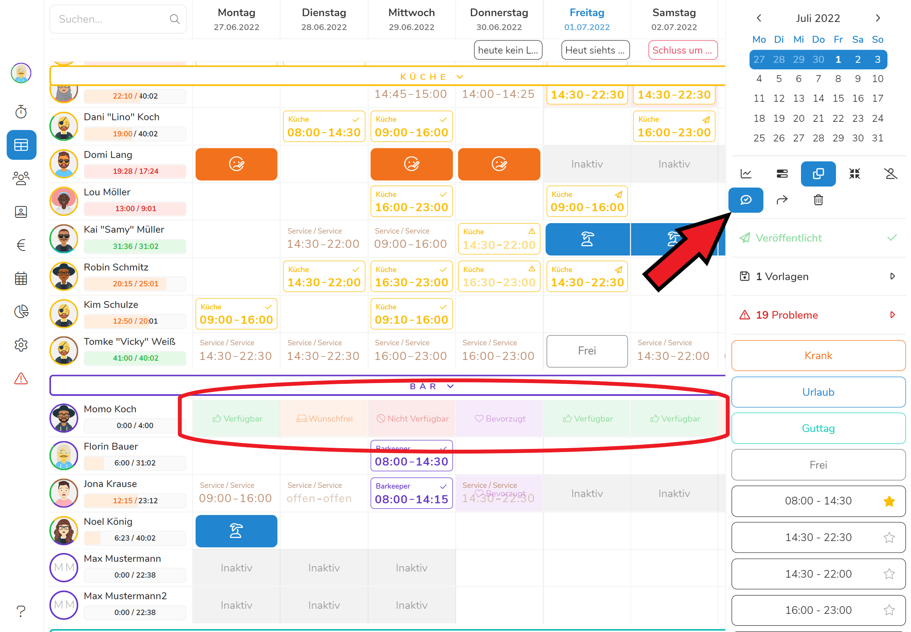



### Wochenstunden

Über die "Fortschrittsanzeige" auf der Linken des Dienstplans sehen Sie auf
einen Blick, wie viele Stunden einem Mitarbeiter noch fehlen, um auf die
Sollstunden für diese Woche zu kommen. Diese Anzeige ist jeweils unter dem Namen
des Mitarbeiters zu finden und aktualisiert sich automatisch, wenn Sie
Änderungen an den Dienstplanzeiten des Mitarbeiters vornehmen.

### Monatsstunden

Analog zu der [Wochenstunden-Anzeige](#wochenstunden) gibt es außerdem eine
"Fortschrittsanzeige" für die Ist- und Sollstunden eines Mitarbeiters im
aktuellen Monat. Diese finden Sie in der [Tagesansicht](#tagesansicht) für den
aktuell selektierten Mitarbeiter.

### Stundenvorgaben

Sie möchten mehr Kontrolle darüber, wie viele Stunden von jeder Abteilung
täglich aufgewendet werden? Über das Pentacode Planungsmodul können Sie genau
definieren, wie viele Stunden von jeder Abteilung an einem bestimmten Tag
insgesamt in Anspruch genommen werden sollen. Diese
[Stundenvorgaben](/hilfe/handbuch/planung/stundenvorgaben/) werden Ihnen dann
direkt im Dienstplan in Form von "Fortschrittsbalken" angezeigt. Diese
Stundenvorgaben-Leisten können Sie über den -**Button**
ein- und ausblenden.

Mehr Informationen über das Planen nach Stundenvorgaben erfahren Sie
[hier](/hilfe/handbuch/planung/stundenvorgaben/).

### Kompakte Darstellung

Über den -**Button** können Sie den Dienstplan
von der regulären in eine kompaktere Darstellungsform bringen. Die kompakte Form
erlaubt es Ihnen auf einen Blick noch mehr Schichten einzusehen, indem einige
Informationen, wie die Wochenstunden, ausgeblendet werden. Besonders für
routinierte Anwender und die **erste Grobarbeit an neuen Plänen** eignet sich
die kompakte Darstellung.



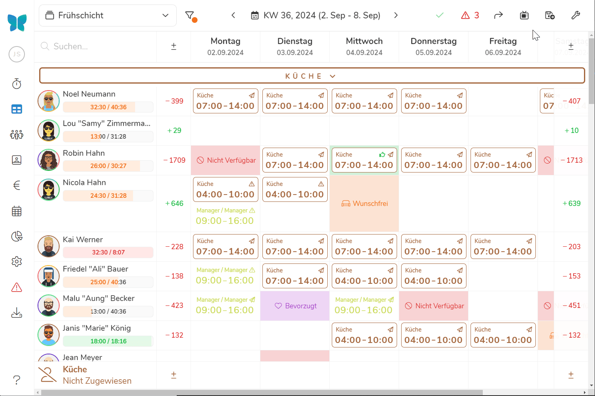



### Personalkostenanalyse

Für eine effiziente Personalplanung ist es essentiell, immer einen Überblick
über die entstehenden Personalkosten zu haben. Über den -**Button** im Dienstplanmenü erhalten Sie nicht nur eine direkte
Auskunft darüber, wie hoch der Kostenaufwand für eine bestimmten Tag ist, Sie
können bei vergangenen Tagen sogar die geplanten Kosten mit den tatsächlich
entstandenen vergleichen!

## Plan-Ist-Vergleich

Oft verliert eine Planung ihre Bedeutung, sobald sie beendet ist. Dabei macht
ein Plan erst dann seinen wahren Wert erkennbar, wenn er an der Wirklichkeit
überprüft wird. Im Falle der Dienstplanung lässt sich dies durch eine einfache
Frage beantworten: Haben die Mitarbeiter die durch den Plan gesetzten Vorgaben
eingehalten?

Durch das Anklicken des -**Symbols** erscheinen am Fuß
des Dienstplans **zwei Linien** über welche die **Personalkosten** aus der
**Planung** den Kosten durch die tatsächlich aufgewendeten **Arbeitszeiten**
gegenübergestellt sind. Die Kosten beinhalten die **Arbeitgeberanteile** zur
Sozialversicherung.



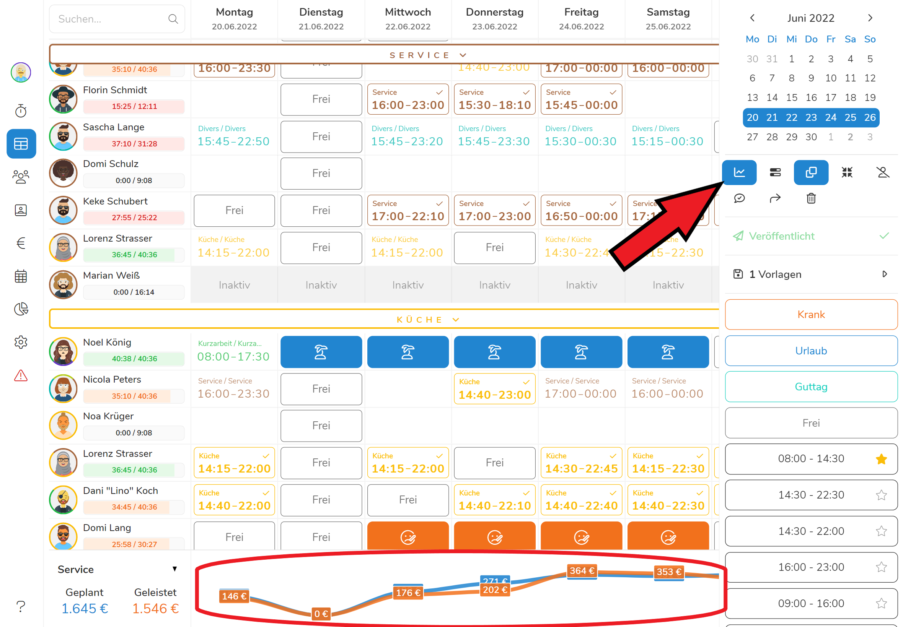



Sollten sich die **Felder** mit Angabe der €-Beträge **überlappen**, werden die
jeweiligen Beträge durch "**Mouse-over**" sichtbar.



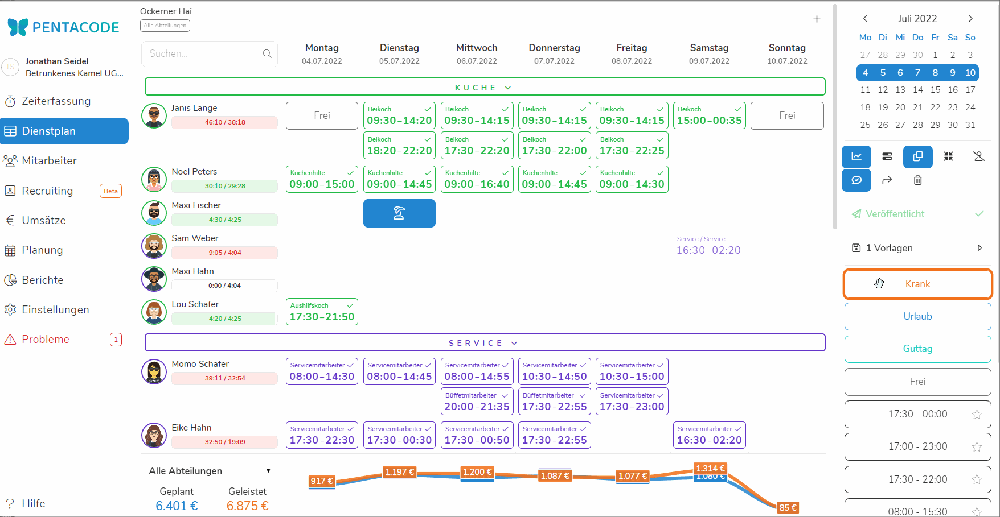



In der Standard-Einstellung werden die Gesamtkosten in "**Alle Abteilungen**"
gezeigt. Über das **Dropdown-Menü** können Sie **einzelne Abteilungen**
auswählen.



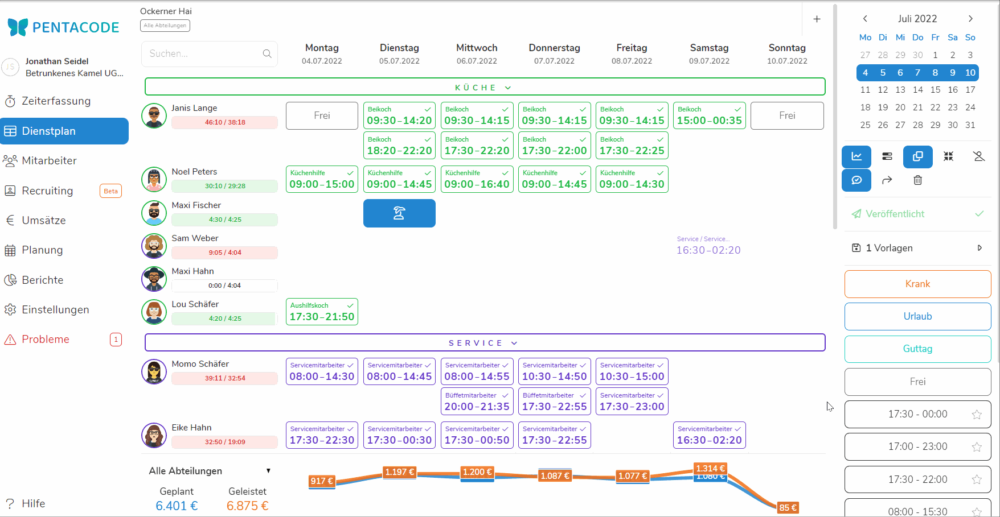



Durch **erneutes Anklicken** des -**Symbols** wird die
Plan-Ist-Anzeige wieder **ausgeblendet**.

Die Unterscheidung zwischen geplanten und tatsächlich entstandenen Kosten setzt
die Arbeitszeiterfassung durch die Stempeluhr voraus.

**Hinweis**: Wenn an einem Tag Arbeiten zu leisten sind, die nicht mit dem
aktuellen Tagesgeschäft in Zusammenhang stehen (z.B. vorbereitende Arbeiten in
der Küche für eine Veranstaltung, die erst in zwei Tagen stattfindet, setzen Sie
in [**Planung nach Stundenvorgaben**](/hilfe/handbuch/planung/stundenvorgaben/)
idealerweise das Stundenkontingent für diesen Tag entsprechend nach oben.

Im Menüpunkt "[**Berichte**](/hilfe/handbuch/berichte/)" erhalten Sie u.a. auch
hierzu Informationen in Form einer monatlichen Zusammenfassung.
