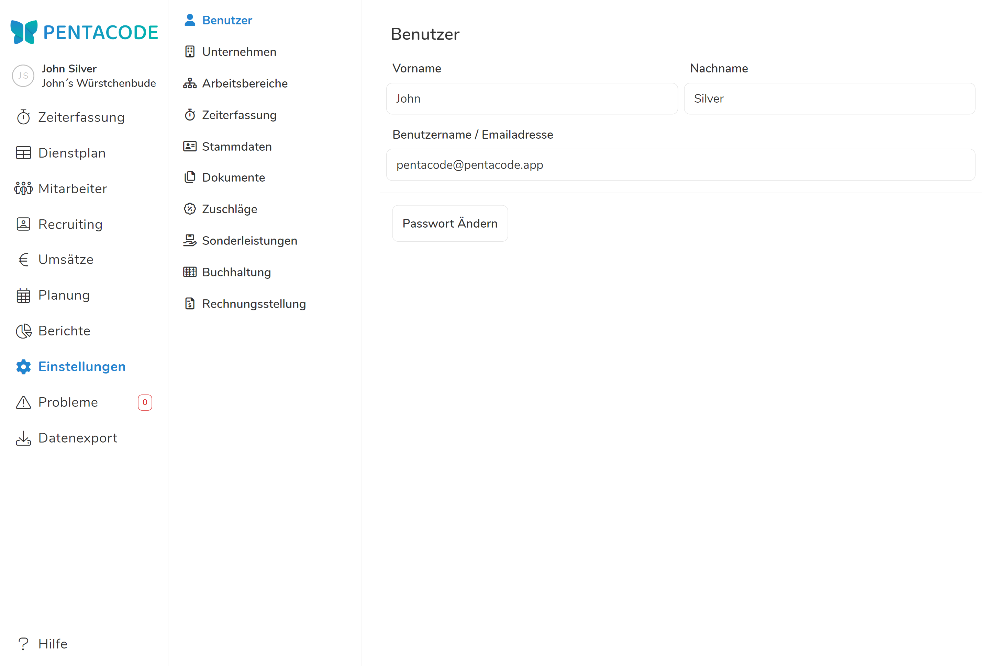

Im Benutzerkonto wird der Zugang zu Pentacode verwaltet. Sofern ein Administrator Zugang zum "Benutzerkonto" hat, kann er in diesem Menüpunkt seine Email-Adresse wie auch sein Passwort ändern.





Hat ein Administrator sein Passwort vergessen, kann er lediglich auf der Startseite von Pentacode über "**Passwort Vergessen**" ein neues Passwort anfordern.
