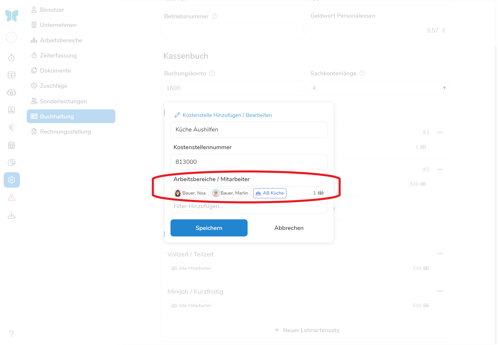
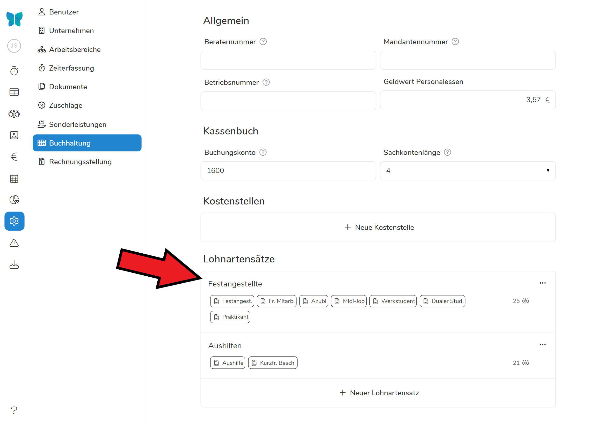
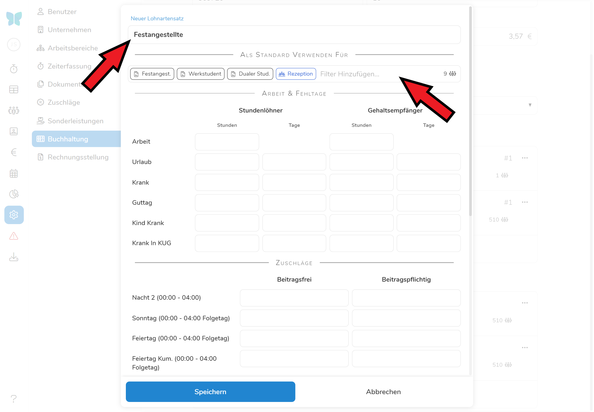

"_Wer den Kern essen will, muss die Nuss knacken_". Leider.

Pentacode ermöglicht Ihnen auf sehr einfache Weise den Export des Kassenbuchs, sowie der Arbeitszeiten, Zuschläge u.a.m. in das Buchhaltungssystem, mit dem Ihr Steuerbüro oder Ihre Buchhaltung arbeitet.

Um den Export durchführen zu können, ist es leider notwendig, diesen einmalig vorzubereiten. Um die Richtigkeit der Angaben zu gewährleisten, lassen Sie bei der Eingabe am besten Ihre Buchhaltung mitwirken. Haben Sie die Einrichtung vorgenommen, führen Sie zur Überprüfung idealerweise einen Probe-Export durch.

Die Vorbereitungsarbeiten für den Export gehören sicher nicht zum Spannendsten, was der Arbeitsalltag zu bieten hat. Der einmalige Aufwand wird sich durch die Zeitersparnis in Zukunft jedoch in jedem einzelnen Monat zig-fach ausbezahlen.

## Allgemein

### Berater-, Betriebs- und Mandantennummer

Die Berater-, Betriebs- und Mandantennummer sind Angaben, die für den Datentransfer in verschiedene Lohnbuchhaltungsprogramme
benötigt werden. Diese Informationen erhalten sie von Ihrem Steuerberater oder Buchhaltungsverantwortlichen.

### Geldwert Personalessen

Mit dieser Angabe können Sie bestimmen in welcher Höhe Mitarbeiteressen bezuschusst werden sollen. Der angegebene Eurobetrag wird in der Lohnabrechnung mit der Anzahl der im Dienstplan vermerkten Mitarbeiteressen multipliziert.

## Kassenbuch

### Buchungskonto

Geben Sie hier die Kontennummer ein, unter der in Ihrer Buchhaltung das Kassenbuch geführt wird. Diese Information erhalten Sie von Ihrem Steuerberater oder Buchhaltungsverantwortlichen. Die Standardeinstellung ist "1600".

### Sachkontenlänge

Geben Sie hier die in Ihrer Buchhaltung verwendete Sachkontenlänge ein. Diese Information erhalten Sie von Ihrem Steuerberater oder Buchhaltungsverantwortlichen. Die Standarteinstellung ist "4".

## Kostenstellen 

Um ihre Ausgaben besser im Blick zu haben können Sie Kostenstellen erstellen, denen Sie einzelne Mitarbeiter oder ganze Abteilungen zuordnen können. Sie helfen Ihnen ihre Kassenbuchführung strukturierter anzugehen und die Buchhaltung automatisierter zu gestalten.

### Kostenstellen erstellen

Mit einem Klick auf  öffnet sich ein Bearbeitungsdialog, mit dem Sie eine neue Kostenstelle individualisieren können. Füllen Sie dabei folgende Felder aus:

- *Name der Kostenstelle*
- *Kostenstellennummer -* Unter dieser Nummer wird die Kostenstelle beim Export in ein Buchhaltungsprogramm übertragen.
- *Arbeitsbereiche / Mitarbeiter -* Wählen Sie hier aus, welche Mitarbeiter unter der Kostenstelle berechnet werden sollen. Wählen Sie eine **Abteilung in Kombination mit einzelnen Mitarbeitern** aus, werden **nur die Schichten des Mitarbeiters in der ausgewählten Abteilung** dieser Kostenstelle angerechnet.





## Lohnarten

"Bewegungsdaten" ist das Amtsdeutsch für Arbeits- Fehl-, Zuschlagszeiten u.a.m., was Ihre Lohnbuchhaltung für die Abrechnung der Löhne benötigt. Wenn Sie diese Bewegungsdaten an die Buchhaltung exportieren wollen, müssen Sie die "Lohnarten" festlegen. Als Lohnarten werden jene Konten genannt, in denen die verschiedenen Datensätze gebucht werden.

Wenn Sie es sich so einfach wie möglich machen wollen, empfehlen wir Ihnen im ersten Schritt folgendes Vorgehen:

Klicken Sie auf "**+ Neuer Lohnartensatz**". Es öffnet ein leeres Eingabeformular, von dem Sie am besten einen Screenshot machen und Ihrer Buchhaltung zusenden.





> Schicken Sie den **Screenshot an die Buchhaltung** mit der Aufforderung, die für Sie benutzten Nummern in die entsprechenden Eingabefelder einzugeben und Ihnen das ausgefüllte Formular wieder zurückzusenden.

**Übertragen** Sie im zweiten Schritt die Nummern eins zu eins **in Pentacode** und speichern Sie. Geben Sie dem Lohnartensatz einen eindeutigen Namen, z.B. "Festangestellte" und wählen Sie die Mitarbeiter und Abteilungen / Vertragsarten aus, für die diese Lohnart zutreffend sein soll. Lassen Sie sich auch hierbei von Ihrer Lohnbuchhaltung anleiten.





Das war's! Ab jetzt können Sie exportieren.

**Hinweis**: Im Regelfall haben fast alle Mitarbeiter (unabhängig davon, ob Sie einen Stunden- oder einen Monatslohn erhalten oder Azubis sind) die gleichen Lohnarten. Sie benötigen für diese deshalb nur einen Lohnartensatz.

Bei Aushilfen weichen die Lohnarten häufig ab. Sollte dies bei Ihnen der Fall sein, legen Sie einen weiteren Lohnartensatz an, indem Sie wieder auf "+ Neuer Lohnartensatz" klicken und die Felder entsprechend befüllen.

Wie viele Lohnartensätze Sie benötigen und für welche Mitarbeiter diese gelten, kann Ihnen Ihre Buchhaltung sagen.

Nach getaner Arbeit und "Speichern" klappt das Eingabefeld wieder zu. Sie sehen in der Unterzeile die Vertragsarten und Abteilungen, welche durch den Lohnartensatz erfasst werden. Das **-Symbol** daneben zeigt Ihnen, wie viele Mitarbeiter ingesamt von der Lohnart erfasst werden. 





Die Zuordnung der Mitarbeiter findet beim Export **automatisch** durch Pentacode statt. Sie müssen hierfür nichts tun. Und Sie werden sehen: Diese Arbeit hat sich gelohnt.
