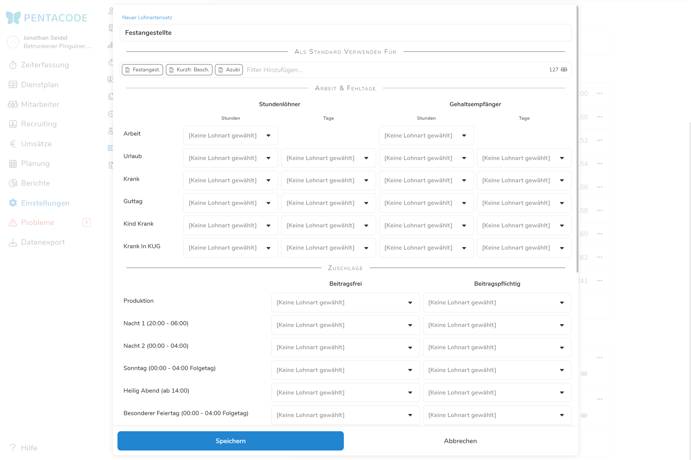
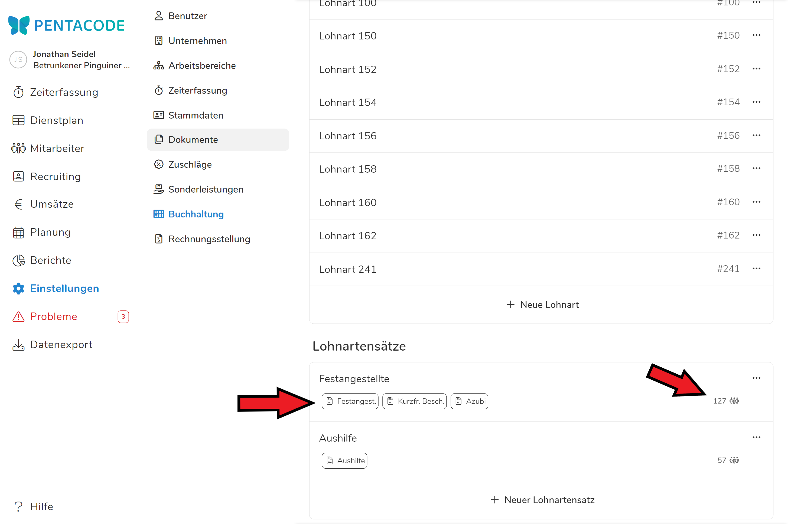

Pentacode ermöglicht Ihnen auf sehr einfache Weise den Export des Kassenbuchs, sowie der Arbeitszeiten, Zuschläge u.a.m. in das Buchhaltungssystem, mit dem Ihr Steuerbüro oder Ihre Buchhaltung arbeitet.

Um den Export durchführen zu können, ist es leider notwendig, diesen einmalig vorzubereiten. Um die Richtigkeit der Angaben zu gewährleisten, **lassen Sie bei der Eingabe am besten Ihre Buchhaltung mitwirken**. Haben Sie die Einrichtung vorgenommen, führen Sie zur Überprüfung idealerweise einen Probe-Export durch.

Die Vorbereitungsarbeiten für den Export gehören sicher nicht zum Spannendsten, was der Arbeitsalltag zu bieten hat. Der einmalige Aufwand wird sich durch die Zeitersparnis in Zukunft jedoch in jedem einzelnen Monat zig-fach ausbezahlen.

## Allgemein

### Berater-, Betriebs- und Mandantennummer

Die Berater-, Betriebs- und Mandantennummer sind Angaben, die für den Datentransfer in verschiedene Lohnbuchhaltungsprogramme
benötigt werden. Diese Informationen erhalten sie von Ihrem Steuerberater oder Buchhaltungsverantwortlichen.

## Kassenbuch

### Buchungskonto

Geben Sie hier die Kontennummer ein, unter der in Ihrer Buchhaltung das Kassenbuch geführt wird. Diese Information erhalten Sie von Ihrem Steuerberater oder Buchhaltungsverantwortlichen. Die Standardeinstellung ist "1600".

### Sachkontenlänge

Geben Sie hier die in Ihrer Buchhaltung verwendete Sachkontenlänge ein. Diese Information erhalten Sie von Ihrem Steuerberater oder Buchhaltungsverantwortlichen. Die Standarteinstellung ist "4".

## Kostenstellen 

Um ihre Ausgaben besser im Blick zu haben können Sie Kostenstellen erstellen, denen Sie einzelne Mitarbeiter oder ganze Abteilungen zuordnen können. Sie helfen Ihnen ihre Kassenbuchführung strukturierter anzugehen und die Buchhaltung automatisierter zu gestalten.

### Kostenstellen erstellen

Mit einem Klick auf  öffnet sich ein Bearbeitungsdialog, mit dem Sie eine neue Kostenstelle individualisieren können. Füllen Sie dabei folgende Felder aus:

- **Name der Kostenstelle**
- **Kostenstellennummer:** Unter dieser Nummer wird die Kostenstelle beim Export in ein Buchhaltungsprogramm übertragen.
- **Arbeitsbereiche / Mitarbeiter:** Wählen Sie hier aus, welche Mitarbeiter unter der Kostenstelle berechnet werden sollen. Wählen Sie eine **Abteilung in Kombination mit einzelnen Mitarbeitern** aus, werden **nur die Schichten des Mitarbeiters in der ausgewählten Abteilung** dieser Kostenstelle angerechnet.





## Lohnarten

"Bewegungsdaten" ist das Amtsdeutsch für Arbeits- Fehl-, Zuschlagszeiten u.a.m., was Ihre Lohnbuchhaltung für die Abrechnung der Löhne benötigt. Wenn Sie diese Bewegungsdaten an die Buchhaltung exportieren wollen, müssen Sie die "Lohnarten" festlegen. Als Lohnarten werden jene Konten bezeichnet, in denen die verschiedenen Datensätze gesammelt werden.

Wenn Sie es sich so einfach wie möglich machen wollen, empfehlen wir Ihnen im ersten Schritt in **Absprache mit ihrer Buchhaltung** alle von Ihnen verwendeten Lohnarten in Pentacode anzulegen.

Klicken Sie hierzu auf "**+ Neue Lohnart**" und füllen folgende Felder aus:

- *Name der Lohnart:* Dieses Feld dient einzig der Darstellung in Pentacode, falls unsicher verwenden Sie als Namen am besten die **Lohnartnummer**.
- *Lohnartnummer:* Dieses Feld dient später ihrer Buchhaltung aus Pentacode exportierte Lohndaten richtig zuzuordnen - **füllen Sie dieses Feld mit den Informationen ihrer Buchhaltung aus!**
- *Einheit:* Nicht jede Lohnart wird in Euro abgerechnet - Kilometergeld etwa. Hier können Sie auswählen in welchem Format die Lohnart an ihre Buchhaltung übertragen wird.
- *Beschreibung:* Sollten Sie weitere Vermerke für die Lohnart haben, tragen Sie diese hier ein. 

## Lohnartensätze

Jeder Mitarbeiter wird seinen Lohn mit mehreren Lohnarten erhalten. Diese können unterschiedlich für Grundlohn, Zuschlagszahlungen und sonstige Leistungen sein. Lohnartsätze speichern ab **Was mit welcher Lohnart berechnet wird**.

Klicken Sie auf **+ Neuer Lohnartensatz** öffnet sich ein Formular, in dem Sie einen Lohnartensatz erstellen können. Die erste Zeile dient dabei dazu den **Lohnartensatz zu benennen**, darunter können Sie zuordnen für welche Abteilungen, Anstellungsverhältnisse oder Mitarbeiter dieser Lohnartensatz **standardmäßig verwendet** werden soll. 

>  Für den Rest des Formulars empfehlen wir Ihnen, Ihrer **Buchhaltung einen Screenshot des Formulars zuzusenden**. Diese sollte Ihnen erklären können, welche der im ersten Schritt erstellten Lohnarten wo einzutragen sind. **Normalerweise müssen auch nicht alle Felder ausgefüllt werden!**





Nach getaner Arbeit klicken Sie auf **Speichern** und das Eingabefeld klappt wieder zu. Sie sehen in der Unterzeile die Vertragsarten und Abteilungen, welche durch den Lohnartensatz erfasst werden. Das **-Symbol** daneben zeigt Ihnen, wie viele Mitarbeiter insgesamt von der Lohnart erfasst werden.

Das war's! Ab jetzt können Sie exportieren.





**Hinweis**: Im Regelfall haben fast alle Mitarbeiter (unabhängig davon, ob Sie einen Stunden- oder einen Monatslohn erhalten oder Azubis sind) die gleichen Lohnarten. Sie benötigen für diese deshalb nur einen Lohnartensatz.

Bei Aushilfen weichen die Lohnarten häufig ab. Sollte dies bei Ihnen der Fall sein, legen Sie einen weiteren Lohnartensatz an, indem Sie wieder auf "+ Neuer Lohnartensatz" klicken und die Felder entsprechend befüllen.

Wie viele Lohnartensätze Sie benötigen und für welche Mitarbeiter diese gelten, kann Ihnen Ihre Buchhaltung sagen.

Die Zuordnung der Mitarbeiter findet beim Export **automatisch** durch Pentacode statt. Sie müssen hierfür nichts tun. Und Sie werden sehen: Diese Arbeit hat sich gelohnt.
