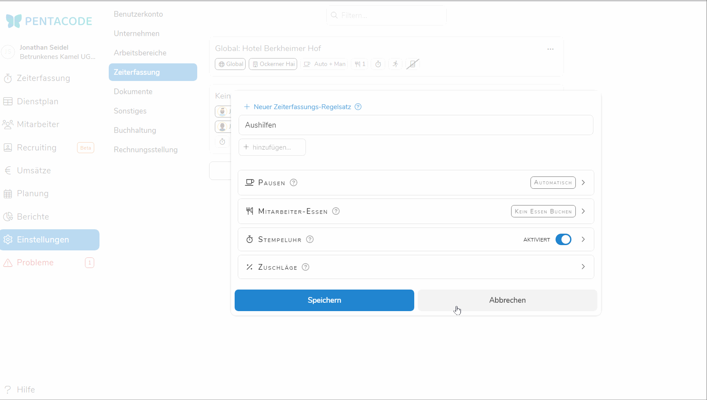

Egal wie Sie Arbeitszeiten in Pentacode verwalten - über die [Digitale Stempeluhr](/hilfe/handbuch/stempeluhr/), unsere
[Mitarbeiter-App](/hilfe/handbuch/mitarbeiter-app/) oder manuell - Pentacode bietet Ihnen eine Vielzahl von
Einstellungsmöglichkeiten mit denen Sie definieren können, wie und wann sich Mitarbeiter ein- und ausstempeln dürfen,
wie Pausen erfasst werden und vieles mehr.

> Die Zeiterfassungseinstellungen betreffen in Pentacode vor allem das Erfassen von Arbeitszeiten per Digitaler
> Stempeluhr oder Mitarbeiter-App. Aber auch wenn Sie Zeiten ausschließlich manuell erfassen finden Sie hier einige
> relevante Einstellungen, so wie die [automatische Pausenberechnung](#pausenberechnung) oder das
> automatische Buchen von [Mitarbeiteressen](#mitarbeiteressen).

## Über Zeiterfassungs-Regelsätze

Zeiterfassungs-Einstellungen werden in Pentacode über sogenannte **Regelsätze** verwaltet. Ein Regelsatz kann die
Zeiterfassung-Einstellungen für Ihren gesamten Betrieb, bestimmte Abteilungen oder sogar einzelne Mitarbeiter bestimmen.
So ist es zum Beispiel üblich, die Abteilungen "Schule" und "Kurzarbeit" (soweit Vorhanden) von der Zeiterfassung per
Stempeluhr auszuschließen, da Zeiten für diese Bereiche in der Regel manuell erfasst werden.

Den ersten Regelsatz erstellt Pentacode für Sie automatisch. Dieser enthält Ihre "globalen" Einstellungen welche für
alle Standorte, Abteilungen und Mitarbeiter Anwendung finden, denen kein anderer Regelsatz zugewiesen ist. Darüber
hinaus können Sie eine beliebige Anzahl an weiteren Regelsätzen definieren und beliebig zuweisen (mehr dazu weiter
unten).

## Regelsätze Verwalten

### Neuen Regelsatz Erstellen

Um einen neuen Regelsatz zu erstellen, klicken Sie einfach auf den Button .
Es öffnet sich ein Dialogfeld über welches Sie nun die Einstellungen für diesen Regelsatz bearbeiten können. Um den Regelsatz
hinzuzufügen, klicken Sie auf . Vergessen Sie nicht, dem Regelsatz einen Namen zu geben!

### Regelsatz Bearbeiten

Einen existierenden Regelsatz bearbeiten Sie, indem Sie einfach den gewünschten Eintrag mit einem Klick aus der Liste
wählen. Es öffnet sich ein Dialogfeld, in welchem Sie die gewünschten Änderungen vornehmen können. Klicken Sie auf  um die Änderungen zu übernehmen oder  um die Änderungen zu
verwerfen.

### Regelsatz Entfernen

Sie können einen Regelsatz entfernen, indem Sie auf den  icon in der rechten oberen Ecke des
Listeneintrags klicken und im angezeigten Menü die Option  **Löschen** wählen.

> **Hinweis:** Der "globale" Regelsatz kann nicht gelöscht werden.

### Regelsatz Duplizieren

Beim Erstellen eines neuen Regelsatzes kann es oft nützlich sein, die Einstellungen eines anderen Regelsatzes zu
kopieren und einzelne Einstellungen anzupassen. Dies können Sie bequem über die Option 
**Duplizieren** im -Menü des zu duplizierenden Eintrags wählen. Es öffnet sich dann ein
Bearbeitungsdialog, in dem Sie den duplizierten Eintrag noch bearbeiten können bevor Sie durch einen Klick auf den  button den Regelsatz hinzufügen.

## Zuordnung von Regelsätzen





Regelsätze können einer beliebigen Anzahl von Standorten, Abteilungen und Mitarbeitern zugeordnet werden. Dies
funktioniert wie folgt:

1. Erstellen Sie einen neuen Regelsatz oder wählen Sie einen existierenden Regelsatz.
2. Klicken Sie auf das  Feld direkt unter dem Namensfeld.
3. Es öffnet sich ein Dropdown mit einer Liste aller Standorte, Abteilungen und Mitarbeiter, denen der Regelsatz noch
   nicht zugeordnet wurde. Klicken Sie einfach auf einen der Einträge um den Regelsatz der/dem entsprechenden Standort,
   Abteilung oder Mitarbeiter zuzuordnen. **Tipp:** Sie können die Liste filtern, indem Sie einen Suchbegriff in das -Feld eingeben.
4. Die/der Standort, Abteilung oder Mitarbeiter erscheinen dann in der Liste unter dem Namensfeld. Um die Zuordnung
   aufzuheben, klicken Sie einfach auf den entsprechenden Eintrag in dieser Liste.
5. Klicken Sie auf  um den Vorgang abzuschließen oder 
   um die Änderungen zu verwerfen.

> **Hinweis:** Jeder/jedem Standort, Abteilung und Mitarbeiter kann jeweils höchstens ein Regelsatz zugeordnet werden.
> Sollten Sie bei der Zuordnung eine/n Standort, Abteilung oder Mitarbeiter wählen, der/dem bereits ein Regelsatz
> zugeordnet wurde, wird Pentacode Ihnen eine entsprechende Warnung anzeigen und Sie fragen, ob sie die Zuordnung
> überschreiben wollen.

### Regelsatz global verwenden

Sie können einen individuell erstellten Regelsatz ebenfalls als neuen globalen Regelsatz festlegen. Wählen Sie dabei bei der [Zuordnung von Regelsätzen](#zuordnung-von-regelsätzen) ** Als globale Einstellung verwenden** aus. Der ausgewählte Regelsatz wird nun nach erneuter Bestätigung für alle Mitarbeiter und Abteilungen verwendet, denen kein eigener Regelsatz zugeordnet ist. 

## Anwendung von Regelsätzen

Welcher Regelsatz für eine bestimmte Schicht angewandt wird hängt von dem Arbeitsbereich und zugewiesenen Mitarbeiter
sowie der jeweiligen Zuordnung von Regelsätzen ab. Hierbei werden grundsätzlich spezifische Zuordnungen (z.B. direkte
Zuordnung zu einem Mitarbeiter) höher priorisisert als weniger spezifische (z.B. Zuordnung zu einem Standort). Die
Anwendungslogik ist wie folgt:

1. Ist dem **Mitarbeiter** ein Regelsatz zugeordnet?  **Ja**: Regelsatz anwenden; **Nein**:
   
2. Ist der **Abteilung** ein Regelsatz zugeordnet?  **Ja:** Regelsatz anwenden ; **Nein**:
   
3. Ist dem **Standort** ein Regelsatz zugeordnet?  **Ja:** Regelsatz anwenden ; **Nein**:
   
4. Verwende den globalen Regelsatz

### Anzeige im Dienstplan & Arbeitszeitblatt

Bei großen Betrieben mit mehreren Regelsätzen und komplexen Zuordnungen kann es oft schwierig sein nachzuvollziehen,
welcher Regelsatz bei einer bestimmten Schicht zur Anwendung kommt. Pentacode schafft Ihnen hier Abhilfe indem es bei
der Dienstplanung und Bearbeitung von Arbeitszeiten den angewandten Regelsatz direkt anzeigt. Selektieren Sie hierfür
einfach die gewüschte Schicht - der Regelsatz erscheint dann unter dem Punkt  **Regeln**.

## Pausen

### Pausenmodus

Unter dem Punkt "Pausenmodus" können Sie definieren, wie Pausenzeiten in Pentacode erfasst werden sollen. Es stehen Ihnen
hierbei folgende Modi zu Verfügung.

> **Keine Sorge**, egal welchen Pausenmodus Sie wählen, Sie haben immer das letzte Wort. D.h. Pausen können nach
> Abschluss einer Schicht jederzeit nachbarbeitet und korrigiert werden.

#### Automatisch

In diesem Modus ermittelt Pentacode automatisch die Dauer der Pause basierend auf der **entgültigen
Arbeitsdauer** (nicht anhand der geplanten Dauer). Dabei können Sie genau definieren ab welcher Dauer wie viel Pause
berechnet werden soll. Die Standardeinstellungen für die automatische Pause entsprechen den gesetzlichen
Pausenvorschriften - d.h. **30 Minuten** ab einer Arbeitszeit von **6 Stunden** und **45 Minuten** ab einer Arbeitszeit
von **9 Stunden**. Diese Werte können Sie natürlich jederzeit abändern beziehungsweise Stufen hinzufügen oder
entfernen. Zum Hinzufügen einer Stufe, klicken Sie den  button. Um
eine Stufe zu entfernen, bewegen Sie die Maus darüber und klicken Sie den  button.

#### Manuell

In diesem Modus werden Zeiten ausschließlich manuell über die [Digitale Stempeluhr](/hilfe/handbuch/stempeluhr)
oder [Mitarbeiter-App](/hilfe/handbuch/mitarbeiter-app) erfasst. Der Mitarbeiter erfasst dann immer Beginn und Ende jeder Pause -
Pentacode berechnet dann automatisch die Länge der Pause und zählt am Ende alle Teilpausen zusammen um zur entgültigen
gesamten Pausenlänge zu gelangen.

#### Automatisch + Manuell

Dieser Pausenmodus kombiniert die Funktionalität der beiden vorgenannten Pausenmodi: Pentacode berechnet zunächst die
automatische Pause anhand der von Ihnen definierten Stufen. Mitarbeiter können dann zusätzlich manuell Pausen
erfassen, welche dann zu der automatischen Pause **hinzugerechnet** werden.

#### Geplant

Dieser Pausenmodus funktioniert ähnlich wie der Modus [Automatisch](#automatisch), mit dem Unterschied dass die Länge
der Pause nicht anhand Arbeitszeitdauer und vordefinierten Stufen berechnet, sondern bei jeder Schicht explizit bei der
Planung angegeben wird. Die geplante Pause wird dann beim Abschluss der Schicht automatisch als entdgültige Pause
übernommen.

#### Geplant + Manuell

Ähnlich wie der Pausenmodus "Automatisch + Manuell" vereint dieser Pausenmodus die Funktionalität der geplanten und
manuell erfassten Pausen. Manuell erfasste Pausen werden dann beim Abschluss der Schicht zur geplante Pause
**hinzuaddiert**.

### Bezahlte Pausen

> **Achtung:** Diese Einstellung kann sich (auch rückwirkend!) auf die Berechnung von Zuschlägen, Konten und
> Lohnabrechnungen auswirken. Mehr Informationen unter [Neuberechnung von Konten &
> Lohnabrechnungen](#neuberechnung-von-konten--lohnabrechnungen).

Sollten Sie die **Pausenzeiten** Ihrer Mitarbeiter **bezahlen**, können Sie dies durch das Setzen der Buttons
 und  einstellen.

Bezahlte Pausen werden im Arbeitszeitkonto des Mitarbeiters als Pausen ausgewiesen, bei der Lohnabrechnung in ihrer
Dauer jedoch der Arbeitszeit zugerechnet.

> **Beispiel:** Wenn Sie die **gesetzlichen Pausen bezahlen** wollen, **nicht** aber die Raucherpausen/zusätzlichen Pausen, so setzen Sie den Button bei "**Automatische Pausen Werden Bezahlt**". In diesem Fall werden nur die gesetzlichen Pausen der bezahlten Arbeitszeit zugerechnet, nicht jedoch die Raucherpausen.

### Pausenabzug

> **Achtung:** Diese Einstellung kann sich (auch rückwirkend!) auf die Berechnung von Zuschlägen, Konten und
> Lohnabrechnungen auswirken. Mehr Informationen unter
> [Neuberechnung von Konten & Lohnabrechnungen](#neuberechnung-von-konten--lohnabrechnungen).

Unter dem Punkt **Pausen abziehen von** können Sie definieren, ob genommene Pausen am Anfang oder am Ende der Schicht zum Abzug kommen sollen. Dies hat vor allem Einfluss auf die Berechnung von SFN-Zuschlägen.

> **Beispiel**: Ein Mitarbeiter arbeitet an einem Wochentag von **18:00 Uhr bis 02:00 Uhr**, inklusive einer **Pause von 30 Minuten**. Wenn die Option "Pausen abziehen von Schichtbeginn" gewählt ist, dann verwendet Pentacode zur Berechnung der Zuschläge das Zeitinterval **18:30 - 02:00**. Es fallen **6 Stunden** an Nachtzuschlägen an. Ist jedoch die Option "Pausen abziehen von Schichtende" gewählt, gilt als effektive Arbeitszeit das Interval **18:00 - 01:30** und es fallen nur **5,5 Stunden** an Nachtzuschlägen an. 

## Mitarbeiteressen

Im Bereich ** Mitarbeiter-Essen** können Sie bestimmen, wie mit der Buchung von Mitarbeiteressen umgegangen werden soll. 

### Erfassungsmodus

Der Erfassungsmodus bestimmt, wie Mitarbeiteressen erfasst werden. Folgende Varianten stehen zur Verfügung:

>  Das manuelle Erfassen und nachträgliche Bearbeiten von Mahlzeiten ist immer möglich, auch wenn Sie den Erfassungsmodus **Automatisch** oder **Durch Mitarbeiter** gewählt haben!

#### Manuell

Es werden keine Mitarbeiteressen automatisch gebucht, sondern müssen bei jeder Schicht manuell eingetragen werden.

#### Automatisch

Mahlzeiten werden am Ende der Schicht automatisch gebucht, und zwar basierend auf der Arbeitszeit und den definierten [Zeiträumen](#essensarten-%26-zeiträume).

> ** Beispiel:** Ein Mitarbeiter arbeitet von 8:00 bis 16:00. In den Zeiterfassungseinstellungen haben wir Früstück (6:00 - 9:00), Mittagessen (11:00 - 13:00) und Abendessen (17:00 - 21:00) aktiviert. Die Schicht überlappt mit den Zeiträumen für Frühstück und Mittagessen, also werden diese beiden Mahlzeiten automatisch gebucht.

#### Durch Mitarbeiter

Der Mitarbeiter kann beim [Beenden der Schicht](/hilfe/stempeluhr#schicht-beenden) selbst angeben, welche Mahlzeiten er zu sich genommen hat. Dabei stehen nur die Mahlzeiten zur Verfügung, deren [Zeiträume](#essensarten-%26-zeiträume) mit der tatsächlichen Arbeitszeit überlappen.

> ** Achtung:** Die Essensbuchung durch den Mitarbeiter ist aktuell nur über die Stempeluhr 2.0 möglich!
> Dieses Feature wird aber zeitnah auch bei der Zeiterfassung über die Mitarbeiterapp verfügbar sein.

<figure>

<figcaption>Falls in den Zeiterfassungs-Einstellungen vorgesehen, können Sie beim Beenden der Schicht angeben, ob Sie ein Mitarbeiteressen zu sich genommen haben.</figcaption>
</figure>

### Essensarten & Zeiträume

Neben dem Erfassungsmodus können Sie außerdem bestimmen, welche Arten von Mahlzeiten in welchen Zeiträumen verfügbar sein sollen.
Geben Sie einfach die gewünschten Zeiträume über die jeweiligen **von** und **bis** Eingabefelder (Zeiträume dürfen sich nicht überschneiden!). Um eine Mahlzeitart komplett zu deaktieren, enfernen Sie einfach den Haken in der entsprechenden Zeile.

>  Das Konfigurieren von Essensarten und Zeiträumen ist nur für die Erfassungsmodi **Automatisch** und **Durch Mitarbeiter** notwendig.

## Stempeluhr

Unter dem Punkt **"Stempeluhr"** können Sie bestimmen, ob Arbeitszeiten über die [Digitale Stempeluhr](/hilfe/handbuch/stempeluhr) und oder [Mitarbeiter-App](/hilfe/handbuch/mitarbeiter-app) erfasst werden sollen oder ob Sie Zeiten ausschließlich manuell über den [Dienstplan](/hilfe/handbuch/dienstplan) oder das [Arbeitszeitblatt](/hilfe/handbuch/arbeitszeitblatt) erfassen möchten. Aktivieren oder deaktivieren Sie hierzu einfach den Button .

> Alle weiteren Optionen betreffen ausschließlich die Zeiterfassung per Stempeluhr und werden ausgeblendet, falls diese Option deaktiviert ist.

### Stempeln via MA-App erlauben

Hier können Sie einstellen, ob Mitarbeiter zusätzlich zur digitalen Stempeluhr auch über die Mitarbeiter-App Zeiten erfassen dürfen. Hierfür aktivieren oder deaktivieren Sie einfach den Button .

### Stempeln Erfordert QR-Code

Über den Button  können Sie einstellen, ob der Mitarbeiter vor dem Ein-
oder Ausstempeln über die Mitarbeiter-App zunächst den QR-Code an der digitalen Stempeluhr scannen muss oder nicht.
Durch das Scannen des QR-Codes kann Pentacode verifizieren, dass sich der Mitarbeiter zum Zeitpunkt des Stempelns am
Arbeitsplatz befindet. Deaktivieren Sie diese Option, falls der Mitarbeiter auch an jenen Arbeitsorten Zeiten erfassen
soll, an denen kein Tablet mit Stempeluhr vorhanden ist (z.B. im Homeoffice).

> Der QR-Code an der digitalen Stempeluhr wechselt alle 30 Minuten und ist jeweils eine Stunde lang gültig. Das heißt
> nach jedem Scannen des QR-Codes muss der Mitarbeiter nach spätestens einer Stunden den Code erneut scannen, bevor er/sie
> erneut ein- oder ausstempeln kann. Auch das erfassen von Pausen erfordert eine verifizierung per QR-Code (falls diese
> Option aktiviert ist).

### Verfrühte Anmeldung

Unter dem Punkt **Bei Verfrühter Anmeldung** können Sie bestimmen, wie Pentacode verfahren soll, wenn ein Mitarbeiter
sich über die Stempeluhr oder Mitarbeiter-App **vor dem geplanten Schichtbeginn** einstempelt.

Bei der Option **Übernehme Zeit laut Dienstplan** wird immer der **geplante Schichtbeginn** als Beginn der Arbeitszeit
übernommen, auch wenn sich der Mitarbeiter schon früher eingestempelt. Die Zeit vor dem geplanten Schichtbeginn wird
also nicht als Arbeitszeit gewertet.

Wählen Sie die Option **Übernehme aktuelle Zeit**, so wird der **Zeitpunkt des Einstempelns** als Arbeitszeitbeginn
übernommen, es wird also auch die Zeit vor dem geplanten Schichtbeginn als Arbeiszeit gewertet.

### Anmeldung Erlauben

Unter **Anmeldung Erlauben** definieren Sie, wie lange vor dem geplanten Schichtbeginn sich der Mitarbeiter einstempeln
darf. Wählen Sie zum Beispiel "1 Stunde Zuvor", dann darf der Mitarbeiter sich bei einem Schichtbeginn von 10 Uhr
frühestens um 9 Uhr einstempeln. Frühere Versuche werden abgelehnt.

### Spontane Schichten

Ist die Option bei  aktiviert, können zusätzlich zu geplanten Schichten auch **"spontane" Arbeitseinsätze** über die Stempeluhr oder Mitarbeiter-App erfasst werden. Deaktivieren Sie diese Option falls Ihre Mitarbeiter ausschließlich nach Dienstplan arbeiten sollen.

### Verspätete Abmeldung

Unter dem Punkt **Bei Verspäteter Anmeldung** können Sie bestimmen, wie Pentacode verfahren soll, wenn ein Mitarbeiter
sich über die Stempeluhr oder Mitarbeiter-App **nach dem geplanten Schichtend** ausstempelt.

Bei der Option **Übernehme Zeit laut Dienstplan** wird immer das **geplante Schichtende** als Ende der Arbeitszeit
übernommen, auch wenn sich der Mitarbeiter erst später ausstempelt. Die Zeit nach dem geplanten Schichtende wird
also nicht als Arbeitszeit gewertet.

Wählen Sie die Option **Übernehme aktuelle Zeit**, so wird der **Zeitpunkt des Ausstempelns** als Arbeitszeitende
übernommen, es wird also auch die Zeit nach dem geplanten Schichtende als Arbeiszeit gewertet.

### Automatische Abmeldung

Unter dem Punkt **Automatische Abmeldung** legen Sie fest, wie lange der Mitarbeiter sich **nach Beginnen einer Schicht** aus der selbigen ausstempeln kann. Ist dieser Zeitraum verstrichen, wird der Mitarbeiter as der Schicht automatisch "abgemeldet", das heißt er kann sich nicht mehr aktiv aus der Schicht ausstempeln. Dies ist wichtig für den Fall, dass ein Mitarbeiter vergisst, sich aus einer Schicht auszustempeln.

> **WICHTIG:** "Automatische Abmeldung" bedeutet **nicht**, dass automatisch ein Schichtende erfasst wird. Stattdessen vermerkt Pentacode die Schicht als "nicht abgeschlossen" und wird Sie daran erinnern, die Endzeit manuell nachzutragen.

### Rundung von Stempelzeiten

Unter dem Punkt **"Rundung"** können Sie Regeln zur Auf- oder Abrundung von Stempelzeiten bestimmen.

Beispiel für Anmeldung **"auf 5 Minuten Aufrunden"**: Ein Mitarbeiter meldet sich um **17:08** Uhr an, im System ist **17:10** Uhr registriert.

Bespiel für Abmeldung **"Auf 5 Minuten Abrunden"**: Ein Mitarbeiter meldet sich um **22:22** Uhr ab, im System ist **22:20** Uhr registriert.

> **Übrigens**: die Rundungen bei Anmeldung und Abmeldung auf nur volle 5 Minuten entsprechen bei einem durchschnittlichen 8-Stunden-Tag etwas mehr als 1% der Arbeitszeit in Ihrem Unternehmen.

### Mitarbeiter Kurzinfo Anzeigen

Ist diese Option aktiviert, dann wird dem Mitarbeiter bei jedem ein- und ausstempeln (oder einfach durch Eingabe der PIN)
seine aktuellen Überstunden und Resturlaub angezeigt.

### Aktuellen Dienstplan Anzeigen

Ist diese Option aktiviert können Mitarbeiter über einen Button an der Stempeluhr jederzeit den aktuellen Dienstplan
einsehen.

> ** Achtung:** Diese Einstellung gilt nur noch für die "alte" Stempeluhr. Für die 
> Stempeluhr 2.0 finden sie die entsprechende Einstellung im [Zeiterfassungs-Dashboard](/hilfe/handbuch/zeiterfassung/#anzeige)

## Beweisfotos

Das Erfassen von Arbeitszeiten mit einer simplen, vierstelligen PIN ist zwar in der Praxis meist die einfachste und praktikabelste Variante, bietet aber leider wenig Schutz gegen potentiellen Betrug durch Mitarbeiter. Schnell ist der PIN an dem Kollegen weitergegeben, welcher dann "mal schnell für mich stempeln" soll während der Mitarbeiter in der Realität noch lange nicht am Arbeitsplatz ist. Natürlich möchte niemand seinen Mitarbeitern so ein Vorgehen unterstellen, aber in der Realität kommt diese Art von Arbeitszeitbetrug leider immer wieder vor und meist reicht ein einzelner Vorfall schon, um das Vertrauen in die Mitarbeiter dauerhaft zu stören.

Haben Sie Verdacht, dass nicht alles mit richtigen Dingen zugeht, oder möchten einfach nur auf der sicheren Seite sein? Dann könnte das "Beweisfoto" die richtige Lösung für Sie sein. Je nach Einstellung kann beim Schichtbeginn, -ende und sogar bei der Erfassung von Pausen automatisch ein Beweisfoto ausgelöst werden, welches Sie dann später im [Zeiterfassungsprotokoll](/hilfe/handbuch/zeiterfassung/#das-zeiterfassungsprotokoll) prüfen können.

## Standort Festhalten

Optional können Sie bei der Zeiterfassung über die Stempeluhr bei jeder Aktion auch den geografischen Standort festhalten, welcher dann im [Zeiterfassungsprotokoll](/hilfe/handbuch/zeiterfassung/#das-zeiterfassungsprotokoll) angezeigt wird.

## Zuschläge

> **Achtung:** Diese Einstellung kann sich (auch rückwirkend!) auf die Berechnung von Zuschlägen, Konten und
> Lohnabrechnungen auswirken. Mehr Informationen unter [Neuberechnung von Konten &
> Lohnabrechnungen](#neuberechnung-von-konten--lohnabrechnungen).

Der Gesetzgeber bestimmt die maximalen Arbeitszeiträume, für die Zuschläge bezahlt werden dürfen. Dies heißt jedoch
nicht, dass Sie für den gesamten Zeitraum Zuschläge geben müssen.

Unter dem Punkt **Zuschläge** können Sie die Zeiträume, in denen Ihre Mitarbeiter SFN-Zuschläge erhalten sollen,
einengen oder ausweiten.

> **ACHTUNG:** Zwar erlaubt Pentacode Ihnen, die Zuschlagszeiträume über die vom Gesetzgeber vorgesehenen Zeiträume
> hinaus auszuweiten, allerdings gilt es dabei zu beachten, **dass hierdurch zusätzlich entstandene Zuschläge
> beitragspflichtig sind**! Pentacode kann die Unterscheidung zwischen beitragspflichtigen und beitragsfreien Zuschlägen in
> diesem Fall **nicht** vornehmen und behandelt die Zuschläge in ihrer Gesamtheit als beitragsfrei. **Bitte sprechen
> Sie mit Ihrem Lohnbüro oder Steuerberater bevor Sie Änderungen an diesen Zeiträumen vornehmem!**

Folgende Zuschlagszeiträume sind vom Gesetzgeber vorgesehen:

|Zuschlagsart|Zeitraum|Maximaler Zuschlag|
|-|-|-|
|Nacht 1|20:00 - 06:00|25%|
|Nacht 2|00:00 - 04:00|40%|
|Sonntage|Gesamter Tag + bis 4 Uhr des Folgetages|50%|
|Feiertage|Gesamter Tag + bis 4 Uhr des Folgetages|125%|
|Heilig Abend|Ab 14:00|150%|
|Silvester|Ab 14:00|150%|

## Neuberechnung von Konten & Lohnabrechnungen

Bei der Bearbeitung von Zeiterfassungs-Regelsätzen gilt es zu beachten, **dass einige Einstellungen direkte oder
indirekte Auswirkungen auf die Berechnung von Konten, Zuschlägen und Lohnabrechnungen im Allgemeinen haben können**. Da
Zeiterfassungs-Regelsätze anders als z.B. Mitarbeiterverträge nicht auf einen bestimmten Zeitraum begrenzt sind, **lösen
Änderungen an diesen Einstellungen in der Regel eine Neuberechnung (auch rückwirkend!) aller betroffenen Konten &
Lohnabrechnungen aus**. Um dies zu vermeiden, empfehlen wir Ihnen, vor der Änderung einer solchen Einstellung
[Arbeitszeiten und Konten
festzuschreiben](/hilfe/handbuch/einstellungen/sonstiges/#arbeitszeiten--konten-festschreiben).

Folgende Zeiterfassungs-Einstellungen wirken sich auf die Berechnung von Zuschlägen, Konten & Lohnabrechnungen aus:

- [Bezahlte Pausen](#bezahlte-pausen)
- [Pausenabzug](#pausenabzug)
- [Zuschlagszeiträume](#zuschläge)
