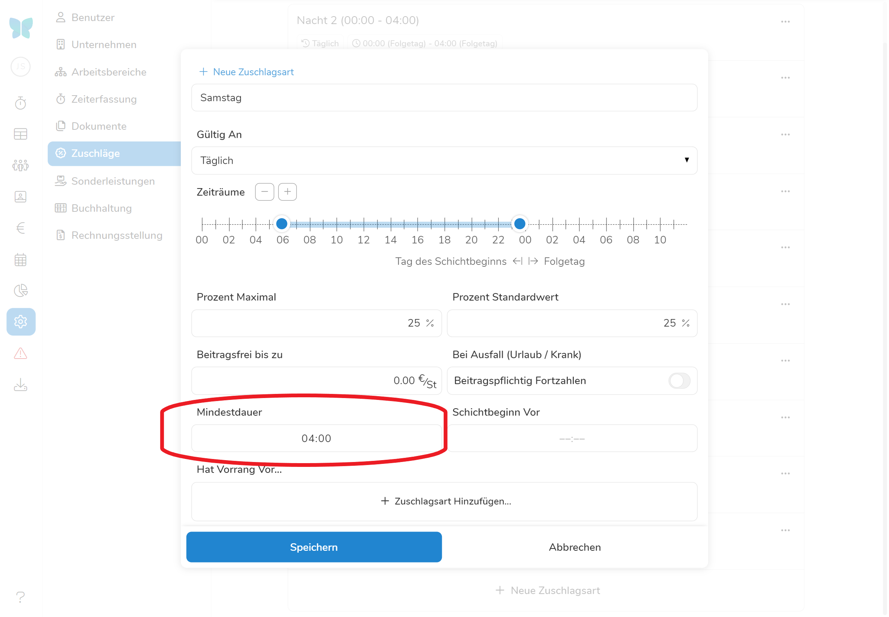

Zuschläge sind eine Möglichkeit, Ihre Mitarbeiter für Arbeit an bestimmten Tagen und in bestimmten Zeiträumen extra zu entlohnen. Generell sollte man dabei zwischen den gesetzlich bestimmten SFN (Sonntag, Feiertag, Nacht) und weiteren frei definierten Zuschlägen (bspw. für Samstagsschichten) unterscheiden. Diese Unterscheidung ist besonders wichtig, da die gesetzlichen SFN Zuschläge beitragsfrei ausgezahlt werden können. 

## Gesetzliche SFN-Zuschläge

Die in [§ 3b des Einkommenssteuergesetzes (EStG)](https://www.gesetze-im-internet.de/estg/__3b.html) definierten SFN (Sonntags-, Feiertags- und Nachts-) Zuschläge werden für Sie automatisch angelegt. Solange für Ihr Unternehmen also keine gesonderten Regeln gelten, sollten Sie in diesem Bereich normalerweise keine Anpassungen machen müssen.

>**Sollten Sie dennoch Änderungen vornehmen wollen (z.B.: eine Anpassung der Zuschlagszeiträume), dann beachten Sie bitte, dass alle Zuschläge, die über den in § 3b EStG definierten Rahmen hinausgehen, beitragspflichtig sind!**

## Neue Zuschlagsart hinzufügen

Wenn Sie weitere Zuschläge außerhalb der SFN-Zeiträume erstellen wollen, gehen sie folgend vor:

Klicken sie auf  um eine neuen Zuschlagsart zu erstellen. Anschließend öffnet sich ein Bearbeitungsdialog in welchem Sie die Eigenschaften des Zuschlags definieren können. 

### Name der Zuschlagsart

Geben Sie hier den Namen der Zuschlagsart ein.

### Gültig an

Hier können Sie auswählen, an welchen Tagen der Zuschlag zu Wirkung kommen soll. Sie haben dabei folgende Optionen zur Verfügung:

- *Täglich -* Der Zuschlag wird allen ausgewählten Mitarbeitern jeden Tag im ausgewählten Zeitraum angerechnet. **Nützlich bspw. für Nachtzuschläge.**
- *Bestimmte Wochentage -* Der Zuschlag wird allen ausgewählten Mitarbeitern an den ausgewählten Tagen angerechnet. Wählen Sie dazu einfach die gewünschten Wochentage aus.
- *Feiertage -*  Sollten Sie einen speziellen Zuschlagssatz für **bestimmte Feiertage** gewähren wollen, können Sie dies hier tun. Wählen Sie einfach die gewünschten Feiertage aus der Liste aus. 
- *Datum -* Vielleicht ist der Tag den Sie auswählen wollen gar kein offizieller Feiertag bspw. Neujahr. Unter Datum können Sie **jeden Tag des Jahres** auswählen. 





### Zeiträume

Hier können Sie die Stunden auswählen, zu denen der Zuschlag gewährt werden soll. Klicken Sie auf  und  um zusätzliche Zeitspannen hinzuzufügen. Ziehen Sie anschließend die Leisten mittels Drag & Drop so, dass sie den gewünschten Zeitraum beinhalten. 

### Prozent Maximal

Der hier eingetragene Wert gilt als Obergrenze, wenn diese Zuschlagsart einem Mitarbeiter zugeteilt wird. Dies verhindert, dass Sie ausversehen einen zu hohen Betrag im Vertrag eines Mitarbeiters angeben. 





### Prozent Standardwert

Dieser Wert ist die Norm, die beim Auswählen dieser Zuschlagsart für einen Mitarbeiter ausgewählt wird.

### Beitragsfrei bis zu

Hier wird bestimmt ob der Zuschlag betragsfrei abgerechnet werden kann. **Generell gilt, dass nur gesetzlich [gesetzlich definierte SFN-Zuschläge](https://www.gesetze-im-internet.de/estg/__3b.html) bis zu 25€ / Std. beitragsfrei sind.** Sollte es sich um einen SFN-Zuschlag handeln, haben Sie normalerweise natürlich Interesse daran diesen so lange wie möglich beitragsfrei abzurechnen. Deshalb sollte dieses Feld normalerweise mit 25 € / Std. für SFN-Zuschläge und 0 € / Std. für restliche Zuschläge ausgefüllt werden.

> **Achtung!** Zuschläge außerhalb der [gesetzlich definierten SFN-Zuschläge](https://www.gesetze-im-internet.de/estg/__3b.html) können nicht beitragsfrei abgerechnet werden - dies würde einer Abgabenhinterziehung gleichkommen!

### Bei Ausfall (Urlaub / Krank)

Nach den im [Entgeldfortzahlungsgesetz](https://www.gesetze-im-internet.de/entgfg/__4.html) definierten Regelungen, sind SFN-Zuschläge grundsätzlich auch im Lohnfortzahlungsfall zu gewähren. In diesem Fall berechnet Pentacode für Sie automatisch die entsprechenden Stundenwerte basierend auf den Durchschnittswerten der letzten 13 Wochen. 
**Achtung: Aus Fehltagen entstehende Zuschläge sind in jedem Fall beitragspflichtig!**

### Mindestdauer

Sollten Zuschläge erst ab einer gewissen Mindestdauer im Zuschlagszeitraum angerechnet werden, können Sie dies hier auswählen. Geben Sie dazu einfach die Mindestdauer in das Feld ein. 





### Schichtbeginn Vor

Wenn ein Zuschlag nur gewährt werden soll, wenn die Schicht vor einem bestimmten Zeitpukt angefangen hat, können Sie diesen Zeitpunkt hier definieren. **Diese Option eignet sich bspw. für Nachtzuschläge, wenn manche Mitarbeiter schon früh morgens anfangen aber nicht mehr von den Nachtzuschlägen profitieren sollen**.

### Hat Vorrang Vor...

Es passiert des Öfteren, dass mehrere Zuschlagszeiträume aufeinander fallen. Stellen Sie sich etwa vor, ein Mitarbeiter arbeitet an einem Sonntag, der zugleich Feiertag ist. Oder eine Nachtschicht ragt von Samstag in den Sonntag. Für diese Fälle muss es klar sein, welche Zuschlagsart berücksichtigt werden soll. Wählen Sie dazu hier die Zuschlagsarten aus, **die vom aktuell ausgewählten Zuschlag überschrieben werden sollen**. 





## Zuschlagsart bearbeiten

Wenn Sie einen bestehenden Zuschlag bearbeiten wollen, klicken Sie den  neben diesem und wählen **Bearbeiten** aus. Sie gelangen anschließend in das gleiche Menü, wie unter [**Neue Zuschläge**](#neue-zuschlagsart-hinzufügen) beschrieben. 

## Zuschlagsart löschen

Wenn Sie eine Zuschlagsart löschen möchten, klicken Sie auf  neben dieser und wählen **Löschen** aus.

## Zuschlagsart duplizieren

Sie möchten eine weitere Zuschlagsart hinzufügen und eine bestehende als Vorlage nutzen? Klicken Sie auf das  neben der Vorlage und wählen **Duplizieren** aus. Die Zuschlagsart mit all ihren Einstellungen ist nun dupliziert und bereit als Vorlage genutzt zu werden. 

## Zuschlagsarten Mitarbeitern zuordnen

Um die nun erstellten Zuschläge Mitarbeitern zuzuordnen, wählen Sie den Reiter **Mitarbeiter** aus und navigieren zu den **Verträgen**. Unter **Zuschläge** können Sie nun die Zuschläge auswählen, die dem Mitarbeiter angerechnet werden sollen. Weitere Informationen zur Zuteilung finden Sie unter [Vertrag](/hilfe/handbuch/mitarbeiter/vertrag)

