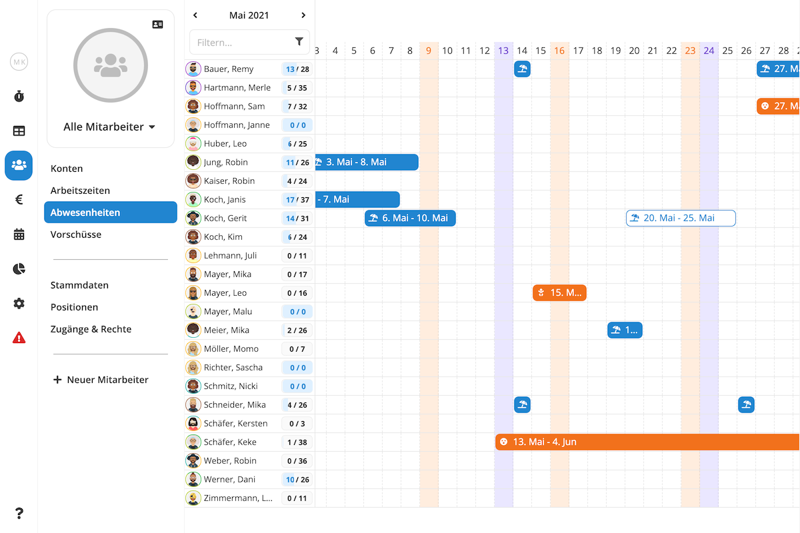
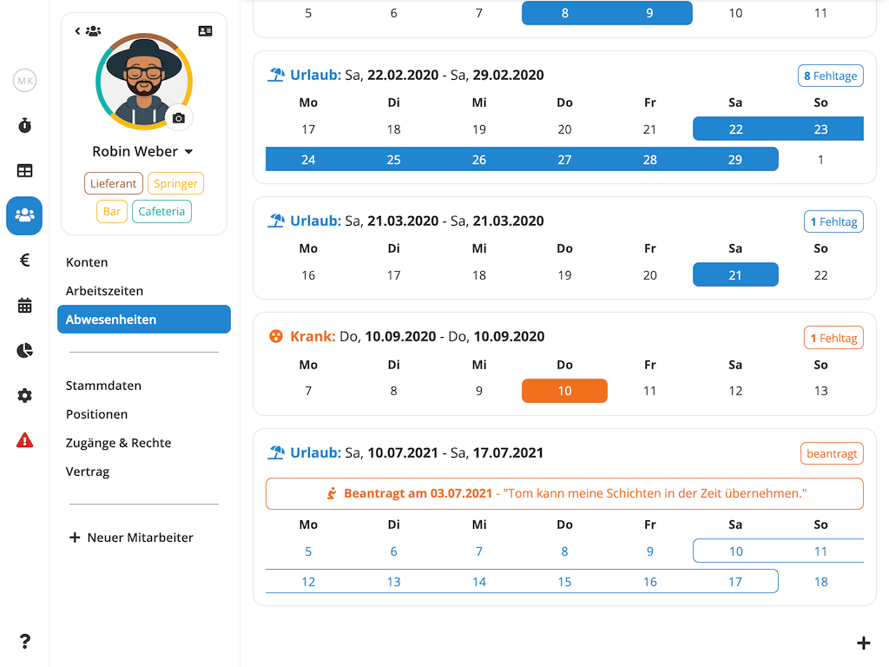
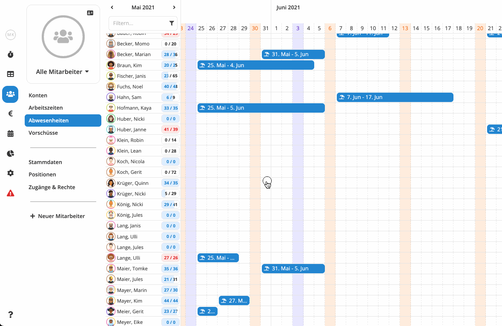
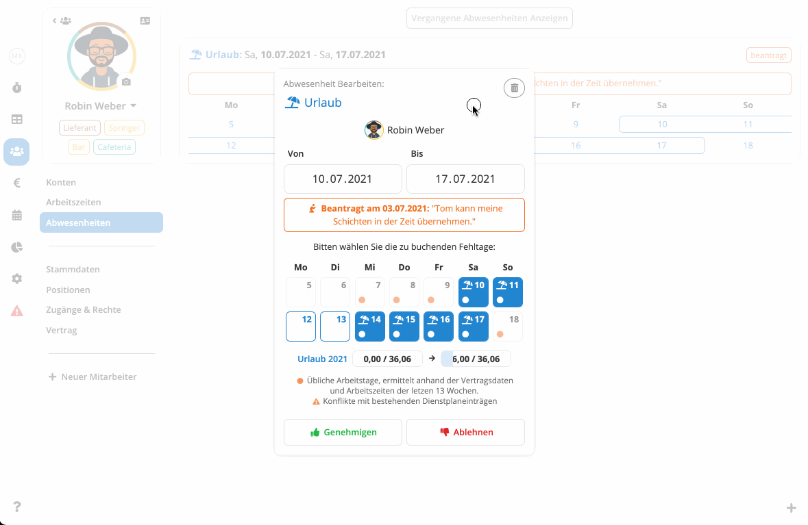

Neben der Arbeitszeitdokumentation und Dienstplanung ist das Verwalten von Abwesenheiten wie Urlaub und
Krankheit eine der wichtigsten Aufgaben der Personalverwaltung. Mit Pentacode können Sie nicht nur erfassen und planen,
wer wann krank oder im Urlaub war, ist oder sein wird - die Software errechnet automatisch für Sie, wann und wie viele
Fehltage für einen Abwesenheitszeitraum gebucht werden müssen und wie viele Fehlstunden und Zuschläge anfallen. Und diese Informationen fließen dann wiederum vollautomatisch in die Lohnbuchhaltung und Mitarbeiterkonten ein!

Alles was Sie tun müssen, ist einen Mitarbeiter, Abwesenheitstyp und Zeitraum zu wählen und Pentacode erledigt den Rest für Sie. Und wenn Sie unsere [Mitarbeiter-App](/hilfe/handbuch/mitarbeiter-app) nutzen, können Ihre Mitarbeiter selbstständig Urlaubsanträge und Krankmeldungen erfassen, die Sie dann nur noch genehmigen müssen!

## Übersicht

In der Abwesenheiten-Übersicht sehen Sie die erfassten, geplanten, beantragten Abwesenheiten aller Ihrer Mitarbeiter
auf einen Blick.

Sie gelangen in die Abwesenheiten-Übersicht, indem Sie im Hauptmenü den Punkt **Mitarbeiter** und dort den Unterpunkt **Abwesenheiten** wählen.

>  **Tipp:** Möchten Sie die nur die Abwesenheiten einer bestimmten Abteilung sehen? Über das
> -Symbol in der linken oberen Ecke können Sie die Anzeige auf Mitarbeiter aus einer oder mehrerer
> bestimmter Abteilungen beschränken.

<figure caption="In der Abwesenheiten-Übersicht sehen Sie die erfassten, geplanten, beantragten Abwesenheiten aller Ihrer Mitarbeiter auf einen Blick.">

</figure>

## Einzelansicht

Über die Abwesenheiten-Einzelansicht können Sie die Abwesenheiten eines einzelnen Mitarbeiters einsehen und bearbeiten.

Um in die Abwesenheiten-Einzelansicht eines Mitarbeiters zu gelangen, navigieren Sie zunächst zur [Abwesenheiten-Übersicht](#übersicht) und wählen dort den gewünschten Mitarbeiter.

<figure caption="Über die Abwesenheiten-Einzelansicht können Sie die Abwesenheiten eines einzelnen Mitarbeiters einsehen und bearbeiten.">

</figure>

## Neue Abwesenheit Erfassen

So funktioniert das **Erfassen einer neuen Abwesenheit**:

1. **In der [Übersicht](#übersicht):** Klicken Sie auf das Kästchen, dass dem gewünschten
   Mitarbeiter und Tag des Abwesenheitsbeginns entspricht, oder
   halten Sie die Maustaste gedrückt, um durch horizontales Ziehen direkt einen Zeitraum zu wählen.

   **In der [Einzelansicht](#einzelansicht):** Klicken Sie den -Button in der rechten unteren Ecke.

2. Wählen Sie die gewünschte **Abwesenheitsart**.
3. Geben Sie **Abwesenheitsbeginn** und **-ende** ein.
4. Wählen Sie aus, welche Tage innerhalb des Abwesenheitszeitraums als **Fehltage** erfasst werden sollen. Pentacode
   trifft hier automatisch eine Vorauswahl anhand der üblichen Arbeitstage des Mitarbeiters (ermittelt basierend auf den
   [Vertragsdaten](/hilfe/handbuch/mitarbeiter/vertrag#feste-wochentage) und bisher erfasster Arbeitszeiten).
5. Klicken Sie auf  um die Abwesenheit zu **übernehmen** oder
    um sie zu **verwerfen**.
6. Falls es in dem gewählten Zeitraum bereits erfasste Arbeitszeiten oder geplante Schichten gibt wird Pentacode Sie
   fragen, ob Sie diese löschen möchten. Bestätigen Sie, dass Sie den Vorgang abschließen möchten.

<figure caption="Indem Sie die Maustaste gedrückt halten, können Sie direkt den kompletten Zeitraum der Abwesenheit selektieren.">

</figure>

## Abwesenheit Bearbeiten

Um eine Abwesenheit zu **bearbeiten** gehen Sie wie folgt vor:

1. **Selektieren** Sie zunächst in der [Übersicht](#übersicht) oder [Einzelansicht](#einzelansicht) die gewünschte
   Abwesenheit durch einen Mausklick.
2. Sie können nun **Abwesenheitsbeginn** und **-ende** und die zu erfassenden **Fehltage** bearbeiten.
3. Klicken Sie auf  um die Änderungen zu **übernehmen** oder
    um sie zu **verwerfen**.

## Abwesenheit Löschen

So **löschen** Sie eine Abwesenheit:

1. **Selektieren** Sie zunächst in der [Übersicht](#übersicht) oder [Einzelansicht](#einzelansicht) die gewünschte
   Abwesenheit durch einen Mausklick.
2. Im Bearbeitungsdialog, klicken Sie den  Button in der rechten oberen Ecke.
3. **Bestätigen** Sie, dass Sie die Abwesenheit löschen möchten.

## Urlaubsanträge & Krankmeldungen

Über die Pentacode [Mitarbeiter-App](/hilfe/handbuch/mitarbeiter-app) können Ihre Mitarbeiter Urlaubsanträge und Krankmeldungen in Form von **Abwesenheitsanträgen** erfassen, welche Sie dann genehmigen oder ablehnen können.

### Abwesenheitsantrag Genehmigen

So **genehmigen** Sie einen Abwesenheitsantrag:

1. **Wählen** Sie zunächst den Abwesenheitsantrag durch einen Mausklick in der [Übersicht](#übersicht) oder
   [Einzelansicht](#einzelansicht) oder indem Sie dem Link in der Benachrichtungs-Email folgen.
2. Wählen Sie aus, welche Tage innerhalb des Abwesenheitszeitraums als **Fehltage** erfasst werden sollen. Pentacode
   trifft hier automatisch eine Vorauswahl anhand der üblichen Arbeitstage des Mitarbeiters (ermittelt basierend auf den
   [Vertragsdaten](/hilfe/handbuch/mitarbeiter/vertrag#feste-wochentage) und bisher erfasster Arbeitszeiten).
3. Klicken Sie auf .
4. Sie können nun noch eine optionale Antwortnachricht eingeben. Klicken Sie auf  um den
   Vorgang abzuschließen.

<figure caption="Über die Mitarbeiter-App können Ihre Mitarbeiter Urlaubsanträge und Krankmeldungen erfassen, welche Sie dann genehmigen oder ablehnen können.">

</figure>

### Abwesenheitsantrag Ablehnen

So lehnen Sie einen Abwesenheitsantrag **ab**:

1. **Wählen** Sie zunächst den Abwesenheitsantrag durch einen Mausklick in der [Übersicht](#übersicht) oder
   [Einzelansicht](#einzelansicht) oder indem Sie dem Link in der Benachrichtungs-Email folgen.
2. Klicken Sie auf .
3. Sie können nun noch eine optionale Antwortnachricht eingeben. Klicken Sie auf  um den
   Vorgang abzuschließen.
