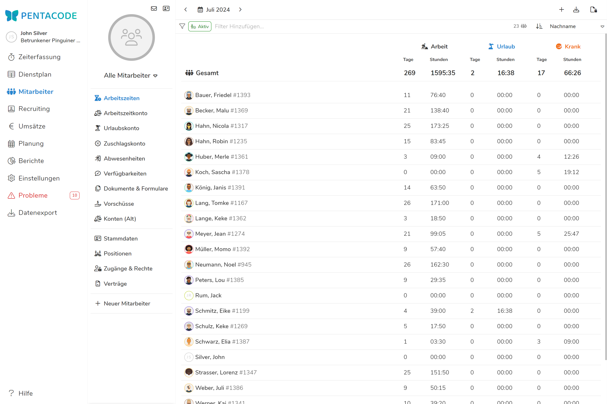
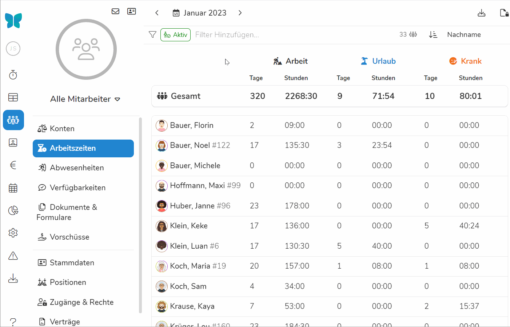
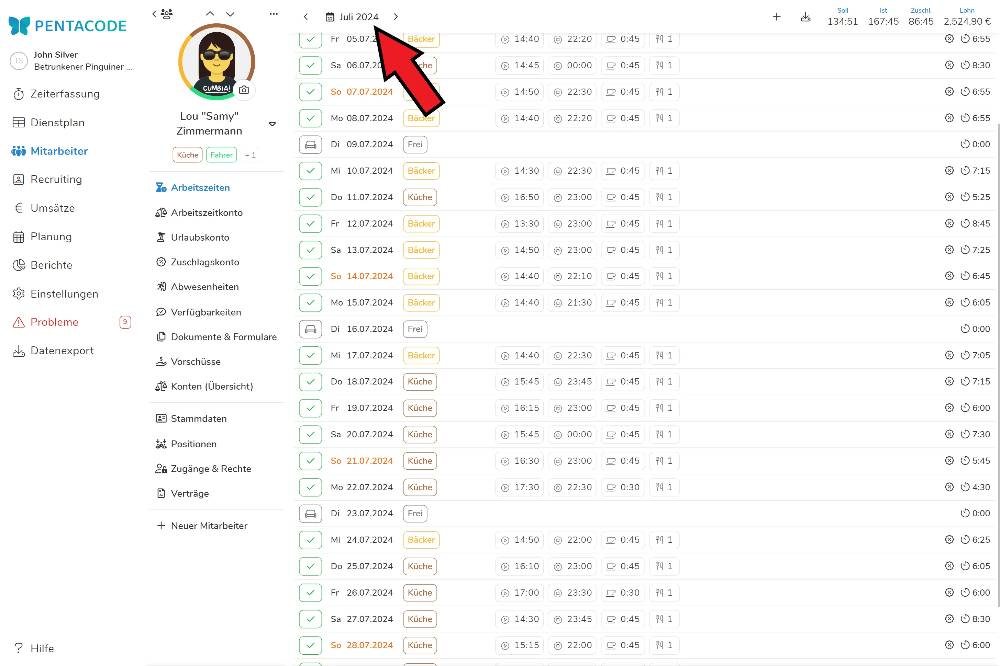
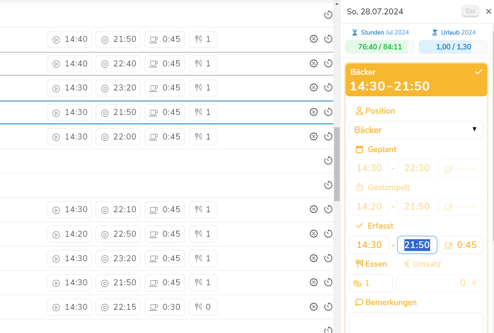

Das Planen, Erfassen und Dokumentieren von Arbeitszeiten gehört zu den Kernaufgaben von Pentacode. In diesem Artikel
erfahren Sie unter anderem, wie Sie die Arbeitszeiten Ihrer Mitarbeiter einsehen, manuell erfassen, bearbeiten und
exportieren können.

## Arbeitszeiten Übersicht

Die Arbeitszeiten-Übersicht zeigt Ihnen die geleisteten Arbeitstage und -stunden, Urlaubs- sowie Krankheitszeiten all ihrer Mitarbeiter auf einen Blick. Klicken Sie auf das  **Symbol** um die gewünschte Zeitspanne einzustellen, für die Ihnen die Arbeitszeiten angezeigt werden sollen. Klicken Sie auf die über dem Kalender erscheinenden Monate, um diese direkt ganz auszuwählen.





Über das Feld  können Sie nach einzelnen Abteilungen und Vertragsarten suchen. Beachten Sie, dass wenn Sie eine Abteilung aussuchen **Ihnen nur Arbeitszeiten aus der betroffenen Abteilung angezeigt werden** und diese nicht die ganze Arbeitszeit einzelner Mitarbeiter darstellt. In der rechten oberen Leiste können Sie zusätzlich auswählen, nach welchem Kriterium die Mitarbeiter in der Liste aufgeführt werden sollen. 

Um zur Arbeitszeiten-Übersicht zu gelangen, wählen Sie den Punkt  aus dem Hauptmenü und dort den Unterpunkt .





## Das Arbeitszeitblatt

Das **Arbeitszeitblatt** zeigt Ihnen die geplanten und geleisteten Arbeitszeiten eines Mitarbeiters in einer übersichtlichen Liste an. Hier können Sie [Arbeitszeiten erfassen](#neue-arbeitszeit-erfassen), Abwesenheiten bearbeiten, Soll- und Ist-Stunden vergleichen und vieles mehr. Um zum Arbeitszeitblatt eines Mitarbeiters zu gelangen, navigieren Sie zunächst zur [Arbeitszeiten-Übersicht](#arbeitszeiten-übersicht) und wählen dort den gewünschten Mitarbeiter.

### Zeitraum auswählen

Im Arbeitszeitblatt können Sie genau wie in der Übersicht jeden gewünschten Zeitraum genauer betrachten. Klicken Sie auf das  **Symbol** um den Zeitraum auszuwählen, welcher angezeigt werden soll. Dabei kann maximal ein Zeitraum von 70 Tagen gewählt werden. 





>  **Tipp:** Verwenden Sie Ihre Tastatur, um noch
schneller zwischen Monaten, Tagen und Einträgen zu wechseln! Mit der  Taste springen Sie in den vorherigen Monat, die  Taste
bringt Sie in den nächsten Monat. Mit der  Taste springen Sie in
die nächste Zeile, mit der  Taste selektieren Sie die vorherige
Zeile.

## Neue Arbeitszeit Erfassen

So erfassen Sie eine neue Arbeitszeit für einen Mitarbeiter:

1. Gehen Sie in das [Arbeitszeitblatt](#das-arbeitszeitblatt) des gewünschten
   Mitarbeiters und klicken Sie dort auf den Tag, in dem Sie eine Arbeitszeit
   erfassen möchten.
2. Falls bereits ein Eintrag an diesem Tag vorliegt, wird dieser automatisch zur
   Bearbeitung geöffnet. In diesem Fall müssen Sie zunächst  wählen. Ist der Tag noch leer, können
   Sie diesen Schritt überspringen.
3. Es öffnet sich ein Menü auf der rechten Seite. Wählen Sie hier die Option . Falls der Mitarbeiter mehreren
   Arbeitsbereichen zugewiesen ist, wird Ihnen für jeden mögliche Position ein
   separater Button angezeigt. Wählen Sie die Position, für die Sie eine
   Arbeitszeit erfassen möchten.
4. Es öffnet Sich ein Formular, in dem Sie nun Schichtbeginn und Ende, sowie
   verschiedene andere Felder ausfüllen können. Mehr zu den einzelnen Feldern
   und was sie genau bedeuten erfahren Sie unter [Felder &
   Eigenschaften](#felder-%26-eigenschaften).
5. Ihre Eingaben werden automatisch gespeichert. Wenn Sie möchten können Sie den
   Eintrag nun schließen, indem sie den  button klicken oder  auf Ihrer Tastatur
   drücken.

>  **Tipp:** Falls Sie bereits Arbeitszeiten für diesen
> Mitarbeiter erfasst haben, erstellt Pentacode automatisch
> **Schichtvorschläge** anhand von üblichen Arbeitszeiten und Arbeitsbereichen.
> Mehr zu Schichtvorschlägen erfahren Sie im [
> Dienstplan](/hilfe/handbuch/dienstplan#schichtvorschläge) Hilfeartikel.

## Arbeitszeit Bearbeiten

So bearbeiten Sie einen existierenden Arbeitszeiteintrag:

1. Gehen Sie in das [Arbeitszeitblatt](#das-arbeitszeitblatt) des gewünschten
   Mitarbeiters und klicken Sie dort auf den Eintrag, den Sie bearbeiten
   möchten.
2. Es öffnet Sich ein Formular, in dem Sie nun Schichtbeginn und Ende, sowie
   verschiedene andere Felder bearbeiten können. Mehr zu den einzelnen Feldern
   und was sie genau bedeuten erfahren Sie unter [Felder &
   Eigenschaften](#felder-%26-eigenschaften).
3. Ihre Eingaben werden automatisch gespeichert. Wenn Sie möchten können Sie den
   Eintrag nun schließen, indem sie den  button klicken oder  auf Ihrer Tastatur
   drücken.

>  **Tipp:** Um beim Selektieren eines Eintrags direkt in
> ein bestimmtes Feld zu springen, klicken Sie einfach auf den entsprechenden
> Wert in der Listenansicht. Also wenn Sie z.B. die Pausenzeit bearbeiten
> wollen, klicken Sie einfach auf den Pausenwert und Sie landen direkt im
> entsprechenden Eingabefeld wo Sie Ihre Änderung vornehmen können.

## Felder & Eigenschaften

Wenn Sie eine Arbeitszeit zur Bearbeitung wählen oder eine neue Arbeitszeit
erfassen, wird Ihnen ein Bearbeitungsformular präsentiert, wo Sie Sie Plan- und
Ist-Zeiten einer Schicht sowie Pausen, Mitarbeiteressen und einiges mehr
bearbeiten können. Im Folgenden möchten wir kurz auf die enthaltenen Felder und
deren Bedeutung eingehen.


 

### Position

Unter dem Punkt  **Position** können Sie über ein Dropdown-Menü
den Arbeitsbereich festlegen, in dem die Schicht stattfinden soll. Die
verfügbaren Optionen beschränken sich selbstverständlich auf die dem Mitarbeiter
zugewiesenen [Arbeitsbereiche](/hilfe/handbuch/arbeitsbereiche).

### Geplant

Unter dem Punkt  **Geplant** können Sie den geplanten
Schichtbeginn, das geplante Schichtende sowie die geplante Pause bearbeiten.

>  **Hinweis:** Dieser Bereich ist nur bearbeitbar,
> falls der Eintrag in der Zukunft liegt und für den zugewiesenen Mitarbeiter
> und Arbeitsbereich die Zeiterfassung per Stempeluhr oder Mitarbeiter-App
> aktiviert ist.

#### Schichtbeginn und -ende

Über die ersten beiden Felder können Sie den geplanten Schichbeginn sowie das
geplante Schichtende eintragen. Diese Zeiten, zusammen mit den
[Zeiterfassungs-Regeln](/hilfe/handbuch/einstellungen/zeiterfassung) für diese
Schicht, bestimmen, wann sich der Mitarbeiter per Stempeluhr oder
Mitarbeiter-App, ein- bzw. ausstempeln darf und können später als Vergleich zu
den tatsächlich gearbeiteten Zeiten herangezogen werden (siehe [Berichte /
Arbeitszeit](/hilfe/handbuch/berichte/arbeitszeit) und [Dienstplan /
Soll-Ist-Vergleich](/hilfe/handbuch/dienstplan#soll-ist-vergleich)).

>  **Tipp:** Lassen Sie eines oder beide dieser Felder
> leer, um eine Schicht mit offenem Beginn bzw. Ende zu planen. Dies ist zum
> Beispiel dann nützlich, wenn ein Mitarbeiter zu einer bestimmten Zeit zur
> Schicht erscheinen soll, das Schichtende aber vom Tagesgeschäft abhängt und
> spontan entschieden wird.

#### Pause

Über das rechte Eingabefeld (erkennbar durch das  Symbol)
können Sie die geplante Pause für eine Schicht eintragen. Dieses Feld ist nur
bearbeitbar, falls der Pausenmodus **Geplant** oder **Geplant + Manuell** für
diese Schicht gewählt ist. Mehr über diese Pausenmodi und wie geplante Pausen
zur Anwendungen kommen, erfahren Sie in dem Hilfeartikel [
Einstellungen / 
Zeiterfassung](/hilfe/handbuch/einstellungen/zeiterfassung#pausenberechnung).

### Gestempelte Arbeitszeiten

Unter dem Punkt  **Gestempelt** finden Sie die über die
**digitale Stempeluhr erfassten** Arbeitszeiten des Mitarbeiters. Diese Option
ist nicht bearbeitbar und nur ausgefüllt bei vergangenen Schichten, die über
Pentacode gestempelt wurden!

Bei der **Zeiterfassung per Digitaler Stempeluhr oder Mitarbeiter-App** werden
diese Zeiten automatisch befüllt, sobald der Mitarbeiter sich in die
entsprechende Schicht ein- oder ausstempelt, können aber im Nachhinein jederzeit
bearbeitet werden.

### Erfasste Arbeitszeiten

Unter dem Punkt  **Erfasst** können Sie die Schichtzeiten
sehen und bearbeiten, welche in die Lohnberechnung einfließen. Sollten Sie die
Stempeluhr verwenden werden dies die **gestempelten Zeiten** mit jeweils
[eingestellter
Rundung](/hilfe/handbuch/einstellungen/zeiterfassung#rundung-von-stempelzeiten)
sein. Sollten Sie die Stempeluhr nicht verwenden, werden dies die **geplanten
Schichtzeiten** sein. Bei zurückliegenden Schichten können Sie manuell den
erfassten Schichtbeginn und -ende anpassen. 

>  **Hinweis:** Änderungen an den erfassten
> Arbeitszeiten fließen direkt in die für die Lohnabrechnung verwendeten
> Bewegungsdaten ein! **Verändern Sie die erfassten Zeiten nur mit Vorsicht!**

#### Erfasste Pause

Über das rechte Eingabefeld (erkennbar durch das  Symbol)
können Sie die genommene Pause für eine Schicht bearbeiten. Dieses Feld wird
automatisch befüllt, sobald die Schicht beendet wurde, kann aber im nachhinein
jederzeit bearbeitet werden.

>  **Hinweis:** Falls für die aktuelle Schicht der
> [Pausenmodus](/hilfe/handbuch/einstellungen/zeiterfassung#pausenberechnung)
> **Automatisch** bzw. **Automatisch + Manuell** gewählt ist, befüllt Pentacode
> dieses Feld automatisch basierend auf der Länge der geleisteten Arbeitszeit. **Dies
passiert aber nur dann, wenn noch keine Pause eingetragen wurde!** Das heißt:
> Sollten Sie Schichtbeginn oder -ende im Nachhinein bearbeiten wird das
> Pausenfeld **nicht** automatisch mit der neuen Pausenzeit überschrieben. Sie
> können eine Neuberechnung der automatischen Pause aber veranlassen, indem Sie
> den aktuellen Wert aus dem Pausenfeld löschen und das Feld anschließend per
> Mausklick oder Tabulator-Taste verlassen.

### Mitarbeiteressen

Im Feld  **Essen** können Sie eingeben, ob Mitarbeiteressen
für die aktuelle Schicht gebucht werden sollen. Es wird unterschieden zwischen
** Frühstück**, ** Mittagessen**
und ** Abendessen**.

>  Zusätzlich zu manuellen Buchen von Mitarbeiteressen
> können Sie auch einstellen, dass Mahlzeiten selbstständig durch den
> Mitarbeiter oder sogar vollautomatisch gebucht werden. Mehr dazu unter
> [Einstellungen/Zeiterfassung](/hilfe/handbuch/einstellungen/zeiterfassung/#mitarbeiteressen)

### Umsatz

Über das Feld  **Umsatz** können Sie erfassen, wie viel
Umsatz der Mitarbeiter während der Schicht eingenommen hat. Dieser Wert wird für
die Berechnung der Provision herangezogen.

>  **Hinweis:** Dieses Feld ist nur dann bearbeitbar,
> wenn im Vertrag des Mitarbeiters eine Provision hinterlegt ist.

### Bemerkungen

Über das  **Bemerkungen**-Feld können Sie einen Kommentar für die Schicht hinterlegen.

### Zeiterfassungs-Regeln

Unter dem Punkt  **Regeln** sehen Sie den für diese
Schicht geltenden
[Zeiterfassungs-Regelsatz](/hilfe/handbuch/einstellungen/zeiterfassung) mit
einer Zusammenfassung der enthaltenen Einstellungen in Form von Symbolen. Durch
einen Klick auf den Regelsatz-Namen (auf der rechten Seite) gelangen Sie direkt
zur Bearbeitungsansicht des Regelsatzes, wo Sie die genauen Einstellungen
einsehen und Änderungen vornehmen können (sofern Sie die nötigen Berechtigungen
haben).

>  **Tipp:** Sie wissen nicht, was die angezeigten Symbole
> bedeuten? Indem Sie mit der Maus über ein Symbol fahren, erscheint nach kurzer
> Zeit ein Hinweis zu diesem Symbol.

### Veröffentlicht und bearbeitet

An jeder geplanten und erfassten Schicht steht, wann die Schicht zuletzt geloggt
oder verändert wurde. Ein **veröffentlicht vor...** gibt an wann die Schicht im
Dienstplan eingetragen wurde. Ein **bearbeitet vor...** zeigt, wann die Schicht
zuletzt verändert wurde. So können Sie Änderungen leichter Nachvollziehen. 

## Arbeitszeit Löschen

Zum Löschen eines Arbeitszeiteintrags gehen Sie wie folgt vor:

1. Gehen Sie in das [Arbeitszeitblatt](#das-arbeitszeitblatt) des gewünschten
   Mitarbeiters und klicken Sie dort auf den Eintrag, den Sie löschen möchten.
2. Bewegen Sie die Maus über die farbige Box direkt über dem
   Bearbeitungsformular und klicken Sie das  Symbol im
   rechten oberen Eck.
3. Der Eintrag ist nun gelöscht. Wenn Sie möchten können Sie die Tagesansicht
   nun schließen, indem sie den 
   button klicken oder  auf Ihrer Tastatur drücken.

>  **Tipp:** Mit der Tastenkombination  **+**
>    löschen Sie eine
> ausgewählte Arbeitszeit noch schneller.

## Freien Tag oder Guttag Erfassen

1. Gehen Sie in das [Arbeitszeitblatt](#das-arbeitszeitblatt) des gewünschten
   Mitarbeiters und klicken Sie dort auf einen leeren Tag, den Sie als freien
   Tag oder Guttag erfassen möchten.
2. Es öffnet sich ein Menü auf der rechten Seite. Klicken Sie hier auf den  oder  button oder drücken
   Sie die  Taste auf Ihrer Tastatur für "Frei" oder die  Taste für "Guttag".
3. Der Eintrag wird automatisch gespeichert. Wenn Sie möchten können Sie die
   Tagesansicht nun schließen, indem sie den  button klicken oder  auf Ihrer Tastatur
   drücken.

>  **Hinweis:** Freie Tage dienen nur als
> Platzhalter/Planhilfe und haben keinen Einfluss auf das Arbeitszeitkonto oder
> die Zeiterfassung.

## Urlaub oder Krankeit Erfassen

1. Gehen Sie in das [Arbeitszeitblatt](#das-arbeitszeitblatt) des gewünschten
   Mitarbeiters und klicken Sie dort auf den Tag des Urlaubs- oder eine
   Krankheitsbeginns.
2. Es öffnet sich ein Menü auf der rechten Seite. Klicken Sie hier auf den  oder  button oder drücken
   Sie die  Taste auf Ihrer Tastatur für "Urlaub" oder die  Taste für "Krank".
3. Es öffnet sich ein Dialog, in dem Sie den Abweisenheits-Zeitraum und die zu
   buchenden Fehltage eintragen können. Details zu diesem Dialog und generelle
   Informationen zur Erfassung von Abwesenheiten finden Sie im [
   Abwesenheiten](/hilfe/handbuch/mitarbeiter/abwesenheiten#neue-abwesenheit-erfassen)
   Hilfeartikel.

>  **Hinweis:** aus Gründen der Übersichtlichkeit haben
> wir die Abwesenheitsarten **Kind Krank** und **Krank in KuG** an dieser Stelle
> weggelassen. Sie können diese im Bereich [Mitarbeiter /
> Abwesenheiten](https://manage.pentacode.app/employees/all/absences/) erfassen.

## Zeitbuchungen

Abgesehen vom Erfassen von Arbeitszeiten können Sie die Arbeitsstunden für einen
Mitarbeiter auch direkt hinzubuchen oder abziehen. Dies erfolgt über eine
sogannte **Zeitbuchung**. Um eine Zeitbuchnung vorzunehmen, klicken Sie auf den
-Button mittig-oben, neben den Soll- und Ist-Stunden im
[Arbeitszeitblatt](#das-arbeitszeitblatt) des Mitarbeiters und wählen die Option
"Zeitbuchung".

Zeitbuchungen dienen vornehmlich dazu, Korrekturen am
[Arbeitszeitkonto](/hilfe/handbuch/mitarbeiter/arbeitszeitkonto/) eines Mitarbeiters
vorzunehmen, die nicht über das Erfassen von Arbeitszeiten oder Fehltagen
abgebildet werden können. Beim Abbuchen von Stunden, können Sie außerdem
angeben, ob die abgezogenen Stunden bezahlt werden, also ob sie in der
Lohnabrechnung des entsprechenden Monats aufgeführt werden sollen oder nicht.

### Datum

Über das Datumsfeld können Sie festlegen, an welchem Tag die Zeitbuchung
eingetragen werden soll. Der genaue Tag der Buchung ist in der Regel nicht
enscheidend (wichtig ist nur, welchem Monat die Buchung zugeordnet wird), kann
aber für eine bessere Nachvollziehbarkeit in der Dokumentation hilfreich sein.

### Betrag

Hier können Sie den Betrag der Buchung in Echtminuten (also Stunden und Minuten)
festlegen und ob der Betrag abgezogen oder hinzugebucht werden soll. Um den
Betrag zum Abzug zu bringen wählen Sie **Abbuchung** aus dem Dropdown. Um
Stunden hinzuzubuchen, wählen Sie **Gutschrift**.

### Kommentar

Optional können Sie einen Kommentar für die Buchung hinterlegen. Dieser kann der
besseren Dokumentation und Nachvollziehbarkeit dienen und erscheint neben dem
Arbeitszeitblatt auch in der [Arbeitszeiten-Übersicht](#arbeitszeiten-übersicht),
im [Arbeitszeitnachweis](#arbeitszeit-nachweis) und in der
[Lohnabrechnung](#lohnabrechnung-individuell) und
[Lohnabrechnung-Übersicht](#lohnabrechnung-übersicht). Wenn kein Kommentar
hinterlegt ist, erscheint der Eintrag lediglich als "Zeitbuchung".

### Zeitbuchung Ausbezahlen

Wenn Sie die Zeitbuchung ausbezahlen und **im Lohnbericht Berücksichtigen**
wollen, wählen Sie die Box an. Dadurch wird die Zeitbuchung an die
Lohnbuchhaltung übetragen und normal mit dem Lohn ausgezahlt. Dazu müssen Sie
auch auswählen mit welcher
[Lohnart](/hilfe/handbuch/einstellungen/buchhaltung/#lohnarten) die Zeitbuchung
ausgezahlt werden soll. Sollten Sie sich unsicher sein, fragen Sie dazu ihre
Buchhaltung. 

>  **Beispiel:** Ein Mitarbeiter hat eine
> wesentliche Menge an Überstunden angesammelt. Um das Arbeitszeitkonto
> auszugleichen und die geleisteten Überstunden auszubezahlen, wählen Sie die
> Option **Abbuchung**, geben den auszubezahlenden Stundenbetrag ein und wählen
> Sie die Option **im Lohnbericht Berücksichtigen** und die passende Lohnart.

  

## Urlaubsbuchungen

Ähnlich wie [Zeitbuchungen](#zeitbuchungen) können Urlaubsbuchungen verwendet
werden, um Korrekturen am [Urlaubskonto](/hilfe/handbuch/mitarbeiter/konten)
eines Mitarbeiters vorzunehmen. Um eine Urlaubsbuchung zu erfassen, klicken Sie
auf den -Button in der Rechten unteren Ecke des
[Arbeitszeitblatts](#das-arbeitszeitblatt) des Mitarbeiters und wählen die
Option "Urlaubsbuchung".

### Datum

Über das Datumsfeld können Sie festlegen, an welchem Tag die Urlaubsbuchung
eingetragen werden soll. Der genaue Tag der Buchung ist in der Regel nicht
enscheidend (wichtig ist nur, welchem Monat die Buchung zugeordnet wird), kann
aber für eine bessere Nachvollziehbarkeit in der Dokumentation hilfreich sein.

### Betrag

Hier können Sie den Betrag der Buchung in Tagen festlegen und ob der Betrag
abgezogen oder hinzugebucht werden soll. Um den Betrag zum Abzug zu bringen
wählen Sie **Abbuchung** aus dem Dropdown. Um Stunden hinzuzubuchen, wählen Sie
**Gutschrift**. Abbuchungen **verringern** der Urlaubsanspruch des Mitarbeiters,
während eine Gutschrift den Urlaubsanspruch des Mitarbeiters **erhöht**.

>  **Tipp:** Sie können neben ganzen Urlaubstagen auch
> beliebige Brüche mit bis zu zwei Nachkommastellen eingeben.

### Kommentar

Optional können Sie einen Kommentar für die Buchung hinterlegen. Dieser kann der
besseren Dokumentation und Nachvollziehbarkeit dienen und erscheint neben dem
Arbeitszeitblatt auch in der [Arbeitszeiten-Übersicht](#arbeitszeiten-übersicht)
und in der [Lohnabrechnung](#lohnabrechnung-individuell) und
[Lohnabrechnung-Übersicht](#lohnabrechnung-übersicht) (sofern die Option
[bezahlt](#urlaub-ausbezahlen) ausgewählt wurde). Wenn kein Kommentar hinterlegt
ist, erscheint der Eintrag lediglich als "Urlaubsbuchung".

### Urlaub Ausbezahlen

Ist unter **Betrag** die Option **"Abbuchung"** gewählt, kann unter dem Punkt
**Im Lohnbericht Berücksichtigen** festgelegt werden, ob die abgebuchten
Urlaubstage bezahlt werden sollen. Ist diese Option gewählt, erscheint die
Buchung in der Lohnabrechnung und Lohnabrechnung-Übersicht mit der ausgewählten
**Lohnart**. Der **Fehlstundenbetrag** ist der Betrag der durchschnittlichen
Tages-Arbeitsstunden der letzten 13 Wochen, multipliziert mit dem Betrag der
abgebuchten Tage.

>  **Beispiel:** Ein Mitarbeiter hat eine größere
> Menge an Resturlaub, der aus Zeitgründen nicht vollständig in Anspruch
> genommen werden kann. Um das Urlaubskonto auszugleichen und den nicht
> genommenen Urlaub auszubezahlen, wählen Sie die Option **Abbuchung**, geben
> die Menge von abzubuchenden Urlaubstagen ein und wählen Sie die Option **Im
> Lohnbericht Berücksichtigen** mit der richtigen Lohnart.

## Arbeitszeiten Exportieren

Klicken Sie auf das  mittig-oben auf dem
Arbeitszeitenblatt, um auf den Reiter  verwießen zu werden. Dort können Sie die Bewegungsdaten
des Mitarbeiters sowie weitere Lohndaten exportieren.
[Hier](/hilfe/handbuch/datenexport/) finden Sie weitere Informationen wie Sie
die Arbeitszeiten ihrer Mitarbeiter Drucken und in ihr Lohnbuchhaltungsprogramm
übertragen können.