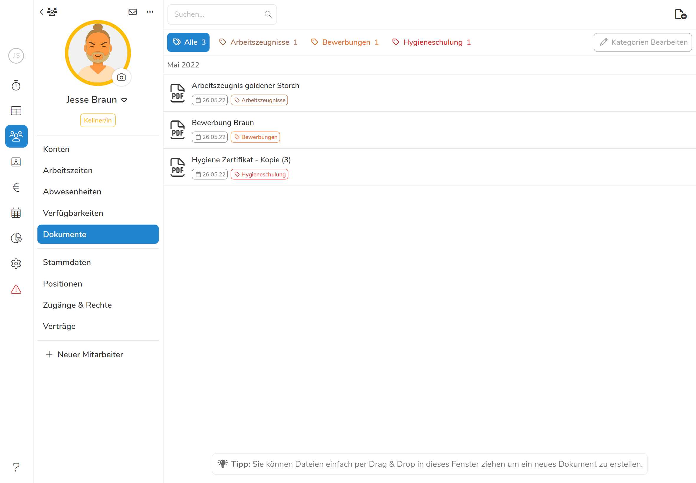
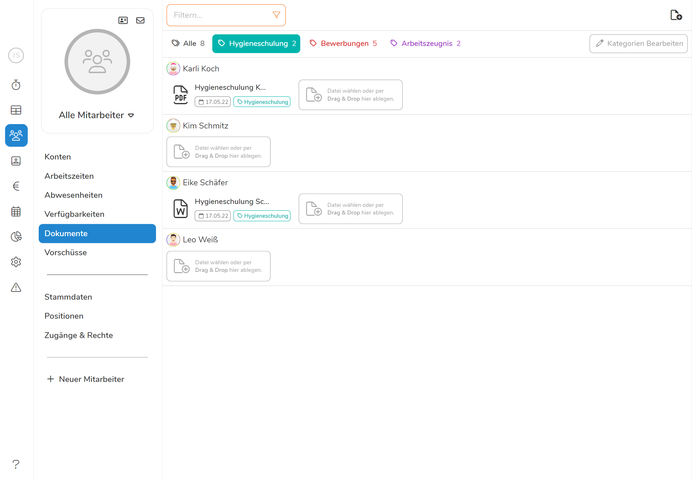
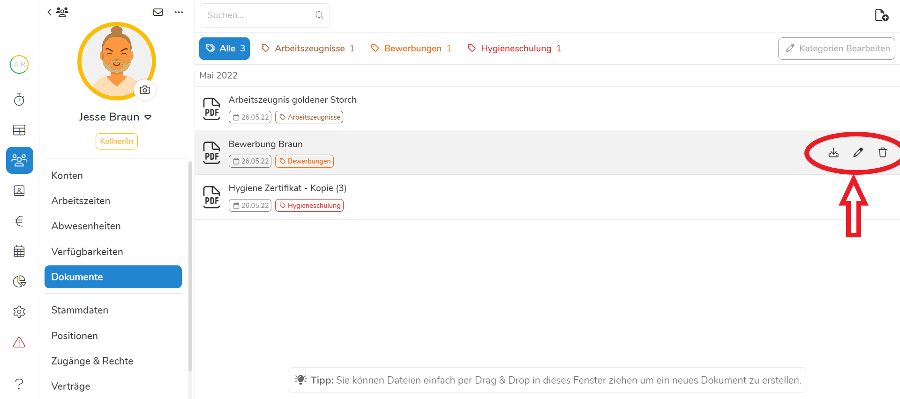
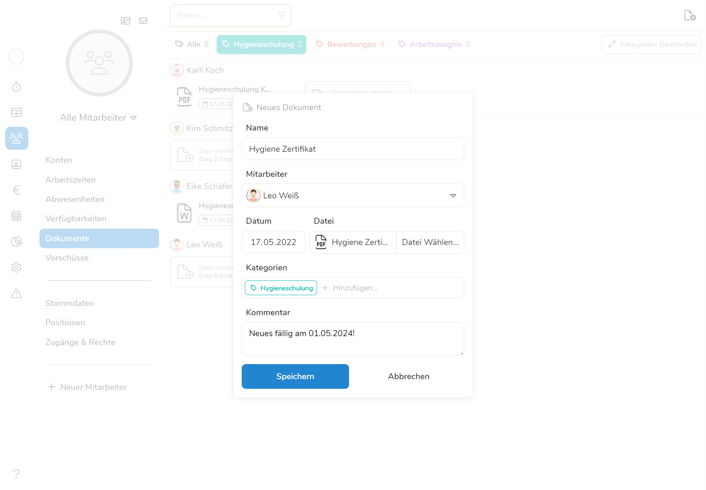
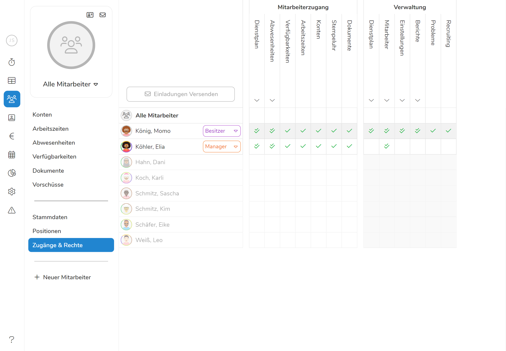

Das **Dokumentenarchiv** bietet Ihnen die Möglichkeit die **Dokumente ihrer
Mitarbeiter direkt in Pentacode zu speichern und von überall verfügbar zu
haben**. So bietet es sich an, Lebensläufe, Arbeitszeugnisse, Bescheinigungen
oder ähnliche Dateien hier abzuspeichern um auf ein ausgedrucktes Archiv
weitestgehend verzichten zu können. So sparen Sie sich Mühe und Papier, da Sie
in Sekundenschnelle stets über das gesuchte Dokument verfügen können.

## Dokumentenübersicht

In die Dokumentenübersicht gelangen Sie über den Reiter **Mitarbeiter** im
Hauptmenü und den Unterpunkt **Dokumente**. Die Dokumentenübersicht zeigt ihnen
eine sortierte Liste ihrer gespeicherten Dokumente. Unter jedem Mitarbeiter
erscheinen dabei die ihm zugeteilten Dateien mit Namen, Datum und
Dokumentenkategorie. Von hier aus können Sie Dateien einsehen, indem Sie auf das
gewünschte Dokument klicken, worauf sich diese in ihrem Browserfenster öffnet.
Sie können zudem neue Dateien hinzufügen oder nach bestimmten Mitarbeitern oder
Dokumentenkategorien filtern.

<figure caption="Hier können Sie die gespeicherten Datein all ihrer Mitarbeiter einsehen.">

</figure>

## Einzelansicht

Sie gelangen in die Einzelansicht der Dokumente eines Mitarbeiters, indem Sie
den Namen in der [Dokumentenübersicht](#dokumentenübersicht) anklicken. Hier haben Sie die
Möglichkeit, die Dokumente eines bestimmten Mitarbeiters einzusehen,
Einträge gezielt zu suchen oder auch neue Dateien hinzufügen. Von hier aus
können Sie die Dateien des ausgewählten Mitarbeiters auch auf ihrem PC sichern,
bearbeiten oder löschen ohne die Datei zuvor öffnen zu müssen. Bewegen Sie dazu
ihren Cursor über eines der Dokumente und folgen den Anweisungen
[hier](#dokument-bearbeiten).

<figure caption="Die Einzelansicht zeigt Ihnen nur die Dokumente eines Mitarbeiters">

</figure>

## Dokumente hinzufügen

So fügen Sie ein neues Dokument hinzu:

1. Klicken Sie auf den -
   **Button** in der rechten oberen Ecke der [Übersicht](#dokumentenübersicht)
   oder [Einzelansicht](#einzelansicht).
2. Sie werden nun aufgefordert die gewünschte Datei auszuwählen, dazu wählen Sie
   erst links das Verzeichnis aus, in dem das Dokument auf ihrer Festplatte
   gespeichert ist und anschließend die Datei, welche Sie hochladen wollen.
3. Nun öffnet sich ein Fenster in dem Sie weitere
   [Dokumenteneigenschaften](#dokumenteneigenschaften) bestimmen können.
4. Klicken Sie auf  um den Vorgang abzuschließen.

### Drag and Drop

Um ein Dokument hinzuzufügen können Sie auch den Ordner mit den gewünschten
Dateien auf ihrem PC öffnen und das Dokument per Drag and Drop in das
Dokumentenarchiv ziehen. Drücken Sie dazu auf die Datei und
**halten die linke Maustaste gedrückt**. Nun **ziehen** Sie die Datei
in die Dokumentenübersicht zum gewünschten Mitarbeiter. Anschließend
öffnet sich auch das Fenster für weitere
[Dokumenteneigenschaften](#dokumenteneigenschaften)

> **Tipp:**  Haben Sie eine Datei gerade erst von ihrem
> Mitarbeiter erhalten bspw. über den Anhang einer E-Mail, wird diese im
> Verzeichnis **Dieser PC/Downloads** gespeichert und kann von hier in Pentacode
> importiert werden.

## Dokument öffnen

Nachdem Sie nun zahlreiche Dokumente ihrer Mitarbeiter auf Pentacode
in digitaler Form gespeichert haben, möchten Sie natürlich auch wieder auf diese
zugreifen. Klicken Sie dazu einfach auf die Datei in der
[Dokumentenübersicht](#dokumentenübersicht) oder
[Einzelansicht](#einzelansicht). Die gewählt Datei wird sich darauf direkt im
Browserfenster öffnen.

> **Tipp:**  Mit  +  und
>  +  können Sie Dokumente beim Einsehen vergrößern und
> verkleinern.

## Dokumente filtern

Ein großer Vorteil eines digitalisierten Archivs ist die Geschwindigkeit, in der
Sie das gesuchte Dokument selbst unter einer Vielzahl anderer Dokumente finden
können.
Pentacode bietet Ihnen dabei zwei mögliche **Filteroptionen**:
Nach Mitarbeiterkriterien und nach Dokumentenkategorien

### Mitarbeiterfilter

So filtern Sie ihre Mitarbeiter nach ihren Positionen und
Beschäftigungsverhältnissen:

1. Gehen Sie in die Dokumentenübersicht und wählen **Filtern...** neben dem
    -**Button** im rechten oberen Eck aus.
2. Nun können Sie durch Ab- und Anwählen verschiedener
   **Beschäftigungsverhältnisse** und **Arbeitsbereiche** nur die Gruppe an
   Mitarbeitern auswählen, deren Dokumente Sie einsehen möchten.
3. Sobald Sie wieder die Dokumente aller Mitarbeiter sehen wollen, scrollen Sie
   im Filtern-Dialogfenster ganz nach unten und drücken Sie auf **Filter
   zurücksetzen**.

### Kategorienfilter

Beim Suchen bestimmter Dokumententypen werden Ihnen zudem die
[Kategorien](#kategorien) nützlich, die sie beim Erstellen eines Datei
zugeordnet haben. Wählen Sie dazu die mit den  markierten
Kategorien am oberen Rand der Dokumentenübersicht aus. Durch Anklicken einer
der Kategorien sehen Sie nur noch die Dateien, welche dieser Kategorie
zugeordnet sind. Um wieder zu allen Dokumenten zurückzukehren drücken Sie auf
den -Button.

### Filter kombinieren

Die Mitarbeiter- und Kategorienfilter können auch kombiniert werden, wenn Sie
nach einer Art von Dokument in einer Gruppe ihrer Belegschaft suchen.

> **Beispiel:** Sollte eine Behörde alle Hygieneschulungen ihrer Köche einsehen
> wollen, stellen Sie den **Filter** auf **Küche** und die Kategorie auf
> **Hygieneschulung** und schon haben Sie alle relevanten Bescheinigungen
> aufgelistet.

<figure caption = "Hier wurden die Mitarbeiter nach der Abteilung Küche und die Dokumentenkategorie nach ´Hygieneschulung´ gefiltert">

</figure>

## Dokument bearbeiten

So **bearbeiten** Sie eine Datei:

1. [Öffnen](#dokument-öffnen) Sie das Dokument
2. Drücken Sie nun auf den -**Button** im
   rechten oberen Eck, um wieder in das [Dialogfeld](#dokumenteneigenschaften) zu
   gelangen, in dem Sie Namen, Kategorien und Kommentar des Dokuments bearbeiten
   können.
3. Nehmen Sie die gewünschten Änderungen vor und klicken Sie auf 

> Innerhalb von Pentacode können Sie den Inhalt (z.B den Text in einem
> Word-Dokument) einer Datei nicht ändern, dazu müssen Sie das Dokument
> [speichern](#dokument-herunterladen) und lokal auf ihrem PC bearbeiten.

## Dokument herunterladen

Wenn Sie eine Kopie eines Dokuments auf ihrem Gerät **speichern** wollen, [öffnen](#dokument-öffnen)
Sie die Datei und klicken Sie auf den -**Button**. Nun
wird das Dokument standardmäßig in ihrem Verzeichnis **Dieser PC/Downloads**
gespeichert.

## Dokument löschen

Sollten Sie eine Datei von Pentacode **löschen** wollen, [öffnen](#dokument-öffnen) Sie die Datei
und klicken Sie auf den -**Button** im rechten oberen Eck. Zur
Sicherheit werden Sie jedoch noch einmal gefragt, ob Sie die Datei wirklich
löschen wollen. Sobald Sie nun auf **Löschen** klicken, ist das Dokument
unwiderruflich gelöscht.

<figure caption="Bewegen Sie in der Einzelansicht ihren Cursor über ein Dokument, erscheinen die Buttons zum Bearbeiten auch ohne das Dokument zu öffnen">

</figure>

## Dokumenteneigenschaften

Wenn Sie ein Dokument hinzufügen müssen Sie folgende Felder und Eigenschaften
angeben:

### Name

Die Bezeichnung des Dokuments. Diese dient für Darstellungszwecke und erleichtert
außerdem die Suche nach bestimmten Dokumenten.

### Mitarbeiter

Jedes Dokument ist einem bestimmten Mitarbeiter zugeordnet. Diese Zuordnung
kann jederzeit durch einen Klick auf das Feld **Mitarbeiter** geändert werden.

### Datei

Jedem Dokument kann eine beliebige Datei **bis zu einer Größe von 5MB**
angehängt werden. Unterstütze Formate sind **PDFs**, **Bilder (JPEG und PNG)**,
**Word- und Excel-Dateien** sowie einfache **Text-Dateien**.

### Datum

Das **Datums-Feld** ist für die chronologische Einordnung des Dokumentes vorgesehen.
Wenn Sie eine Datei auswählen, wird hier automatisch der Zeitpunkt der letzten
Bearbeitung eingetragen - sie können aber auch ein beliebiges anderes Datum wählen.
Generell sollte das Datumsfeld des Dokumentes das Entstehungsdatum der angehängten
Datei widerspiegeln.

### Kommentar

Im Textfeld **Kommentar** kann, wie der Name schon sagt, dem Dokument ein
Kommentar mit zusätzlichen Informationen hinzugefügt werden.

### Kategorien

Besonders relevant ist das Feld **Kategorien**, hier können dem Dokument eine
oder mehrere Kategorien zugeordnet werden, welche es später einfacher machen
nach diesem Dokument zu [filtern](#kategorienfilter) und es schnell zu finden.
Tippen Sie dazu einfach den Namen der gewünschten Kategorie in das Textfeld, bis
diese auftaucht. Um eine neue Kategorie zu erstellen, geben Sie den Namen der
neuen Kategorie ein und drücken Sie . Die neue Kategorie
wird dann automatisch dem Dokument zugeordnet. Wenn Sie den Namen oder die
Darstellungsfarbe der Kategorie im Nachhinein bearbeiten wollen, können
Sie dies unter
[Einstellungen/Dokumente](../../einstellungen/dokumente/#kategorien-bearbeiten)
tun.

<figure caption = "Der Name der Datei sowie das aktuelle Datum werden automatisch übernommen.">

</figure>

## Berechtigungen erteilen

Im Menüpunkt **Zugänge und Rechte** können Sie ihren Mitarbeitern in
verschiedenen Stufen Zugriff auf das Dokumentenarchiv gewähren. Sollen die
Mitarbeiter nur Zugriff auf ihre eigenen Dokumente haben, reicht ein
**Mitarbeiterzugriff**. Soll jedoch das Dokumentenarchiv mit bearbeitet werden,
ist auch das möglich mit einem **Managerzugriff**.

### Mitarbeiterzugriff

In vielen Fällen macht es Sinn ihren Mitarbeitern Zugriff auf ihre eigenen
Dokumente zu gewähren. So haben sie die Möglichkeit diese einzusehen - nicht
aber die Dokumente anderer Mitarbeiter. Gehen Sie dazu unter **Mitarbeiter** auf
**Zugänge und Rechte** und kreuzen Sie das Kästchen **Dokumente** unter
**Mitarbeiterzugang** an. Von nun an kann die ausgewählte Person in ihrer
Mitarbeiterapp die für sie gespeicherten Dokumente einsehen aber keine weiteren
hinzufügen oder bestehende löschen.

> **Tipp:**  Über das Dokumentenarchiv können Sie
> mitarbeiterspezifisch auch To-Do Listen, Meetingmitschriften oder selbst
> ausgestellte Arbeitszeugnisse zur Verfügung stellen - ihrer Fantasie sind keine
> Grenzen gesetzt

### Managerzugriff

Sollten Sie einem Manager Zugriff auf die Verwaltung der Dokumente gewähren
wollen, geht das auch ganz einfach über **Zugänge und Rechte**. Setzen Sie dazu
einen Haken bei **Mitarbeiter** unter **Verwaltung** - somit wird der Zugriff
auf Dokumente in Kombination mit vielen weiteren Verwaltungsfunktionen gewährt.
Sie können den Zugang auch nur für die Dokumentenverwaltung spezifizieren, indem
Sie den Reiter **Mitarbeiter** ausklappen und alle Haken bis auf **Dokumente**
entfernen. Von nun an kann dieser Manager die Dokumente aller Mitarbeiter
einsehen, bearbeiten und löschen sowie Neue hinzufügen.

> **Achtung**  Ein Manager mit Berechtigung auf das
> Dokumentenarchiv hat Zugriff auf eventuell private Daten der Mitarbeiter - eine
> Aufklärung zum Umgang mit vertraulichen Daten ist also vorauszusetzen.

<figure caption="Erteilen Sie einem Manager die Berechtigung **Mitarbeiter** kann er automatisch auch das Dokumentenarchiv bearbeiten">

</figure>

## Kategorien bearbeiten

Wenn Sie ihre Dokumentenkategorien verwalten und die Farbgebung der Kategorien
verändern wollen, drücken Sie in der **Dokumentenübersicht** auf  oben rechts im Fenster. Dieser leitet Sie zu
den **Einstellungen** weiter. Klicken Sie
[hier](/hilfe/handbuch/einstellungen/dokumente) für mehr Informationen.
