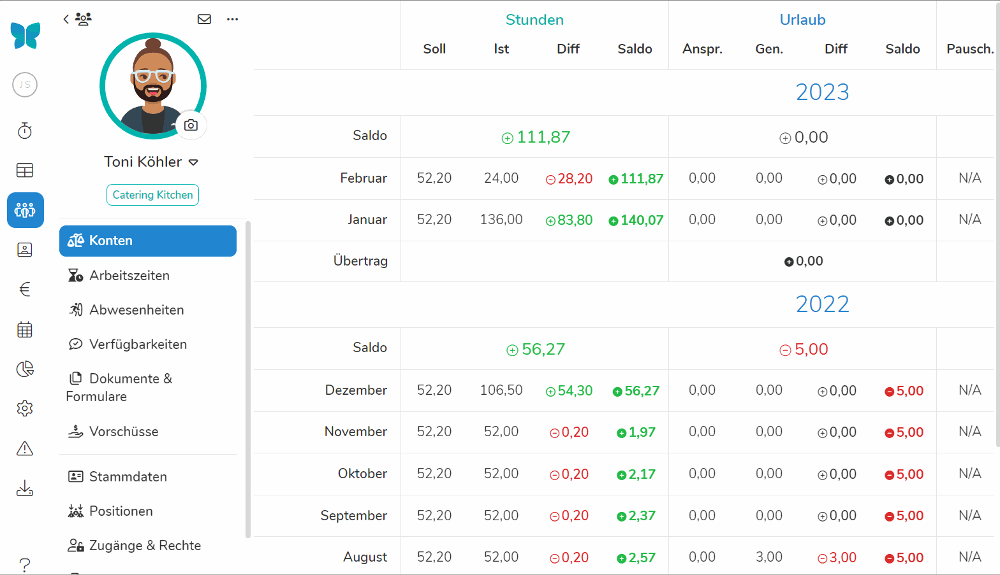

Basierend auf den hinterlegten Vertragsdaten, erfassten Arbeitszeiten und Urlauben kann Pentacode automatisch aggregierte Werte wie Überstunden und Resturlaubsansprüche für Sie berechnen und diese in fortlaufend saldierenden Konten zusammenfassen. Pentacode unterscheidet zwischen drei verschiedenen Kontenarten.

## Stundenkonto

In diesem Konto werden die [**Soll-Zeiten**](/hilfe/handbuch/mitarbeiter/vertrag/#arbeitszeit), die ein Mitarbeiter
arbeiten soll, den tatsächlich **geleisteten Arbeitszeiten** gegenübergestellt und **Über- oder Minderstunden**
ausgewiesen.

Die Gegenüberstellung erfolgt auf **Monatsbasis**, wobei der **laufende Monat** nur die **bis zum aktuellen Zeitpunkt erfassten** Arbeitszeiten ausweist. **Geplante** Arbeitszeiten werden in dieser Übersicht **nicht**
berücksichtigt.

Da das Arbeitskonto weder geplante noch in der Zukunft zu leistende Arbeitszeiten ausweist, wird das laufende Jahr nur
**bis zum aktuellen Monat** dargestellt.

Sofern nicht anders erfasst, werden die **Über- oder Minderstunden** am Ende eines Jahres immer automatisch in das
Folgejahr übertragen. Wie Sie diese Überträge bearbeiten können, erfahren Sie unter dem Punkt [Übertrag
Bearbeiten / Konten Zurücksetzen](#übertrag-bearbeiten--konten-zurücksetzen).

## Urlaubskonto

In diesem Konto werden die diesen Monat **erworbenen**
[Urlaubsansprüche](/hilfe/handbuch/mitarbeiter/vertrag/#urlaub-und-fehltage) den **genommenen** Urlaubstagen
**gegenübergestellt** und Über- oder Unterschreitungen ausgewiesen.

Sofern nicht anders erfasst, wird der **Resturlaub** am Ende eines Jahres immer automatisch in das Folgejahr übertragen.
Wie sie den Resturlaub eines Jahres verwerfen oder Überträge bearbeiten können, erfahren Sie unter dem Punkt [Übertrag Bearbeiten / Konten Zurücksetzen](#übertrag-bearbeiten--konten-zurücksetzen).

## SFN-Konto

Das Konto **SFN-Zuschläge** weist die Summe der monatlichen Zuschläge für Nacht-, Sonn- und Feiertagsarbeit des Mitarbeiters aus.

In der Spalte "**B.Frei**" werden die **beitragsfreien** Zuschläge erfasst, in der Spalte "**(B.pfl.)**" jene Zuschläge, die durch Krankheit oder Urlaub **beitragspflichtig** abgerechnet werden müssen.

Sollte der Mitarbeiter **Zuschläge** unterjährig als [**pauschale
Vorauszahlung**](/hilfe/handbuch/mitarbeiter/vertrag#monatliche-sfn-pauschale) erhalten, werden diese unter
**"Pausch."** gelistet. In diesem Fall werden die monatlichen **Über- oder Unterzahlungen** unter **"Diff"** ausgewiesen
und als fortlaufender **Saldo** gezeigt.

Für die Saldierung werden standardmäßig ausschließlich die **betragsfreien** Zuschläge berücksichtigt. Wenn Sie bei der
Saldierung auch die beitragsplichtigen Zuschläge mit einberechnen wollen, können Sie dies unter [Einstellungen /
Sonstiges](/hilfe/handbuch/einstellungen/sonstiges#saldierung-sfn-konten) einstellen.

Die Gegenüberstellung erfolgt auf **Monatsbasis**, wobei der **laufende Monat** nur die Zuschläge ausweist, die auf
Grund der **bis zum aktuellen Zeitpunkt erfassten Arbeitszeiten** errechnet werden. **Geplante Arbeitszeiten** werden **nicht** berücksichtigt.

>  **Hinweis:** Anders als beim Stunden- und Urlaubskonto wird der Jahressaldo des SFN-Kontos
> **nicht** automatisch in das Folgejahr übertragen.
>
> Zur lohnsteuer- und sozialversicherungsrechtlich **korrekten Behandlung von Über- oder Unterzahlung** bei
> Pauschalvorauszahlungen von SFN-Zuschlägen wenden Sie sich bitte an Ihre **Lohnbuchhaltung**.

## Monatsübersicht

In der Monats-Kontenübersicht sehen Sie die Kontostände aller Mitarbeiter jeweils für einen einzelnen Monat. Diese
Ansicht ist dafür hilfreich, einen schnellen Überblick über die aktuellen Kontostände Ihrer Mitarbeiter zu
erhalten, oder um zu sehen, wer in einem Monat besonders viele Über- oder Mindestunden angehäuft hat.

Sie gelangen in die Monats-Kontenübersicht, indem Sie im Hauptmenü den Punkt **Mitarbeiter** und dort den Unterpunkt **Konten** wählen.





## Jahresübersicht

Die Konten-Jahresübersicht zeigt Ihnen die Konten all Ihrer Mitarbeiter jeweils für ein ganzes
Jahr. Aus Platzgründen kann hier jeweils nur eine der Kontenarten angezeigt werden. Sie können zwischen den
verschiedenen Konten wechseln, indem Sie die gewünschte Kontenart über das Menü in der Kopfzeile wählen.

In die Jahresübersicht gelangen Sie, indem Sie zunächst zur [Monatsansicht](#monatsübersicht) navigieren und dort in der mittig oben von der Option "Monat" auf "Jahr" wechseln.





## Kontenblatt

Im Kontenblatt eines Mitarbeiters sehen Sie den gesamten Kontenverlauf vom Zeitpunkt des Beschäftigungsbeginns bis hin zum aktuellen Monat. Um zum Kontenblatt eines Mitarbeiters zu gelangen, navigieren Sie zunächst zur [Monatsübersicht](#monatsübersicht) oder [Jahresübersicht](#jahresübersicht) und wählen dort den gewünschten Mitarbeiter.





## Manuelle Buchungen

Wie bereits erwähnt führt Pentacode die Konten Ihrer Mitarbeiter anhand der Vertragsdaten
und den erfassten Bewegungsdaten vollkommen automatisch und selbstständig. Natürlich kommt es aber in
jedem Betrieb regelmäßig zu Sonderfällen, die nicht durch "einfaches" Erfassen von Arbeitszeiten und
Abwesenheiten abgebildet werden können und ein manuelles Eingreifen erfordern, z.B. das Ausbezahlen von Überstunden,
Minderung des Urlaubsanspruches als Folge von Kurzarbeit usw. Hierfür bietet Ihnen Pentacode die Möglichkeit der
manuellen [Urlaubsbuchung](/hilfe/handbuch/mitarbeiter/arbeitszeiten#urlaubsbuchungen) und
[Zeitbuchung](/hilfe/handbuch/mitarbeiter/arbeitszeiten#zeitbuchungen). Mehr hierzu erfahren Sie im Hilfeartikel [Mitarbeiter / Arbeitszeiten](/hilfe/handbuch/mitarbeiter/arbeitszeiten#zeitbuchungen).

## Übertrag Bearbeiten / Konten Zurücksetzen

Solange Sie der Software keine abweichenden Anweisungen geben, führt Pentacode die Konten eines Mitarbeiters über den
gesamten Zeitraum des Beschäftigungsverhältnis saldierend fort. Mit Außnahme des SFN-Kontos werden dabei die Kontensaldi
eines Jahres immer automatisch in das Folgejahr übertragen.

In vielen Fällen ist es allerdings notwendig, korrigierend in die Saldierung von Konten einzugreifen, zum Beispiel wenn der Resturlaub eines Mitarbeiters am Ende des Jahres verfallen soll oder die Konten eines Mitarbeiters nach langer Abwesenheit zurückgesetzt werden sollen.

Pentacode bietet Ihnen hierfür die Möglichkeit, den Übertrag eines Monats für eines oder alle Konten eines Mitarbeiters zu bearbeiten.

### Kontenübertrag Eines Einzelnen Mitarbeiters Bearbeiten

Um einen abweichenden Kontenübertrag in einem Monat für einen bestimmten Mitarbeiter zu **erstellen**, verfahren Sie wie folgt:

1. Navigieren Sie zunächst zum [Kontenblatt](#kontenblatt) des Mitarbeiters.
2. Fahren Sie mit der Maus über den Monat, für den Sie einen abweichenden Übertrag erfassen wollen. und klicken Sie auf
   den  Button am linken Rand.
3. Füllen Sie die angezeigten Felder für die jeweiligen Konten mit dem gewünschten Betrag. Sie können Felder für
   bestimmte Konten leer lassen, um für diese Konten den "normalen" Übertrag des Vormonats beizubehalten. Wenn Sie also
   zum Beispiel nur den Urlaubsübertrag zurücksetzen wollen, füllen Sie die Spalte "Urlaub" aus und lassen den Rest
   leer.
4. Klicken Sie auf den  Button um die Änderungen zu übernehmen oder den  Button um sie zu verwerfen.

Um den eingetragenen Übertrag im Nachhinein zu **bearbeiten**, fahren Sie mit der Maus über die entsprechende Zeile und
klicken den  Button auf der linken Seite. Nehmen Sie dann die gewünschten Änderungen vor
und klicken Sie auf den  Button um die Änderungen zu übernehmen oder den  Button um sie verwerfen.

Um den eingetragenen Übertrag zu **entfernen**, fahren Sie mit der Maus über die entsprechende Zeile und
klicken den  Button auf der linken Seite. Es wird dann wieder der "normale" Saldo des Vormonats übernommen.





### Kontenüberträge Mehrerer Mitarbeiter Bearbeiten

Um die Kontenüberträge eines Monats für mehrere (oder alle) Mitarbeiter "in einem Schwung" zu ändern oder zurückzusetzen, gehen Sie wie folgt vor:

1. Navigieren Sie zunächst zur [Jahresübersicht](#jahresübersicht).
2. Klicken Sie den  Button in der rechten oberen Ecke.
3. Es öffnet sich ein Dialog mit der Überschrift "Konten Zurücksetzen". Wählen Sie hier zuächst den gewünschten Monat
   aus.
4. Füllen Sie die Spalten "Stunden", "Urlaub" und "SFN" mit den gewünschten Werten. Lassen Sie jene Mitarbeiter/Spalten,
   für die "normalen" Übertrag des Vormonats beibehalten möchten, einfach leer.





## Konten Drucken

Sowohl das Kontenblatt also auch die Monats- und Jahresübersicht bieten die Möglichkeit, die aktuelle Ansicht zu drucken oder als PDF abzuspeichern.

### Monats- und Jahresübersicht

In der [Monatsübersicht](#monatsübersicht) und [Jahresübersicht](#jahresübersicht) finden Sie die Druckfunktion in der rechten oberen Ecke in Form des  Buttons.

### Kontenblatt

Im [Kontenblatt](#kontenblatt) eines Mitarbeiters können Sie einzelne Jahre ausdrucken, indem Sie mit der Maus über das gewünschte Jahr fahren und dort den  Button klicken, den Sie am rechten Rand der Jahresüberschrift finden.

>  **Tipp:** Passt der Ausdruck nicht vollständig auf ein DIN-A4 Blatt? Versuchen Sie, die
> Druckeinstellungen auf Querformat zu setzen oder die Skalierung des Ausdrucks anzupassen. Die Druckeinstellungen
> finden Sie für gewöhnlich im Druck-Dialog ihres Browsers.
