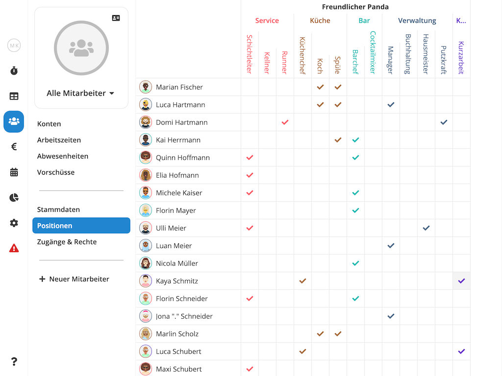
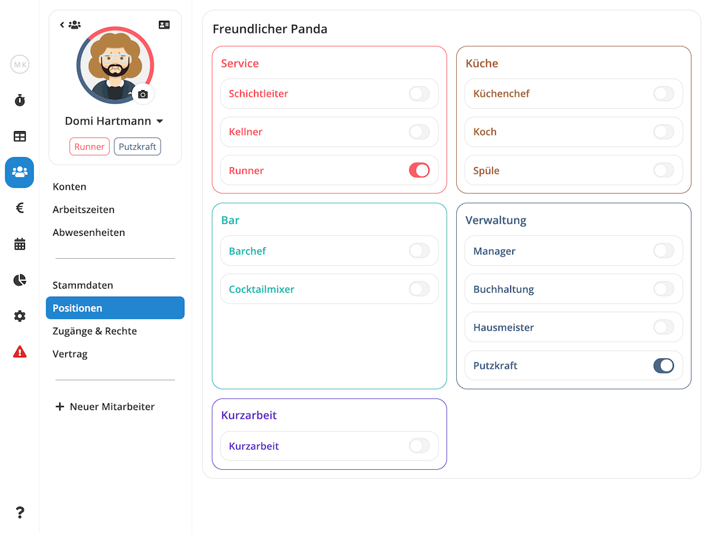

Über die **Positionen** eines Mitarbeiters können Sie festlegen, in welchen
[Arbeitsbereichen](/hilfe/handbuch/einstellungen/arbeitsbereiche/) die Person eingesetzt werden kann. Bevor Sie
[Arbeitszeiten](/hilfe/handbuch/mitarbeiter/arbeitszeiten) für einen Mitarbeiter erfassen oder [Dienste
planen](/hilfe/handbuch/dienstplan/) können, muss der Person zunächst mindestens eine Position zugewiesen werden. Sie
können jedem Mitarbeiter beliebig viele Positionen in beliebig vielen Abteilungen und sogar verschiedenen Standorten
zuweisen.

>  **Hinweis:** Bevor Sie mit dem zuweisen von Positionen beginnen, müssen Sie zunächst die
> entsprechenden Arbeitsbereiche definieren. Mehr dazu erfahren Sie im Handbuch unter [Einstellungen /
> Arbeitsbereiche](/hilfe/handbuch/einstellungen/arbeitsbereiche/).

## Positionen Übersicht

Über die **Positionenübersicht** verschaffen Sie sich einen Überblick über die Einsatzgebiete Ihrere Mitarbeiter und
können diese schnell und einfach bearbeiten.

Sie gelangen in die Positionenübersicht, indem Sie im Hauptmenü den Punkt **Mitarbeiter** und dort den Unterpunkt **Positionen** wählen.

<figure caption="Über die Positionen-Übersicht verschaffen Sie sich einen Überblick über die Einsatzgebiete Ihrere Mitarbeiter und können diese schnell und einfach bearbeiten.">

</figure>

## Positionen Einzelansicht

Wenn Sie die Positionen eines bestimmten Mitarbeiters einsehen oder bearbeiten möchten, finden Sie die
Positionen-Einzelansicht einer Person, indem Sie zunächst zur [Positionenübersicht](#positionen-übersicht)
navigieren und dort den gewünschten Mitarbeiter wählen.

<figure caption="In der Positionen-Einzelansicht können Sie die Positionen eines bestimmten Mitarbeiters einsehen oder bearbeiten.">

</figure>

## Positionen Zuweisen

Das Zuweisen von Positionen erfolgt ganz einfach über das An- oder Abwählen der entsprechenden Haken. In der
[Positionenübersicht](#positionen-übersicht) werden Änderungen automatisch gespeichert. In der
[Einzelansicht](#positionen-einzelansicht) müssen Sie jedoch nach dem Wählen der gewünschten Bereiche noch auf  klicken, damit die Änderungen übernommen werden.
