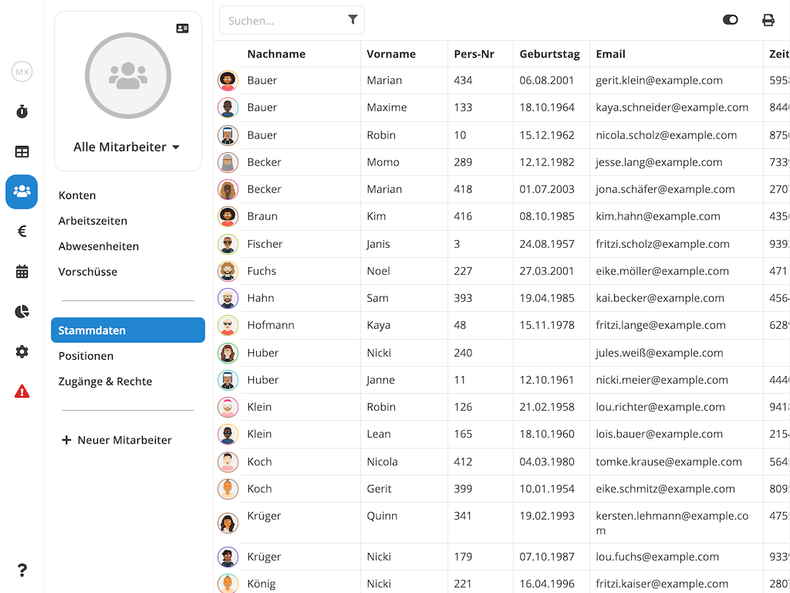
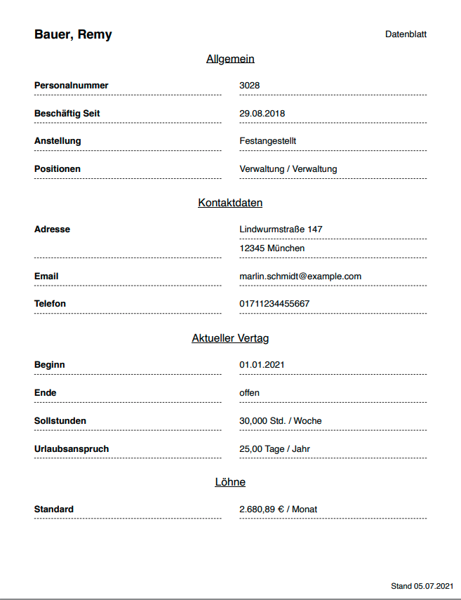

## Stammdaten-Übersicht

Die Stammdaten-Übersicht zeigt die Stammdaten aller Ihrer Mitarbeiter in tabellarischer Form. Um zur
Stammdaten-Übersicht zu gelangen, wählen Sie den Punkt **Mitarbeiter** aus dem Hauptmenü und dort den Unterpunkt
**Stammdaten**.

<figure caption="Die Stammdaten-Übersicht zeigt die Stammdaten aller Ihrer Mitarbeiter in tabellarischer Form.">

</figure>

### Spaltenwahl

Sie interessieren Sich nur für bestimmte Informationen? Über den  Button können Sie einzelne Spalten zur Anzeige an- oder abwählen.

### Stammdaten-Liste Drucken

Über den  Button können Sie die aktuell angezeigte Tabelle drucken.

>  **Tipp:** Ihr Ausdruck passt nicht auf ein DIN-A4 Blatt? Über die [Spaltenwahl](#spaltenwahl)
> können Sie unwichtige Information von der Anzeige ausschließen. Falls dies noch nicht ausreicht, versuchen Sie die
> Druckeinstellungen auf Querformat zu ändern oder die Skalierung zu reduzieren. Die Druckeinstellungen finden Sie für
> gewöhnlich im Druckdialog Ihres Browsers.

## Stammdaten Bearbeiten

Um die Stammdaten eines Mitarbeiters zu bearbeiten, gehen Sie wie folgt vor:

1. Navigieren Sie zur [Stammdaten-Übersicht](#stammdaten-übersicht) und wählen dort den gewünschten Mitarbeiter durch
   einen Klick auf die entsprechende Zeile.
2. Nehmen Sie die gewünschten Änderungen vor.
3. Klicken Sie  am Ihre Änderungen zu übernehmen.

## Mitarbeiter Löschen

So löschen Sie einen Mitarbeiter:

1. Navigieren Sie zur [Stammdaten-Übersicht](#stammdaten-übersicht) und wählen dort den gewünschten Mitarbeiter durch
   einen Klick auf die entsprechende Zeile.
2. Scrollen Sie nach unten, bis Sie den Bereich **Danger Zone** sehen.
3. Klicken Sie auf den Button .

>  **Achtung:** Durch das Löschen eines Mitarbeiters werden nicht nur dessen
> Stammdaten, sondern auch alle erfassten Arbeitszeiten, Abwesenheiten und andere mitarbeiterbezogene Bewegungsdaten
> gelöscht. **Diese Aktion kann nicht rückgängig gemacht werden!** Wenn Sie einen Mitarbeiter als ausgeschieden
> markieren wollen, empfehlen wir, stattdessen das [Vertragsverhältnis zu
> beenden](/hilfe/handbuch/vertrag/#vertrag-beenden).

<figure caption="Das Datenblatt fasst die grundlegenden Informationen eines Mitarbeiters auf einer DIN-A4 Seite zusammen." class="float-right">

</figure>

## Datenblatt Drucken

Das Datenblatt eines Mitarbeiters enthält Informationen wie Name, Addresse und Kontaktdaten, sowie grundlegende
Informationen zum Beschäftigungsverhältnis.

Um das Datenblatt **aller Mitarbeiter** zu drucken, navigieren Sie zunächst zur
[Stammdaten-Übersicht](stammdaten-übersicht) und klicken dann auf den  Button in der rechten oberen Ecke des Mitarbeiter-Untermenüs.

Um das Datenblatt **eines einzelnen Mitarbeiters** zu drucken, navigieren Sie zunächst zur
[Stammdaten-Übersicht](stammdaten-übersicht) und wählen den gewünschten Mitarbeiter. Klicken dann auf den  Button rechts über dem Profilbild (bzw. den Initialen falls kein Profilbild vorhanden).
