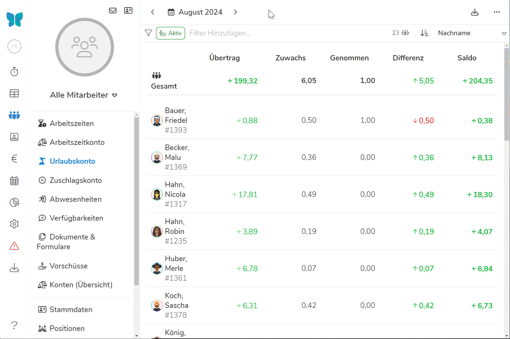
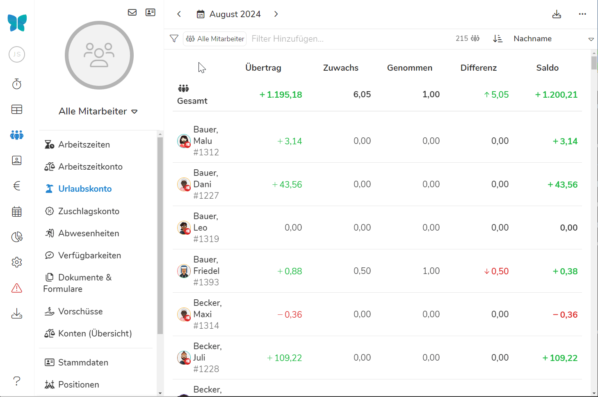
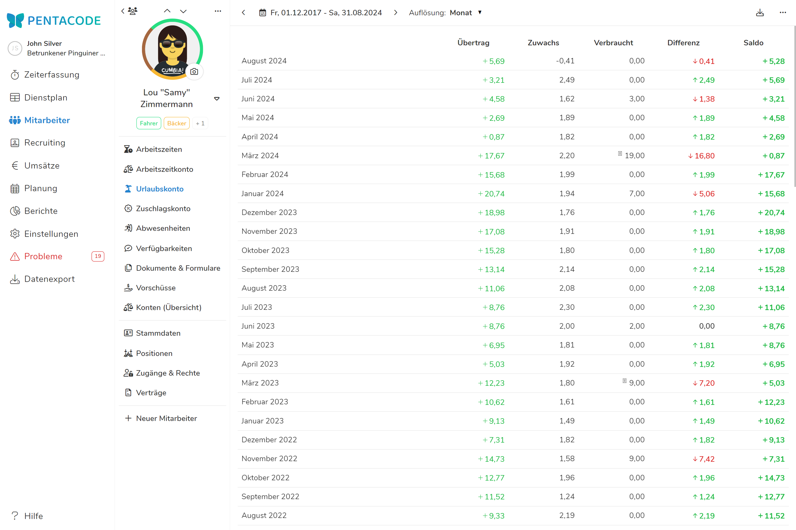

Das Urlaubskonto stellt Urlaubsanspruch und genommene Urlaubstage ihrer Mitarbeiter gegenüber.

Unter [Konten (Übersicht)](/hilfe/handbuch/mitarbeiter/konten/) wird das Urlaubskonto gemeinsam mit dem Zuschlagskonto und Arbeitszeitkonto in einer gemeinsamen Übersicht zusammengefasst. 

Sofern nicht anders erfasst, wird die Urlaubsdifferenz am Ende eines Jahres immer automatisch in das Folgejahr übertragen. Wie Sie diese Überträge bearbeiten können, erfahren Sie unter dem Punkt 'Konten Zurücksetzen'.

## Übersicht

In der Übersicht können Sie die Urlaubstage all ihrer Mitarbeiter über einen selbst gewählten Zeitraum einsehen. Dabei werden fünf Werte im Format Stunden:Minuten angezeigt:

*Übertrag -* sind die Urlaubstage, welche zu Beginn des ausgewählten Zeitraums vom Mitarbeiter angesammelt sind. 

*Zuwachs -* ist der über die [Vertragsbedingungen](/hilfe/handbuch/mitarbeiter/vertrag/) kalkulierten Zuwachs an Urlaubstagen für den Zeitraum. 

*Genommen -* sind die im Zeitraum vom Mitarbeiter bereits genommenen **oder geplanten Urlaubstage**.

*Differenz -* ist der Urlaubsanspruch abzüglich genommenen Urlaubstage im Zeitraum. 

*Saldo -* sind die insgesamt übrigen Urlaubstage.

### Zeitraum wählen

In der Übersicht sehen Sie die Urlaubstage ihrer Mitarbeiter **standardmäßig für den aktuellen Monat**. Sie können jedoch auch **jeden beliebigen Zeitraum** auswählen.

Klicken Sie dazu auf den  Button in der **linken oberen Ecke**. Mit den Pfeiltasten wählen Sie zwischen einzelnen Monaten. 

Dort können Sie auch zwischen ganzen Wochen, Monaten und Jahren auswählen. Durch den linken Kalender kann man zudem einen beliebigen Startzeitpunkt und im Rechten einen beliebigen Endzeitpunkt wählen. Dann wird der Zeitraum dazwischen angezeigt. 





>  Werden zukünftige Monate mit ausgewählt, sind geplante Urlaubstage in den 'Genommenen' Tagen enthalten!

### Nach Mitarbeitern filtern

Wie in anderen Übersichten können Sie auch im Urlaubskonto nach **Positionen, Beschäftigungsverhältnis und einzelnen Mitarbeitern** filtern. Klicken Sie dazu einfach auf die Leiste mit dem  Symbol und wählen aus der Liste die gewünschten Kategorien aus. 

Filter aus der gleichen Klasse (z.B zwei Abteilungen wie 'Küche' und 'Manager') werden additiv verwendet - es werden also Mitarbeiter der Abteilung 'Küche' und der Abteilung Manager 'angezeigt'. Werden Filter aus verschiedenen Klassen verwendet (z.B das Arbeitsverhältnis 'Vollzeit/Teilzeit' und die Abteilung 'Küche') werden sie exklusiv verwendet - es werden nur Mitarbeiter aus der Abteilung Küche mit dem Arbeitsverhältnis 'Vollzeit/Teilzeit' aufgelistet.





## Einzelansicht

Klicken Sie auf einen Mitarbeiter in der Übersicht, erreichen Sie dessen Einzelansicht. Sie können auf [gleiche Weise wie in der Übersicht](#zeitraum-wählen) auch hier den Zeitraum wählen für den Urlaubsanspruch- und Tage angezeigt werden. 

Mit der Einstellung **'Auflösung'** neben dem Kalender können Sie einstellen ob der gewählte Zeitraum in Wochen, Monats oder Jahresblöcke geteilt wird. 





## Übertrag Bearbeiten / Konten Zurücksetzen

Solange Sie der Software keine abweichenden Anweisungen geben, führt Pentacode
die Konten eines Mitarbeiters über den gesamten Zeitraum des
Beschäftigungsverhältnis saldierend fort. Das Urlaubskonto eines Jahres wird
immer automatisch in das Folgejahr übertragen.

In vielen Fällen ist es allerdings notwendig, korrigierend in die Saldierung von
Konten einzugreifen, zum Beispiel wenn der Resturlaub eines Mitarbeiters am Ende
des Jahres verfallen soll. Wie der Übertrag der Konten zu bearbeiten ist sehen Sie [hier](/hilfe/handbuch/mitarbeiter/arbeitszeitkonto/#übertrag-bearbeiten-%2F-konten-zurücksetzen).
