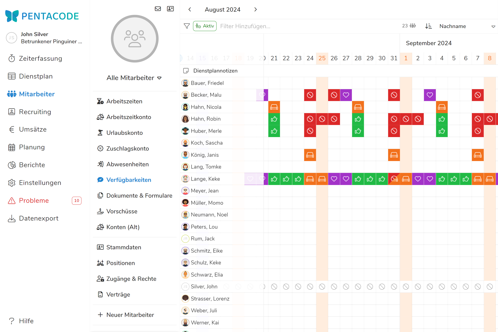
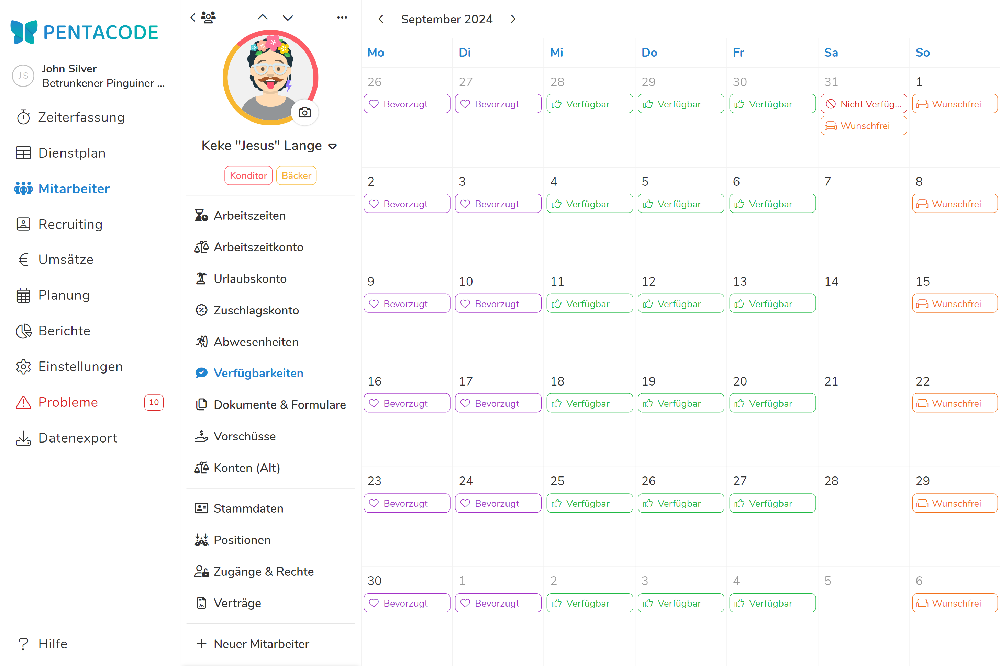
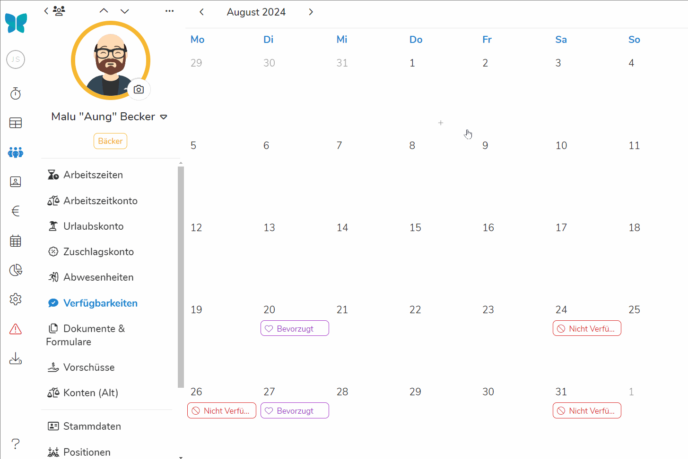

Das Planen von Arbeitszeiten kann eine enorm komplizierte Aufgabe sein, gerade in Betrieben mit volatilen Arbeitszeiten
und vielen Aushilfs- und Teilzeitkräften. Es reicht meist nicht zu wissen, wann wie viele Arbeitskräfte benötigt werden ‒
für eine effektive Dienstplanung ist es außerdem hilfreich (oder gar zwingend notwendig!), die Verfügbarkeiten und
Präferenzen Ihrer Mitarbeiter zu kennen.

Mit Pentacode können Sie schnell und bequem erfassen, welche Tage und Uhrzeiten von Ihren Mitarbeitern bevorzugt werden,
welche Mitarbeiter an bestimmten Tagen nicht arbeiten können, wer eventuell an manchen Tagen früher gehen muss und vieles
mehr! Die gespeicherten Informationen werden dann automatisch im Dienstplan angezeigt und dienen Ihnen dort als intuitive
und leicht zugängliche Planungshilfe.

>  **Tipp:** Über die Pentacode [Mitarbeiter-App](/hilfe/handbuch/mitarbeiter-app)
> können Mitarbeiter Ihre Verfügbarkeiten selbst erfassen!

Pentacode stellt Ihnen vier verschiedene Arten von Verfügbarkeiten zur Verfügung:

-  **Verfügbar**
-  **Nicht Verfügbar**
-  **Bevorzugt**
-  **Wunschfrei**

Verfügbarkeiten dienen lediglich als Hinweis für die Dienstplanung und können jederzeit ausgeblendet oder ignoriert
werden. Ob sie Verfügbarkeiten selbst erfassen oder Ihre Mitarbeiter diese über die Pentacode
[Mitarbeiter-App](/hilfe/handbuch/mitarbeiter-app) eingeben, sie behalten immer das letzte Wort.

## Übersicht

In der Verfügbarkeiten-Übersicht sehen Sie die Verfügbarkeiten aller Ihrer Mitarbeiter auf einen Blick.

Sie gelangen in die Verfügbarkeiten-Übersicht, indem Sie im Hauptmenü den Punkt **Mitarbeiter** und dort den Unterpunkt
**Verfügbarkeiten** wählen.

>  **Tipp:** Möchten Sie nur die Verfügbarkeiten einer bestimmten Abteilung sehen? Über das
> -Symbol in der linken oberen Ecke können Sie die Anzeige auf Mitarbeiter aus einer oder mehrerer
> bestimmter Abteilungen beschränken.





## Einzelansicht

Über die Verfügbarkeiten-Einzelansicht können Sie die Verfügbarkeiten eines einzelnen Mitarbeiters einsehen und bearbeiten.

Um in die Verfügbarkeiten-Einzelansicht eines Mitarbeiters zu gelangen, navigieren Sie zunächst zur [Verfügbarkeiten-Übersicht](#übersicht) und wählen dort den gewünschten Mitarbeiter.





## Verfügbarkeit Erfassen

So funktioniert das **Erfassen einer neuen Verfügbarkeit**:

1. **In der [Übersicht](#übersicht):** Klicken Sie auf das Kästchen, dass dem gewünschten
   Mitarbeiter und Tag der Verfügbarkeit entspricht.

   **In der [Einzelansicht](#einzelansicht):** Klicken Sie auf den gewünschten Tag.

2. Wählen Sie, ob die Verfügbarkeit einmalig, wöchentlich, monatlich oder jährlich gelten soll.
3. Wählen Sie die Art der Verfügbarkeit.
4. Falls die Verfügbarkeit nur für einen bestimmten Zeitraum gelten soll, deaktivieren Sie den Button  und geben Sie den entsprechenden Zeitraum ein. Sie können das **von** oder das **bis**
   Feld leer lassen, um eine Verfügbarkeit **bis** bzw. **ab** einer bestimmten Zeit des Tages einzutragen.
5. Klicken Sie auf  um die Verfügbarkeit **übernehmen** oder
    um sie zu **verwerfen**.





## Verfügbarkeit Bearbeiten

Um eine Verfügbarkeit zu **bearbeiten** gehen Sie wie folgt vor:

1. **Selektieren** Sie zunächst in der [Übersicht](#übersicht) oder [Einzelansicht](#einzelansicht) die gewünschte
   Verfügbarkeit durch einen Mausklick.
2. Bearbeiten Sie die Verfügbarkeit wie unter dem Punkt [Verfügbarkeit Erfassen](verfügbarkeit-erfassen) beschrieben.
3. Klicken Sie auf  um die Änderungen zu **übernehmen** oder
    um sie zu **verwerfen**.

## Verfügbarkeit Löschen

So **löschen** Sie eine Verfügbarkeit:

1. **Selektieren** Sie zunächst in der [Übersicht](#übersicht) oder [Einzelansicht](#einzelansicht) die gewünschte
   Verfügbarkeit durch einen Mausklick.
2. Im Bearbeitungsdialog, klicken Sie den  Button in der rechten oberen Ecke.
3. **Bestätigen** Sie, dass Sie die Verfügbarkeit löschen möchten.
