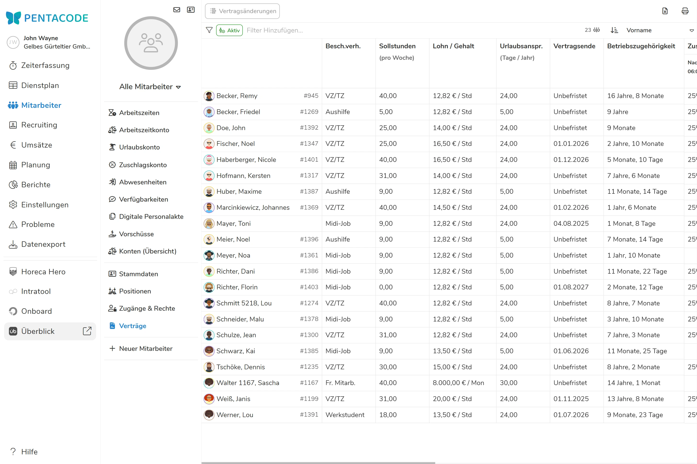
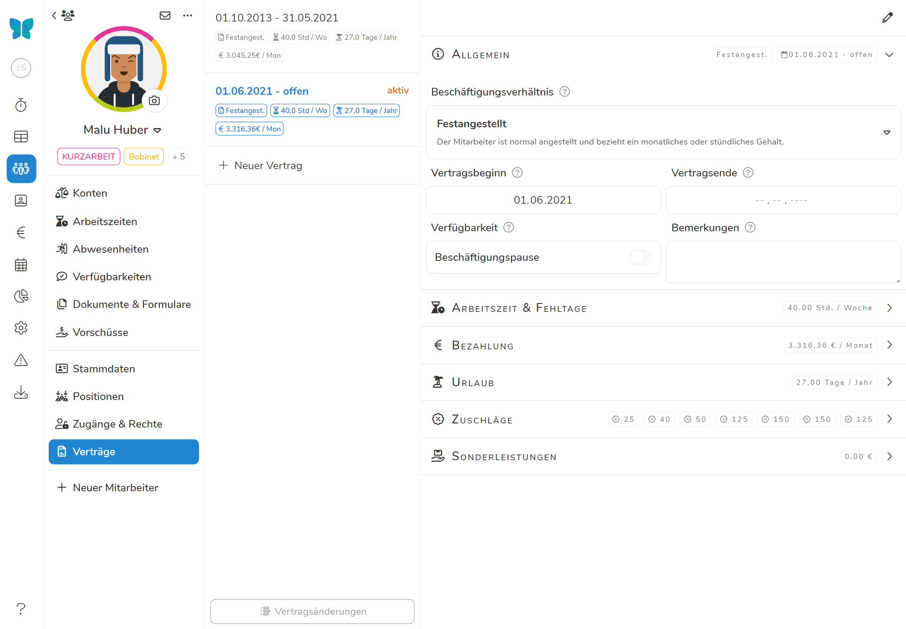
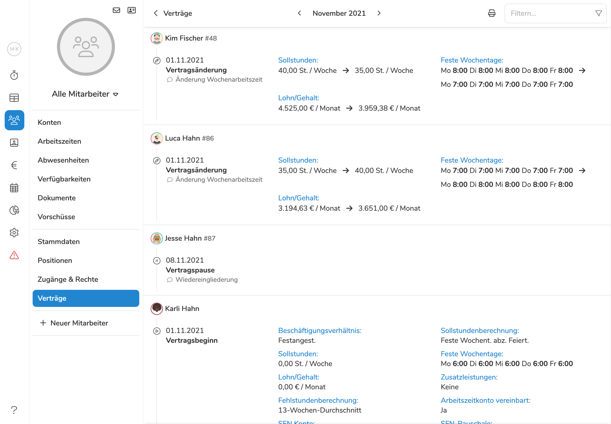
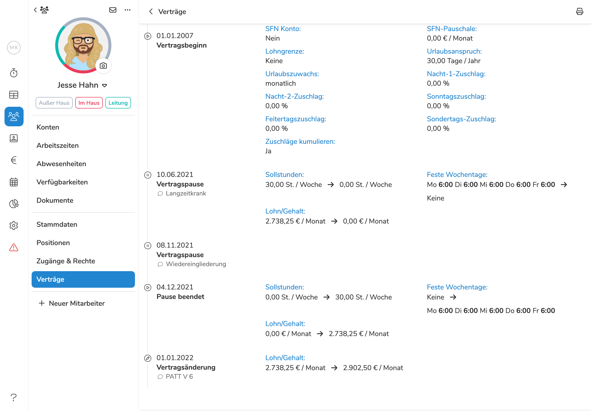

Im Menüpunkt **"Verträge"** verwalten Sie die **arbeitszeit**- und **lohnrelevanten Angaben** Ihrer Mitarbeiter. **Achten Sie hier bitte auf die Richtigkeit und Vollständigkeit der Angaben.**

>  **Die Berechnung aller Konten eines Mitarbeiters, die gesamte Lohnvorbereitung und der Export der Daten beziehen sich auf die hier hinterlegten Daten.**

## Verträge Übersicht

In der Verträge-Übersicht sehen Sie in tabellarischer Form die wichtigsten aktuellen Vertragsdaten Ihrer Mitarbeiter auf
einen Blick. Sie gelangen in die Verträge-Übersicht, indem Sie den Punkt  im Hauptmenü
und dort im Untermenü  wählen.

Über den -Button können Sie diese Ansicht ausdrucken. Das  Eingabefeld in der rechten oberen Ecke gibt Ihnen die Möglichkeit, die Liste
nach Namen, Beschäftigungsverhältnis, Abteilungen etc. zu filtern. Über den  Button gelangen Sie zur [Vertragsänderungen-Übersicht](#vertragsänderungen-übersicht). Ein Klick auf einen einzelne
Mitarbeiter bringt Sie in die [Verträge-Einzelansicht](#verträge-einzelansicht) des Mitarbeiters.





## Verträge Einzelansicht

In der Verträge-Einzelansicht können Sie alle Verträge eines Mitarbeiters einsehen und verwalten. In diese Ansicht
gelangen Sie, indem Sie in der [Verträge-Übersicht](#verträge-übersicht) auf den gewünschten Mitarbeiter klicken.

Um einen bestimmten Vertrag zu öffnen, klicken Sie einfach auf den entsprechenden Eintrag auf der linken Seite. Über den
 kommen Sie in die [Vertragsänderungen-Ansicht](#vertragsänderungen-einzelansicht) des
Mitarbeiters.





## Allgemein

### Beschäftigungsverhältnis

Wählen Sie die Art des Beschäftigungsverhältnisses durch Anklicken des betreffenden Feldes.

Die Überwachung von Lohngrenzen, die Meldung bestimmter Probleme und der Export der Daten in die Lohnbuchhaltung beziehen sich auf das gewählte Beschäftigungsverhältnis.

### Vertragsbeginn und -ende

Geben Sie bei **Vertragsbeginn** das Datum ein, zu dem das Beschäftigungsverhältnis des Mitarbeiters in Ihrem Unternehmen begonnen hat.

Unter **Vertragsende** ist das Datum einzusetzen, zu dem das Beschäftigungsverhältnis endet. Lassen Sie diese Feld leer, um einen unbefristeten Vertrag zu erfassen.

### Bemerkungen

**Bemerkungen** bezeichnet einen Textbereich, in den Sie **Notizen** zum Mitarbeiter hinzufügen können.

### Verfügbarkeit

Wenn Sie den Button bei "**Beschäftigungspause**" setzen, bleibt der Mitarbeiter **im Dienstplan sichtbar**, kann jedoch **nicht geplant** werden. Die Beschäftigungspause **unterbricht** jedoch **nicht** die Fortberechnung der verschiedenen Konten eines Mitarbeiters.

## Arbeitszeit & Fehltage

### Sollstundenberechnung

Für die Berechnung der **Sollarbeitszeit** eines Mitarbeiters stehen Ihnen 5 unterschiedliche Modi zur Wahl.

#### Wochenfaktor

Bei der Wahl "**Wochenfaktor**" erscheint das Eingabefeld **Wochenstunden**.

Geben Sie hier die Anzahl der **Wochenstunden** ein, die ein Mitarbeiter laut Arbeitsvertrag zu leisten hat.

Die Soll-Arbeitszeit des Mitarbeiters errechnet Pentacode automatisch. Die Anzahl der Wochenstunden wird mit dem Faktor 4,35 multipliziert .

Die monatliche Soll-Arbeitszeit bei einem Festangestellten mit einer 40-Stunden Woche beträgt somit 40 x 4,35 = 174 Stunden pro Monat. **Diese Stundenanzahl gilt gleichbleibend für jeden Monat**.

#### Monatsgenau

Bei der Wahl "**Monatsgenau**" erscheint das Eingabefeld **Wochenstunden**.

Geben Sie hier die Anzahl der **Wochenstunden** ein, die ein Mitarbeiter laut Arbeitsvertrag zu leisten hat.

Bei dieser Auswahl errechnet sich die **Soll-Arbeitszeit** des Mitarbeiters anhand der **Länge eines Monats**. Sie schwankt somit von Monat zu Monat.

Um einen Festangestellten mit einer 40-Stunden Woche als Beispiel zu nehmen: Dessen monatliche Soll-Arbeitszeit liegt in einem Monat mit 30 Tagen bei 171,43 Stunden, in einem Monat mit 31 Tagen bei 177,14 Stunden und im Februar (sofern kein Schaltjahr) bei 160 Stunden.

#### Monatsgenau abzgl. Feiertage

Eingabe und Berechnung der monatlichen Soll-Arbeitszeit entsprechen "**Monatsgenau**".

Bei dieser Auswahl errechnet sich die Soll-Arbeitszeit des Mitarbeiters anhand der Länge eines Monats. Sie schwankt somit von Monat zu Monat.

Pentacode kennt die **gesetzlichen Feiertage** des Bundeslands, in dem sich Ihr Unternehmen oder die betreffende Filiale Ihres Unternehmens befindet. Fällt in einem Monat ein gesetzlicher **Feiertag** auf einen **Wochentag**, so wird die monatliche **Soll-Arbeitszeit** um den Feiertag **gekürzt**.

#### Feste Wochentage

Bei der Wahl "Feste Wochentage" erscheinen Eingabefelder zu den **sieben Wochentagen**.

Geben Sie hier die Stunden ein, die ein Mitarbeiter an den betreffenden Tagen arbeiten soll. Diese Auswahl ist im Besonderen zu empfehlen, wenn ein Mitarbeiter **feste Arbeitstage** hat und diese in ihrer Länge auch noch voneinander abweichen. Dies trifft häufig für Mitarbeiter in der Verwaltung zu, bei denen z.B. der Freitag ein verkürzter Arbeitstag ist.

Die **Soll-Arbeitszeit** des Mitarbeiters errechnet sich über die **Häufigkeit**, in der ein bestimmter Wochentag in einem Monat auftritt.

Bei tagesabhängig unterschiedlichen Arbeitszeiten hat diese Art der Berechnung Wirkung bei Krankheit und Urlaub. Wird z.B. ein Mitarbeiter, der am Freitag nur 4 Stunden arbeitet, an einem Freitag krank oder nimmt an diesem Tag Urlaub, so werden für sein Arbeitszeitkonto wie auch für die Lohnabrechnung nur 4 Stunden berechnet.

#### Feste Wochentage abzgl. Feiertage

Eingabe und Berechnung der monatlichen Soll-Arbeitszeit entsprechen "Feste Wochentage".

Bei diesem Modus wird jedoch ein **Feiertag**, der auf einen Arbeitstag des Mitarbeiters fällt, von seiner **Soll-Arbeitszeit** in **Abzug** gebracht. Hierbei wird **Tag-genau unterschieden**.

Fällt ein Feiertag z.B. auf einen Freitag, an dem der Mitarbeiter nur 4 Stunden arbeitet, so werden auch nur 4 Stunden berechnet.

### Fehlstundenberechnung

Hier können Sie einstellen, wie die Fehlstunden für Urlaubs- und Krankheitstage berechnet werden, dabei haben Sie drei verschiedene Möglichkeiten:

#### 13-Wochen Durchschnitt

Bei dieser Einstellung errechnet Pentacode den **Wert eines Urlaub- oder Kranktages** an der Arbeitszeit, die der Mitarbeiter im **Durchschnitt der letzten 13 Wochen** gearbeitet hat.

Sollte der Mitarbeiter sozialversicherungsfreie Zuschläge erhalten, werden auch die Zuschläge errechnet, die er im Durchschnitt der letzten 13 Wochen erhalten hat. Da diese Zuschläge im Lohnfortzahlungsfall beitragspflichtig abzurechnen sind, werden sie auch getrennt als beitragspflichtige Zuschläge ausgewiesen.

Pentacode unterscheidet bei der Berechnung zwischen Wochen-, Sonn und Feiertagen. Dies hat zur Folge, dass bei einem Krank- oder Urlaubstag, der auf einen Wochentag fällt, keine Sonn- oder Feiertagszuschläge hinzugerechnet werden. Diese wären ansonsten beitragspflichtig abzurechnen.

#### Pauschale Stundenzahl

Wenn Sie "**Pauschale Stundenzahl**" wählen erscheint ein **Eingabefeld**, in das Sie die Anzahl der **Arbeitsstunden** eingeben, die der Mitarbeiter **täglich** leisten soll. Bei einem Mitarbeiter mit 40-Stunden-Woche und 5 Arbeitstagen wären das z.B. 8 Stunden.

Bei dieser Einstellung wird jeder Tag, an dem der Mitarbeiter als Krank oder in Urlaub im Dienstplan eingetragen ist, mit 8 Stunden bewertet. Dies gilt sowohl für die Berechnung im Arbeitszeitkonto wie auch für die Lohnfortzahlung in der Buchhaltung.

>  **Hinweis:** Wenn Sie mit Pentacode beginnen, ist es empfehlenswert, in den **ersten drei Monaten** mit der Einstellung "**Pauschale Stundenzahl**" zu beginnen. Die Einstellung "13-Wochenschnitt" ist zu Beginn ungeeignet, da in den ersten Wochen der Zeitraum, auf den Pentacode zurückgreifen kann, zu kurz ist, um einen verlässlichen Durchschnitt zu errechnen.
>
> **Eventuell merken Sie sich ein Datum vor, zu dem Sie diese Einstellung auf** "**13-Wochenschnitt**" **verändern wollen**.

#### Feste Wochentage (Sollstunden)

Diese Einstellung eignet sich **nur, wenn Sie die Sollstunden anhand fester Wochentage bestimmen!** Es werden anschließend nur Fehlstunden berechnet, an den Tagen, für die eine Sollstundenzahl eingetragen ist, und dann immer die Anzahl der Stunden des jeweiligen Wochentags. 

### Jahresarbeitszeitkonto

Pentacode überwacht die Einhaltung des gesetzlichen Mindestlohns. Eine versehentliche Unterschreitung des Mindestlohns
könnte eintreten, wenn z.B. ein Mitarbeiter mit Festlohn Überstunden leistet. Sein Festlohn geteilt durch die Anzahl der
Arbeitsstunden im betreffenden Monat kann einen Stundenlohn ergeben, der unter dem gesetzlichen Mindestlohn liegt.

In diesem Fall erhalten Sie in Pentacode eine [Problem Meldung](/hilfe/handbuch/probleme/).

Dieses Problem können Sie vermeiden, indem Sie mit dem Mitarbeiter die Führung
eines **Jahresarbeitszeitkontos** vereinbaren.

Setzen Sie in diesem Fall den Button bei "**Jahresarbeitszeitkonto Vereinbart**".

Über- und Minderstunden werden in Pentacode grundsätzlich und für alle Mitarbeiter (also selbst bei Aushilfen) saldiert
und in den einzelnen Jahresarbeitszeitkonten in die Zukunft vorgetragen.

>  **Rechtswirksam wird ein
> Jahresarbeitszeitkonto jedoch erst, wenn dessen Führung mit dem Mitarbeiter
> schriftlich vereinbart ist.** Sollte dies bei Ihnen noch nicht der Fall sein,
> so senden wir Ihnen gerne eine entsprechende Vereinbarung als Ergänzung zum bestehenden Arbeitsvertrag zu. Wenden Sie sich hierzu einfach an unseren Support.

## Bezahlung

### Lohn/Gehalt (brutto)

Geben Sie unter **"Alle Arbeitsbereiche"** das Standardgehalt des Mitarbeiters ein.

Wird ein Mitarbeiter **nach Stunden** bezahlt, wählen Sie im Dropdown-Menü **Pro
Stunde**, handelt es sich um einen **festen Monatslohn**, wählen Sie **Monatlich**.

#### Provision

Wenn ein Mitarbeiter **Umsatzprovision** erhält, geben Sie unter Provision den Prozentsatz ein. **Voraussetzung** für die Berechnung der Provision ist die **Erfassung** des individuellen **Umsatzes** im Hauptmenüpunkt "[**Zeiterfassung**](/hilfe/handbuch/zeiterfassung/tagesuebersicht/#provision)".

#### Ein Mitarbeiter - mehrere Löhne

Wenn Sie Mitarbeiter haben, die in verschiedenen Abteilungen bei unterschiedlichen Löhnen arbeiten, kann dies in Pentacode automatisch berücksichtigt werden.

Wählen Sie in diesem Fall beim betreffenden Mitarbeiter unter **"+ Gehalt hinzufügen"** die entsprechende Abteilungen hinzu und weisen Sie dieser den jeweiligen Lohn zu. Die jeweils gearbeiteten Stunden werden getrennt ausgewiesen und unterscheidbar exportiert.

>  **Achtung:** Für die Ermittlung des Lohns im
> Falle der **Lohnfortzahlung** bei Krank und Urlaub wird grundsätzlich der Lohn
> herangezogen, den sie unter **"Alle Arbeitsbereiche"** angelegt haben.

### Lohnarten

Lohnarten werden dem Mitarbeiter normalerweise über sein
[Beschäftigungsverhältnis](#beschäftigungsverhältnis) zugeordnet. Sie können
diese in den Einstellungen unter
[Buchhaltung](/hilfe/handbuch/einstellungen/buchhaltung/index.md/#lohnarten)
bearbeiten. 

## Urlaub

### Urlaubsanspruch

Geben Sie bei "**Urlaubsanspruch (pro Jahr)**" die vereinbarte Anzahl der Urlaubstage/Jahr ein, die mit dem Mitarbeiter vereinbart sind.

### Urlaubszuwachs

Der Urlaubsanspruch definiert den Gesamtanspruch eines Mitarbeiters auf ein komplettes Jahr. Für die forlaufende Saldierung des [Urlaubskontos](/hilfe/handbuch/mitarbeiter/konten#urlaubskonto) muss allerdings noch definiert werden, wie sich der monatliche Urlaubszuwachs aus dem Gesamtanspruch ergibt. Pentacode bietet Ihnen hier zwei Möglichkeiten.

- *Monatlich* Wählen Sie "**Monatlich**", steht dem Mitarbeiter sein monatlicher Urlaubsanspruch zu **Beginn** eines Monats zu.
   Scheidet der Mitarbeiter während eines Monats aus, wird der Urlaubsanspruch, der im Monat des Ausscheidens entstanden ist, in Abhängigkeit von seinen Arbeitsstunden prozentual errechnet.

- *Nach Arbeitsstunden* Der Urlaubsanspruch wird während eines Monats **fortlaufend auf Basis der gearbeiteten Stunden** berechnet. 

## Zuschläge

Hier werden Ihnen die Zuschlagsarten angezeigt, die dem Mitarbeiter angerechnet werden. 

### Zuschlag hinzufügen

Klicken Sie auf  um dem Mitarbeiter eine neue Zuschlagsart zuzuweisen. Wählen Sie den gewünschten Zuschlag aus und tragen Sie die **Positionen des Mitarbeiters ein, die vom Zuschlag betroffen sein sollen, sowie die Höhe des Zuschlags in Prozent des Grundlohns**. Standardmäßig werden **Alle Positionen** und der Standardsatz der Zuschlagsart ausgewählt. 

[Hier](/hilfe/handbuch/einstellungen/zuschläge/) erfahren Sie, wie Sie Zuschlagsarten erstellen und modifizieren. 

#### Kumulierte Zuschläge

Standardmäßig können Sonn- und Feiertagszuschläge mit den Nachtzuschlägen **kumuliert** werden. Dies heißt, dass der Mitarbeiter an Sonn- und Feiertagen auch Nachtzuschläge erhält - statt nur eine der beiden Zuschlagszahlungen. Sollte die Kumulierung gewünscht sein **können Sie die Zuschlagsarten 'Sonntag Kum.' und 'Feiertag Kum.' hinzufügen**.

### Monatliche SFN-Pauschale

Sollten Sie **Zuschläge pauschal im Voraus** bezahlen, so aktivieren Sie den Button bei "**... bezahlen**" und geben Sie im erscheinenden Eingabefeld, die Höhe der monatlichen Pauschalvorauszahlung ein.

Im Konto "[SFN-Zuschläge](/hilfe/handbuch/mitarbeiter/konten/)" werden die Vorauszahlungen mit den Zuschlägen in €, die laut Arbeitszeiterfassung entstanden sind, monatlich abgeglichen und fortlaufend saldiert.

> Eine unterjährige Überzahlung ist sozialversicherungs- und lohnsteuerrechtlich nicht von Bedeutung. Für die korrekte Behandlung der am Jahresende saldierten Über- oder Unterzahlung von Zuschlägen setzen Sie sich bitte mit Ihrem Steuerberater oder Ihrer Lohnbuchhaltung in Verbindung.

## Sonderleistungen

Wenn Sie einem Mitarbeiter über das Gehalt hinaus noch Zusatzleistungen zukommen lassen, z.B. Kindergartenzuschuss, Fahrtgeld, Messergeld u.a.m., können Sie diese hier vermerken.

Wenn Sie auf das Feld "**+ Sonderleistung hinzufügen**" klicken, öffnet sich die Liste an zuvor erstellten [Arten von Sonderleistungen](/hilfe/handbuch/einstellungen/sonderleistungen). Wählen Sie die gewünschte Art der Leistung aus und **tragen den monatlichen Geldbetrag der Leistung ein**. 

Die Sonderleistungen werden der Lohnanbrechnung des Mitarbeiters nun monatlich und unter den unter [Einstellungen](/hilfe/handbuch/einstellungen/sonderleistungen) beschriebenen Voreinstellungen hinzugefügt.  

## Neuer Vertrag

Bei fast jedem Mitarbeiter, der längere Zeit in einem Unternehmen arbeitet, werden früher oder später
Arbeitskonditionen neu verhandelt oder aus anderen Gründen angepasst. Diese Änderungen bilden Sie
in Pentacode ab, indem Sie einen neuen Vertrag anlegen:

1. Navigieren Sie zur [Verträge-Ansicht](#verträge-einzelansicht) des Mitarbeiters.
2. Klicken Sie auf .
3. Es öffnet sich das Vertragsformular, vorausgefüllt mit den Werten des vorherigen Vertrages. Nehmen Sie die gewünschten Änderungen vor und klicken Sie dann auf . Durch einen Klick auf  werden die Änderungen verworfen. Eine Erklärung der einzelnen Felder sowie deren Auswirkungen finden Sie [weiter oben in diesem Hilfsartikel](#icon-info-circle--allgemein). 

>  Das Enddatum des vorherigen Vertrages wird automatisch auf den Vertragsbeginn des neuen Vertrages gesetzt.

## Vertrag Bearbeiten

Als alternative zum Erstellen eines neuen Vertrages können Sie außerdem einen bestehenden Vertrag bearbeiten.

>  **Achtung:** Änderungen an bestehenden Verträgen wirken sich rückwirkend
> auf alle **arbeitszeit- und lohnrelevanten Werte** innerhalb des Vertragszeitraums aus, welche in der Folge
> neu berechnet werden. Änderungen an bestehenden Verträgen sollten deshalb nur in Ausnahmefällen vorgenommen werden.
> **Bei regulären Vertragsänderungen, also Änderungen die erst ab einem bestimmten Zeitpunkt (gewöhnlich in der Gegenwart
> oder Zukunft) greifen sollen, ohne die Konditionen für die vorherigen Zeiträume zu ändern, empfehlen wir, einen [Neuen
> Vertrag](#neuer-vertrag) anzulegen**.

So nehmen Sie Änderungen an einem bestehenden Vertrag vor:

1. Navigieren Sie zur [Verträge-Ansicht](#verträge-einzelansicht) des Mitarbeiters.
2. Wählen Sie den gewünschten Vertrag aus der Liste der existierenden Verträge.
3. Öffnen Sie das Bearbeitungs-Menü durch einen Klick auf den -Button in der rechten
   oberen Ecke.
4. Wählen Sie den Punkt  und bestätigen Sie die Aktion indem
   Sie auf  klicken.
5. Nehmen Sie die gewünschten Änderungen vor und klicken Sie dann auf . Durch einen Klick
   auf  werden die Änderungen verworfen. Eine Erklärung der einzelnen Felder sowie deren
   Auswirkungen finden Sie unter [Felder & Eigenschaften](#felder--eigenschaften).

## Vertragsunterbrechung

Die Funktion **Vertragsunterbrechung** ist ein hilfreiches Feature, um das **vorübergehende Aussetzen** eines bestehenden
Vertragsverhältnisses über einen **bestimmten Zeitraum** abzubilden. Typische Gründe für eine Vertragsunterbrechung sind
z.B. Elternzeit, unbezahlter Urlaub oder eine längere Krankheit. Während des Zeitraums der Aussetzung sind die
Arbeitskonten des Mitarbeiters "eingefroren" und die **Berechnung der "Sollarbeitszeit" wird ausgesetzt**.

Das Erstellen einer Vertragsunterbrechung funktioniert wie folgt:

1. Navigieren Sie zur [Verträge-Ansicht](#verträge-einzelansicht) des Mitarbeiters.
2. Wählen Sie den gewünschten Vertrag aus der Liste der existierenden Verträge.
3. Öffnen Sie das Bearbeitungs-Menü durch einen Klick auf den -Button in der rechten
   oberen Ecke.
4. Wählen Sie den Punkt  und bestätigen Sie die Aktion indem
   Sie auf  klicken.
5. Es öffnet sich ein Dialog, in dem Sie folgenden Angaben tätigen müssen:
   - Der **Zeitraum** der Unterbrechung. Dieser muss innerhalb des Vertragszeitraums des gewählten Vertrages liegen.
   - Der **Grund** der Unterbrechung. Dieser dient vor allem für Anzeigezwecke und für die interne Dokumentation.
   - Ob der **Urlaubsanspruch** trotz Vertragsunterbrechung weiter anwachsen soll (zum Beispiel bei längerer Krankheit).
   - Ob eventuelle **SFN-Pauschalen** im Zeitraum der Vertragsunterbrechung anteilig gekürzt werden soll.
6. Klicken Sie auf  um den Vorgang abzuschließen.

## Änderungsprotokoll

Gerade bei Unternehmen mit vielen Mitarbeitern kann es schnell sehr schwierig werden, einen Überblick über alle
vorgenommenen Vertragsänderungen zu behalten. Vor allem ist es aber von essentieller Bedeutung, Vertragsänderungen
mit Ihrem Lohnbüro oder Steuerberater abzugleichen. Das **Vertragsänderungs-Protokoll** schafft hier Abhilfe! Dieses
kommt in zwei Ausführungen:

### Vertragsänderungen-Übersicht

In der Vertragsänderungen-Übersicht sehen Sie die Vertragsänderungen aller Ihrer Mitarbeiter, die in einem bestimmten
Monat vorgenommen wurden. Um in die Vertragsänderungen-Übersicht zu gelangen, navigieren Sie zunächst zur [Verträge-Übersicht](#verträge-übersicht)
und klicken Sie dort den -Button in der linken oberen Ecke.

Über den -Button können Sie diese Ansicht ausdrucken. Das  Eingabefeld in der rechten oberen Ecke gibt Ihnen die Möglichkeit, die Liste
nach Namen, Beschäftigungsverhältnis, Abteilungen etc. zu filtern. Über den  Button gelangen Sie zurück zur [Verträge-Übersicht](#verträge-übersicht). Ein Klick auf einen einzelnen
Mitarbeiter bringt Sie in die [Vertragsänderungen-Einzelansicht](#vertragsänderungen-einzelansicht) des Mitarbeiters.
Außerdem können Sie über die Pfeiltasten und das Monats-Dropdown in der Kopfleiste den Zeitraum wechseln.





### Vertragsänderungen-Einzelansicht

Die Vertragsänderungen-Einzelansicht zeigt Ihnen alle Vertragsänderungen eines bestimmten Mitarbeiters auf einen Blick.
Um in diese Ansicht zu gelangen, navigieren Sie zunächst zur [Verträge-Einzelansicht](#verträge-einzelansicht) des
Mitarbeiters und klicken Sie dort den -Button in der
linken unteren Ecke.

Über den -Button können Sie diese Ansicht ausdrucken. Über den  Button gelangen Sie zurück zur [Verträge-Einzelansicht](#verträge-einzelansicht).




