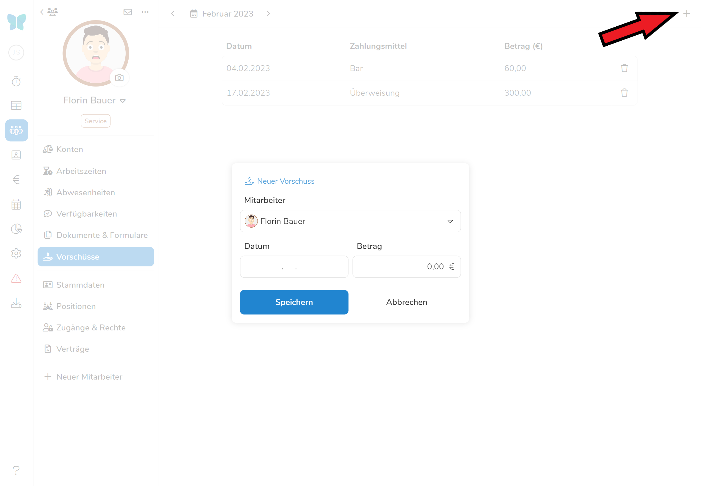

Unter diesem Überpunkt finden Sie eine Auflistung aller Vorschüsse, sowie die Möglichkeit Vorschüsse an Mitarbeiter zu vermerken. Dabei unterscheidet sich das Vorgehen je nachdem, ob es sich um **bare oder unbare Vorschüsse handelt**. 

> Die automatische Erfassung und Listung von Bar-Vorschüssen setzt voraus, dass Sie entweder eine **Tagesabrechnung** in Pentacode durchführen oder aber das **Kassenbuch** führen. Ist dies der Fall, entsteht selbständig eine **Liste der ausgezahlten Vorschüsse**. **Unbare Vorschüsse** können auch ohne Kassenbuchführung über Pentacode verbucht werden. 

## Vorschussliste

Mitarbeiter, die **Vorschüsse** erhalten haben, sind alphabetisch nach Nachnamen gelistet.
Bei Mitarbeitern, die mehrere Vorschüsse erhalten haben, sind sowohl die Einzelzahlungen mit Datumsangabe, als auch die Gesamtsumme ausgewiesen.

### Vorschussliste filtern

Durch die Filteroptionen im oberen Bereich der Übersicht können Sie die Übersicht nach **Zeiträumen und Abteilungen** sortieren. 





> Sie müssen nicht durch die Filteroptionen scrollen, wenn Sie wissen, was Sie suchen! Geben Sie den Namen einer Abteilung in die Filterleiste ein, um diese schneller zu finden. 

## Barvorschüsse

Barvorschüsse werden in der Vorschussliste aufgeführt - können aber nicht direkt hier bearbeitet werden. Da Barvorschüsse aus der Tageskasse gezahlt werden, **können diese nur in der [Tagesabrechnung](/hilfe/handbuch/umsaetze/tagesabrechnung/) unter  erstellt und bearbeitet werden!**





## Einzelansicht Vorschüsse

Wenn Sie die Vorschüsse eines einzelnen Mitarbeiters genauer betrachten wollen, klicken Sie diesen in der Vorschussliste an und Sie gelangen in die **Einzelansicht**. Von hier aus können Sie auch unbare Vorschüsse hinzufügen oder löschen.

## Unbare Vorschüsse 

Nicht alle Vorschüsse werden aus der Tageskasse entnommen - Pentacode bietet Ihnen auch die Option unbare Vorschüsse zu verbuchen. Diese managen Sie direkt aus der Vorschussliste.

### Unbaren Vorschuss hinzufügen

Um einen neuen unbaren Vorschuss hinzuzufügen klicken Sie auf das  **Symbol** in der Vorschussliste oder Einzelansicht. Wählen Sie anschließend **Datum, Betrag des Vorschusses und den bezuschussten Mitarbeiter aus.** Mit einem Klick auf  fügen Sie den Zuschuss der Liste und der Lohnabrechnung hinzu. 





### Unbare Vorschüsse löschen

Um einen Vorschuss zu löschen, navigieren Sie in die Einzelansicht des Mitarbeiters und klicken auf  neben dem zu löschenden Vorschuss. Ein Klick auf  löscht den Vorschuss endgültig. 

## Drucken

Über das -Symbol können Sie die Vorschussliste, wenn gewünscht auch ausdrucken.




