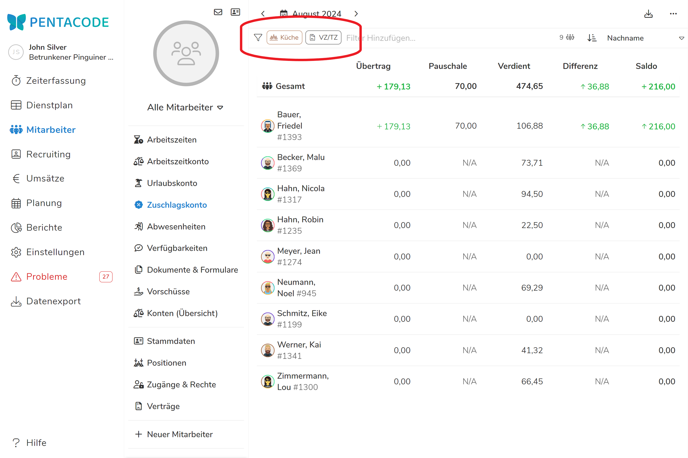

Das Zuschlagskonto stellt die monatlich gezahlte SFN-Pauschale dem tatsächlichen Zuschlagsanspruch entgegen. Sie können auf einen Blick erkennen, ob die Pauschalen angepasst werden müssen. 

Unter [Konten (Übersicht)](/hilfe/handbuch/mitarbeiter/konten/) wird das Zuschlagsskonto gemeinsam mit dem Arbeitszeitkonto und Urlaubskonto in einer gemeinsamen Übersicht zusammengefasst. 

Warum und Wie wir Zuschläge nutzen, um unsere Personalkosten effektiv zu reduzieren, erklären wir [hier](/blog/zuschläge_strategisch_nutzen/). Wie monatliche Pauschalzahlungen diesen Prozess noch einfacher machen, behandeln wir in [diesem Artikel](/blog/pauschale_vorrauszahlungen/).

## Übersicht

In der Übersicht können Sie die SFN-Zuschläge all ihrer Mitarbeiter über einen selbst gewählten Zeitraum einsehen. Dabei werden fünf Werte im Format Stunden:Minuten angezeigt:

*Übertrag -* sind die Zuschlagszahlungen, welche über die Pauschale aus den vorherigen Monaten hinausgingen. 

*Pauschale -* ist die über die [Vertragsbedingungen](/hilfe/handbuch/mitarbeiter/vertrag/) festgelegte monatliche SFN-Pauschale.

*Verdient -* sind die tatsächlich verdienten SFN-Zuschläge.

*Differenz -* sind die verdienten Zuschläge abzüglich der Pauschale

*Saldo -* sind die in diesem Jahr gesamt gesammelten SFN-Zuschläge - bei einem **Saldo von 0 decken sich Pauschale und tatsächliche Zuschläge genau!**

### Zeitraum wählen

In der Übersicht sehen Sie die SFN-Zuschläge ihrer Mitarbeiter **standardmäßig für den aktuellen Monat**. Sie können jedoch auch **jeden beliebigen Zeitraum** auswählen.

Klicken Sie dazu auf den  Button in der **linken oberen Ecke**. Mit den Pfeiltasten wählen Sie zwischen einzelnen Monaten. 

Dort können Sie auch zwischen ganzen Wochen, Monaten und Jahren auswählen. Durch den linken Kalender kann man zudem einen beliebigen Startzeitpunkt und im Rechten einen beliebigen Endzeitpunkt wählen. Dann wird der Zeitraum dazwischen angezeigt. 





>  Werden zukünftige Monate mit ausgewählt, werden geplante Pauschalzahlungen mit berücksichtigt!

### Nach Mitarbeitern filtern

Wie in anderen Übersichten können Sie auch im Zuschlagskonto nach **Positionen, Beschäftigungsverhältnis und einzelnen Mitarbeitern** filtern. Klicken Sie dazu einfach auf die Leiste mit dem  Symbol und wählen aus der Liste die gewünschten Kategorien aus. 

Filter aus der gleichen Klasse (z.B zwei Abteilungen wie 'Küche' und 'Manager') werden additiv verwendet - es werden also Mitarbeiter der Abteilung 'Küche' und der Abteilung Manager 'angezeigt'. Werden Filter aus verschiedenen Klassen verwendet (z.B das Arbeitsverhältnis 'Vollzeit/Teilzeit' und die Abteilung 'Küche') werden sie exklusiv verwendet - es werden nur Mitarbeiter aus der Abteilung Küche mit dem Arbeitsverhältnis 'Vollzeit/Teilzeit' aufgelistet.





## Einzelansicht

Klicken Sie auf einen Mitarbeiter in der Übersicht erreichen Sie dessen Einzelansicht. Sie können auf [gleiche Weise wie in der Übersicht](#zeitraum-wählen) auch hier den Zeitraum wählen, für den Zuschläge angezeigt werden. 

Mit der Einstellung **'Auflösung'** neben dem Kalender können Sie einstellen ob der gewählte Zeitraum in Wochen, Monats oder Jahresblöcke geteilt wird. 
