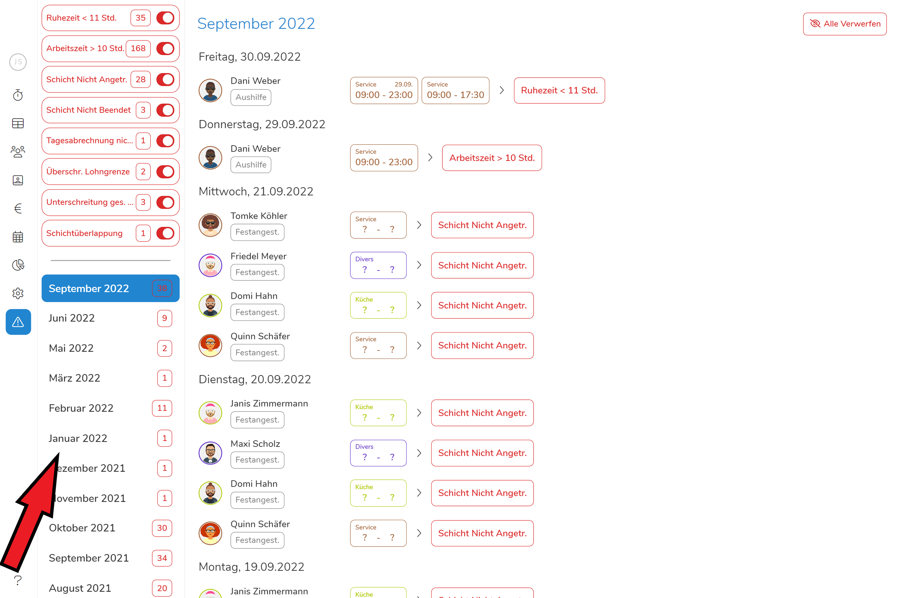
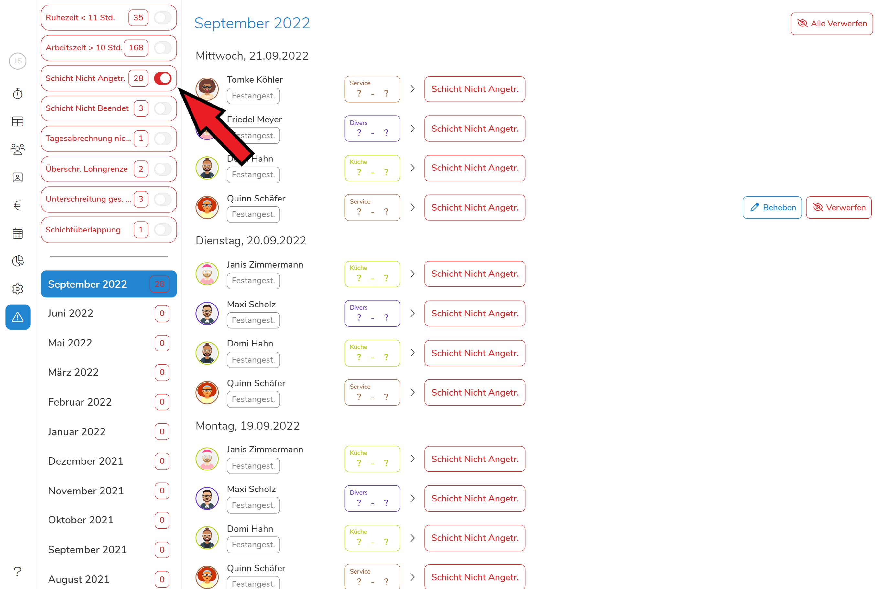
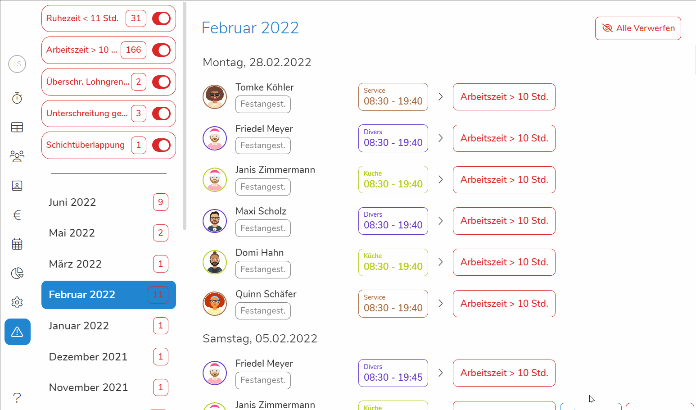

    **"Irren ist menschlich" - und die Fülle gesetzlicher Bestimmungen enorm.**

So gern wir auch auf Anhieb den perfekten
Dienstplan erstellen würden, schnell ist gegen **Arbeitsrichtlinien oder
Vertragsvereinbarungen** verstoßen - früh genug entdeckt ein Aufwendiges, doch im
schlimmsten Fall ein kostspieliges Irren. Um Fehler dieser Art zu vermeiden,
bevor Sie überhaupt entstehen, macht Pentacode Sie auf Probleme aufmerksam, die
während der Dienstplanung aufkommen. So können Sie sich sicher sein, dass Sie **stets im Recht handeln** und vor einer **Prüfung nichts zu befürchten** haben.

## Übersicht nach Monaten

Klicken Sie auf den Reiter  um in die Problemübersicht zu gelangen. Sie werden
anschließend eine **chronologische Auflistung** der von Pentacode erkannten
Problemmeldungen erhalten. Dabei werden die neusten Problemberichte ganz oben
angezeigt, beispielweise von einem gerade erstellten Dienstplan. Sie können
entweder durch scrollen in abgeschlossene Monate gelangen oder den gewünschten Monat
direkt in der linken unteren Ecke auswählen. Eine rot umrahmte Zahl zeigt
Ihnen dabei wie viele Probleme im betroffenen Monat aufgekommen sind. 

<figure>
    
    <figcaption> Wählen Sie den gewünschten Monat in der Liste aus. </figcaption>
</figure>

## Nach Art des Problems filtern

Sie können bestimmen welche Problemberichte Ihnen angezeigt werden, indem Sie
verschiedene "Problemarten" an- und abwählen. Standardmäßig werden Ihnen alle
Probleme angezeigt, um eine Art von Problembericht abzuwählen, klicken Sie diesen
in der oberen rechten Ecke an. 

<figure>
    
    <figcaption>Da alle anderen Problemberichte abgewählt sind werden hier nur *nicht angetretene Schichten* angezeigt.</figcaption>
</figure>

## Problem beheben

Pentacode zeigt Ihnen Probleme, damit Sie diese vorzeigt beheben können. Wenn
Sie mit der Maus über einen der Problemberichte fahren erscheint auf der rechten
Seite der Button . Wenn Sie auf diesen
klicken, bringt Sie Pentacode automatisch zum Ursprung des Problems. 

<figure>
    
    <figcaption> Klicken Sie auf **Beheben** um dem Ursprung eines Problems auf die Schliche zu kommen. </figcaption>
</figure>

## Problembericht verwerfen

Sollten vergangene Probleme nicht mehr zu lösen oder die **Problemberichte** aus
anderem Grund **nicht mehr relevant** sind, können Sie diese verwerfen, um die Übersichtlichkeit
zu wahren. Fahren Sie dazu über einen Problembericht und klicken auf den Button
. Bestätigen Sie anschließend, dass
Sie den Problembericht wirklich verwerfen wollen

**Wichtig: Das Verwerfen eines Problemberichts löst das Problem nicht! Pentacode
zeigt Ihnen das Problem nur nicht mehr an.**

### Alle Problemberichte verwerfen

Sollten Sie alle Problemberichte eines Monats verwerfen wollen, können Sie dies
in einem Klick tun. Klicken Sie dazu auf den Button  neben einem Monat und bestätigen Sie anschließend die Aktion.
Es werden anschließend alle Problemberichte des ausgewählten Monats verworfen. 

<figure>
    
    <figcaption> So verwerfen Sie einzelne Problemberichte oder gleich die des
ganzen Monats. </figcaption>
</figure>

**Aber Achtung: Das Verwerfen von Problemberichten ist nicht rückgängig zu machen!**

> Der Problembericht von **fehlenden Tagesabrechnungen** kann nicht verworfen
> werden! Da die Tagesabrechnung elementar für eine nachvollziehbare
> Buchführung und das Berichtswesen ist, muss diese immer durchgeführt werden!
