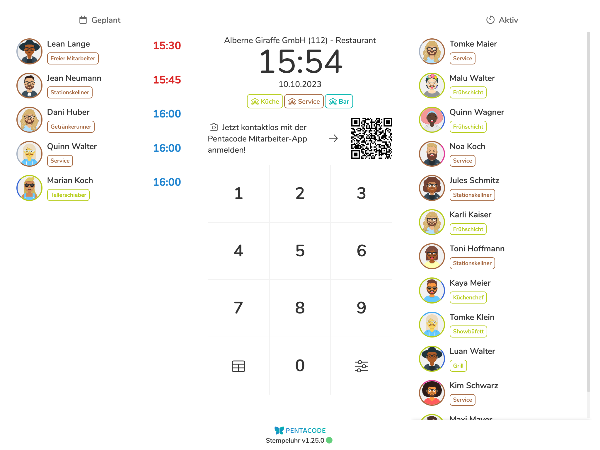
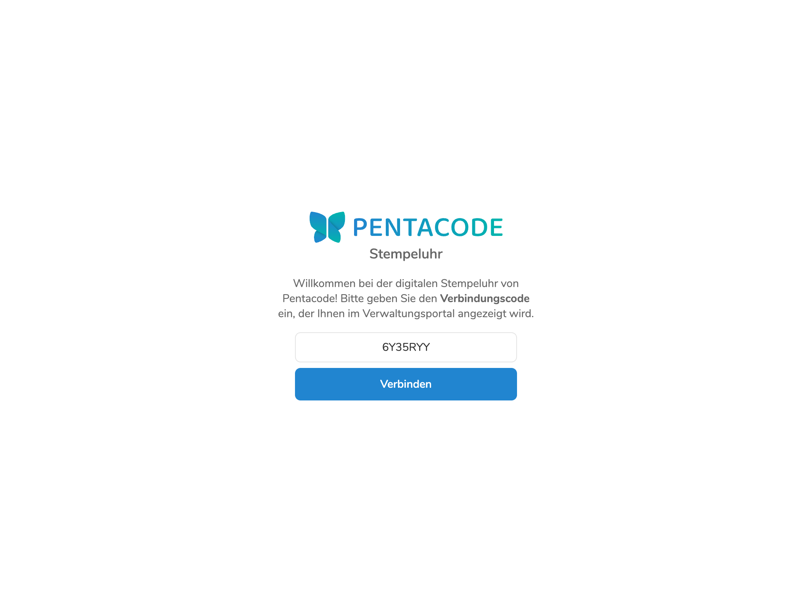
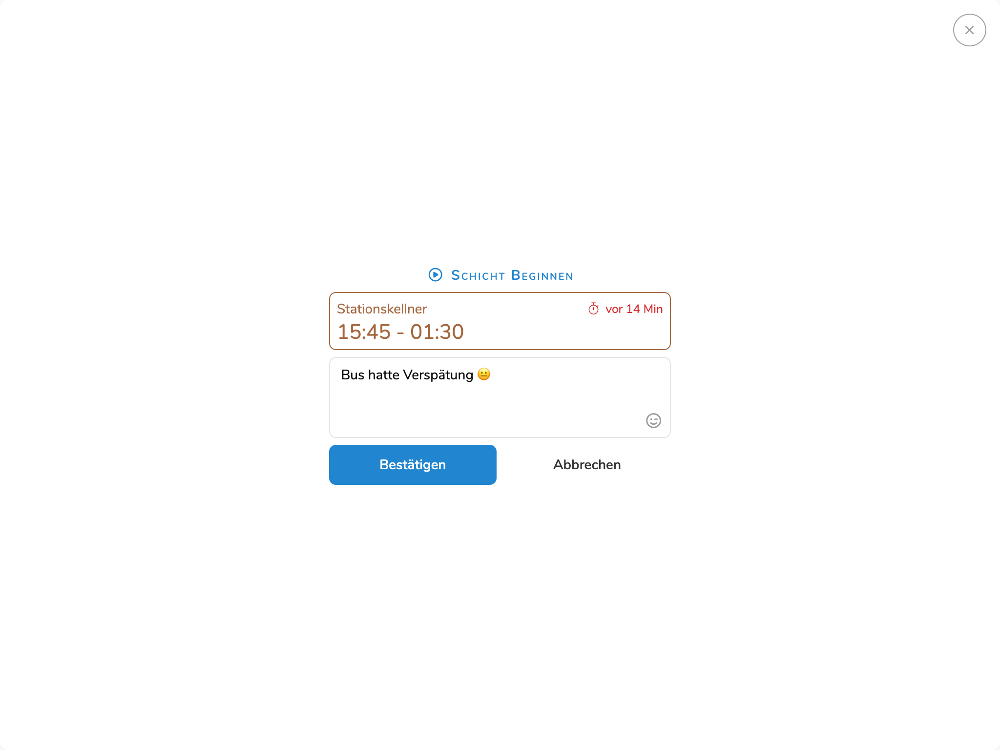

Die digitale Stempeluhr ist eine Webapp, die auf jedes beliebige Tablet, Smartphone oder Desktopgerät geladen werden kann. Das eingerichte Endgerät steht dann am Arbeitsplatz zur selbstständingen Erfassung von Arbeitszeiten, Pausen und Mahlzeiten zur Verfügung.

Abhängig von der auf dem Endgerät verfügbaren Bildschirmgröße werden neben dem Nummernpad außerdem geplante und aktive Schichten angezeigt. Diese können allerdings über die [Anzeigeoptionen](/hilfe/handbuch/zeiterfassung/#stempeluhren-verwalten) ausgeblended werden.

Mitarbeiter beginnen jede Interaktion mit der Stempeluhr mit der Eingabe der persönlichen Zeiterfassungs-PIN, welche zur Verifizierung und Authentifizierung des Mitarbeiters dient. Nachdem sich der Mitarbeiter durch die Eingabe der PIN identifiziert hat, kann er nun zwischen verschiedenen Optionen wählen. Welche Optionen dem Mitarbeiter zur Verfügung stehen ist in den [Zeiterfassungs-Einstellungen](/hilfe/handbuch/einstellungen/zeiterfassung) definiert.

>  Die **Zeiterfassungs-PIN** eines Mitarbeiters können Sie in der [Stammdaten-Ansicht](/hilfe/handbuch/mitarbeiter/stammdaten/) des Mitarbeiters einsehen und bearbeiten.

<figure>

<figcaption>Die digitale Stempeluhr ist eine Webapp, die auf allen handelsüblichen Tablets, Smartphones und Dektop-Computern geladen werden kann.</figcaption>
</figure>

## Stempeluhr Einrichten

Bevor die Stempeluhr App einsatzbereit ist, muss sie zunächst mit dem Server verbunden werden. Hierfür benöten Sie einen **Verbindungsscode**. Wie Sie diesen Code erhalten, erfahren Sie [hier](/hilfe/handbuch/zeiterfassung/#stempeluhr-einrichten).

<figure>

<figcaption>Geben Sie den Verbindungscode aus dem Verwaltungsportal ein, um die Stempeluhr zu verbinden.</figcaption>
</figure>

## Schicht Beginnen

So können Mitarbeiter eine neue Schicht beginnen:

1. Geben Sie Ihre **4-stellige Zeiterfassungs-PIN** über das Zahlenpad ein.
2. Falls eine geplante Schicht vorliegt, wird diese nun angezeigt. Klicken/tippen Sie auf . Falls keine geplante Schicht vorliegt, so können Sie eine spontane Schicht beginnen, falls in den Zeiterfassungseinstellungen die Option [Spontane Schichten Erlauben](/hilfe/handbuch/einstellungen/zeiterfassung/#spontane-schichten) gesetzt ist. In diesem Fall, klicken Sie auf .
3. Falls vom Arbeitgeber so eingestellt, wird nun automatisch ein "Beweisfoto" ausgelöst. Achten Sie in diesem Fall darauf, dass Ihr Gesicht auf dem Foto zu erkennen ist.
4. Sie haben nun die Möglichkeit, eine optionale Nachricht hinzuzufügen. Falls es sich um eine spontane Schicht handelt, können Sie hier außerdem noch die gewünschte Position wählen.
5. Klicken Sie auf  um die Schicht zu beginnen.

<figure>

<figcaption>Mitarbeiter können bei jeder Aktion auch eine optionale Nachricht hinterlassen, die dann im Zeiterfassungsprotokoll angezeigt wird.</figcaption>
</figure>

## Pause Beginnen

So können Mitarbeiter eine Pause beginnen:

>  Diese Option ist nur dann verfügbar, falls in den Zeiterfassungseinstellungen als [Pausenmodus](/hilfe/handbuch/einstellungen/zeiterfassung/#pausenmodus) die Option "Manuell", "Automatisch + Manuell" oder "Geplant + Manuell" gewählt ist.

1. Geben Sie Ihre **4-stellige Zeiterfassungs-PIN** über das Zahlenpad ein.
2. Falls eine aktive Schicht vorliegt, wird diese nun angezeigt. Klicken Sie den Button . Selbstverständlich ist diese Option nur dann verfügbar, wenn vorher eine Schicht begonnen wurde.
3. Falls vom Arbeitgeber so eingestellt, wird nun automatisch ein "Beweisfoto" ausgelöst. Achten Sie in diesem Fall darauf, dass Ihr Gesicht auf dem Foto zu erkennen ist.
4. Sie haben nun die Möglichkeit, eine optionale Nachricht hinzuzufügen.
5. Klicken Sie auf  um die Pause zu beginnen.

## Pause Beenden

So können Mitarbeiter eine Pause beenden:

1. Geben Sie Ihre **4-stellige Zeiterfassungs-PIN** über das Zahlenpad ein.
2. Falls eine aktive Schicht vorliegt, wird diese nun angezeigt. Klicken Sie den Button . Selbverständlich ist dies Option nur dann verfügbar, wenn vorher eine Pause begonnen wurde.
3. Falls vom Arbeitgeber so eingestellt, wird nun automatisch ein "Beweisfoto" ausgelöst. Achten Sie in diesem Fall darauf, dass Ihr Gesicht auf dem Foto zu erkennen ist.
4. Sie haben nun die Möglichkeit, eine optionale Nachricht hinzuzufügen.
5. Klicken Sie auf  um die Pause zu beenden.

## Schicht Beenden

So können Mitarbeiter eine aktive Schicht beenden:

1. Geben Sie Ihre **4-stellige Zeiterfassungs-PIN** über das Zahlenpad ein.
2. Falls eine aktive Schicht vorliegt, wird diese nun angezeigt. Klicken Sie den Button . Selbverständlich ist dies Option nur dann verfügbar, wenn zuvor eine Schicht begonnen wurde.
3. Falls vom Arbeitgeber so eingestellt, wird nun automatisch ein "Beweisfoto" ausgelöst. Achten Sie in diesem Fall darauf, dass Ihr Gesicht auf dem Foto zu erkennen ist.
4. Sie haben nun die Möglichkeit, eine optionale Nachricht hinzuzufügen.
5. Klicken Sie auf  um die Schicht zu beenden.

<figure>

<figcaption>Falls in den Zeiterfassungs-Einstellungen vorgesehen, können Sie beim Beenden der Schicht angeben, ob Sie ein Mitarbeiteressen zu sich genommen haben.</figcaption>
</figure>

## Dienstplan Anzeigen

Um den Dienstplan anzuzeigen, klicken Sie den  Button auf dem Zahlenpad.

>  Diese Option ist nur verfügbar, falls nicht in den [Anzeigeeinstellungen](/hilfe/handbuch/zeiterfassung/#anzeige) der Stempeluhr deaktiviert.

## Stempeluhr Trennen

So können Sie die Verbindung zur Stempeluhr vom Endgerät aus trennen:

1. Klicken Sie auf den  button auf dem Zahlenpad.
2. Wählen Sie die Option .
3. Bestätigen Sie die Aktion mit dem  button.