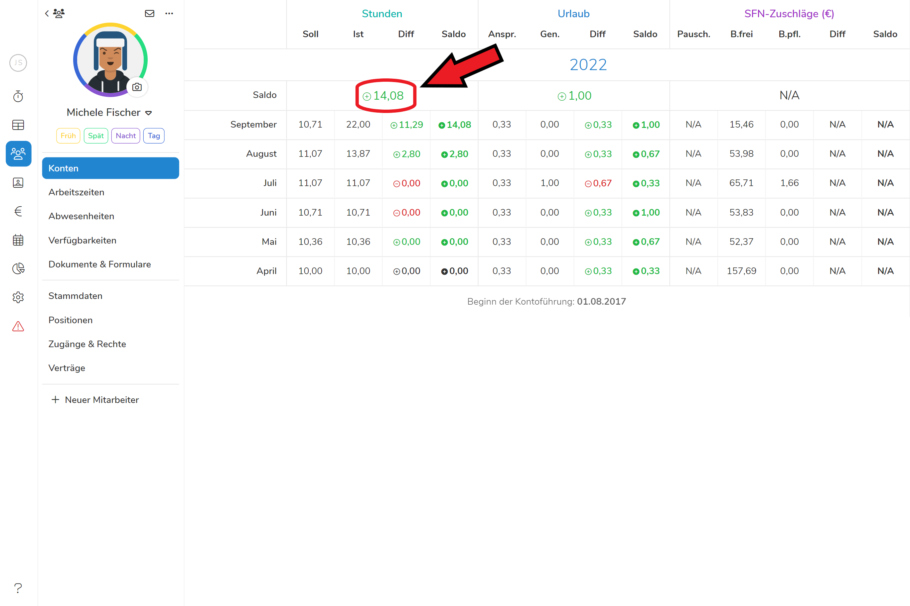

Um zu verstehen wie Pentacode Arbeitszeiten und andere Stundenwerte berechnet und darstellt ist es
wichtig ein einfaches aber essentielles Konzept der Personalverwaltung zu
verstehen: Das der Industrieminute. Im folgenden Artikel
werden wir Ihnen die Unterschiede von Industrie- und Echtminuten näher bringen
und erkären wo diese in Pentacode von Bedeutung sind.

## Definition Industrieminute

Die Industrieminute hat ihren Ursprung in der Idee Stundenbruchteile durch Dezimalzahlen
darzustellen. **Eine Industrieminute ist dabei 1/100 Stunde - also 36
Sekunden.** In Dezimal dargestellt ist eine Industrieminute also 0,01 Stunden.
In Dezimal umgewandelte Stundenbruchteile vereinfachen dabei die Verwaltung der
Arbeitszeiten durch Programme wie Pentacode.

**Es gibt keine Industriestunden! Egal ob in 60 Echtminuten oder 100
Industrieminuten gezählt - unabhängig der Darstellung bleibt eine Stunde eine Stunde.**

>**Beispiel:**
Eineinhalb Stunden oder 1:30 entspricht 1,50 Stunden in Dezimal
oder 150 Industrieminuten.  
Eine Dreiviertelstunde oder 0:45 entspricht 0,75 Stunden in
Dezimal oder 75 Industrieminuten.

## Unterschiede und Verwendung

Während Zeitspannen mit Echtminuten immer mit einem Doppelpunkt dargestellt
werden **2:30h** wird 'Industriezeit' in Dezimal dargestellt, also **2,50h**.
Echtzeit ist natürlich deutlich intuitiver zu nutzen - so würde man sagen ein
Mitarbeiter hat z.B 15 Minuten Pause und nicht 25 Industrieminuten (0,25h).
Industrieminuten sind jedoch nötig damit weitere Berechnungen wie Gehälter,
Urlaubstage, Personalkosten etc. in Dezimal problemlos funktionieren.

## Anwendung von Industriezeit in Pentacode

Pentacode nutzt im Hintergrund immer Industriezeit. Zur inutitiveren Benutzung
wird Ihnen jedoch oft das Pendant in Echtzeit angezeigt.
- So sehen Sie **Schichtlängen immer in Echtminuten**.
- Sie können in den
   [Einstellungen](hilfe/handbuch/einstellungen/zeiterfassung/#Rundung-von-Stempelzeiten)
   anpassen auf wie viele Echtminuten beim Ein- und Ausstempeln gerundet wird.
    

Alle Konten werden hingegen in Industriezeit dargestellt.
- Soll- und Ist-Stunden 
- Überstunden

<figure>
    
    <figcaption> In den Arbeitskonten des Mitarbeiters werden Stunden in Industriezeit angezeigt </figcaption>
</figure>

## Umrechnung 

Normalerweise sollte es nicht nötig sein Industrie- und Echtminuten in einander
umzuwandeln, da Pentacode das bereits für Sie erledigt. Sollten Sie dies aber
doch einmal händisch benötigen, ist die Formel zur Umrechnung sehr einfach:

Echtminuten zu Industrieminuten: EM/60 x 100  
Industrieminuten zu Echtminuten: IM/100 x 60 

> **Beispiel:** Wir wollen eine Schicht mit der Länge von 8:40 in Industriezeit
> umwandeln. Die 8 Stunden bleiben erhalten und die 40 Minuten werden durch die
> Formel **40/60 x 100 = 66,66** zu etwa 67 Industrieminuten -> Die Schicht hat also 8,67h
> in Industriezeit gedauert.  
> *Wie Sie merken lassen sich nicht alle Minutenbeträge ohne Bruchteile
> ineinander überrechnen - wenn Sie auf ganze Industrieminuten rechnen macht
> dies jedoch nur wenige Sekundenbruchteile aus.*

