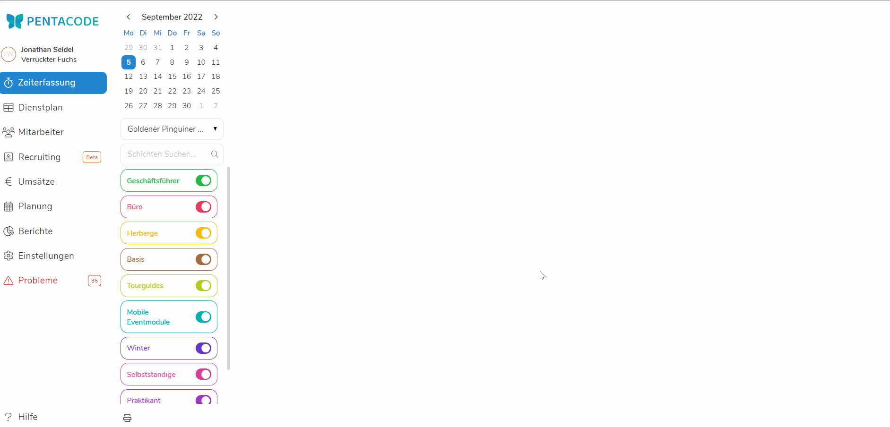
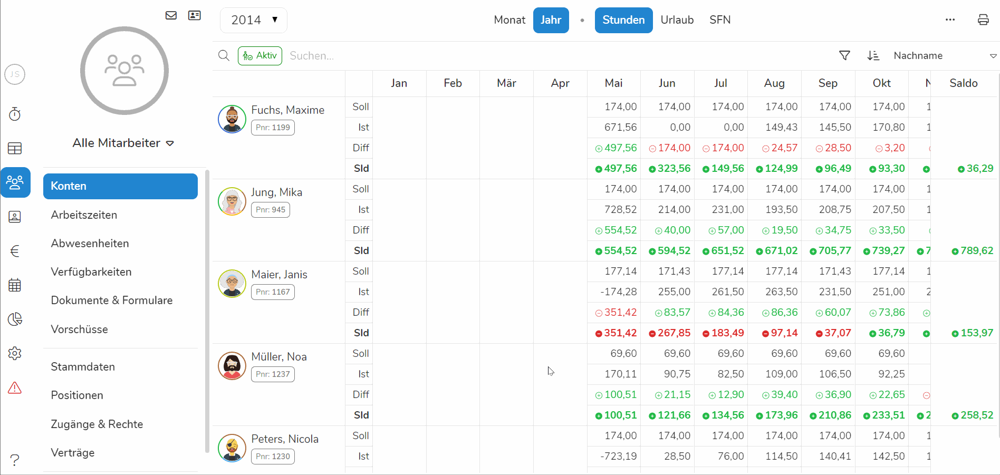

Sollten Sie sich dazu entschieden haben zu Pentacode zu wechseln um ihre gesamte
Personalplanung unter einem Dach zu haben, kommt früher oder später der Punkt an
dem Sie die Urlaubs- und Arbeitskonten ihrer Mitarbeiter - also Resturlaub und
Über- oder Minderstunden übertragen müssen. Zum Glück ist
das in wenigen Klicks getan - im Folgenden erkläre ich Ihnen das ganze anhand
eines Beispieles.

## Warum Konten übertragen?

Mit Hilfe von Pentacode können Sie nicht nur sehen ob ihre Mitarbeiter
 [**Über-oder Minderstunden aufbauen**](/hilfe/handbuch/mitarbeiter/konten/#stundenkonto),
Sie können auch [**Fehl- und Urlaubstage
planen**](/hilfe/handbuch/mitarbeiter/abwesenheiten) und Überstunden auszahlen,
sowie vieles mehr. Als dies wird durch die automatisch geführten
Mitarbeiterkonten ermöglicht. Natürlich sind bei einem Umstieg auf Pentacode
aber nicht alle Uhren auf null gestellt und Resturlaub sowie Überstunden können
nicht einfach entfallen. Um die Mitarbeiterkonten zu Beginn der Nutzung
von Pentacode zu "eichen", müssen Sie also die Konten einmal auf den aktuellen Stand
bringen. 

## Urlaubsansprüche Übertragen

Um das Urlaubskonto ihres Mitarbeiters auf den richtigen Stand zu bringen
verwenden Sie den
[Kontenübertrag](/hilfe/handbuch/mitarbeiter/konten/übertrag-bearbeiten-konten-zurücksetzen).

1. Navigieren Sie dazu zunächst zum Kontenblatt des Mitarbeiters.
2. Fahren Sie mit der Maus über den erste Monat des Mitarbeiters und
   klicken Sie auf den  Button am linken Rand.
3. Tragen Sie im erschienen Feld unter **Urlaub** die Anzahl an Resturlaubstagen
   ein, um diese dem Mitarbeiter gutzuschreiben. 
4. Klicken Sie auf den  um die Änderung zu speichern.

Sollten Sie die Menge an bestehendem **Resturlaub nicht wissen**, weil Sie
bisher keine Personalsoftware verwendet haben - keine Sorge.
[Hier](#übertrag-händisch-berechnen) beschreiben wir, wie Sie den Resturlaub
berechnen.

## Über- und Minderstunden Übertragen

Bei Über- und Minderstunden verfahren Sie fast identisch wie beim Übertrag von
Urlaubsansprüchen. 

1. Navigieren Sie dazu zunächst zum Kontenblatt des Mitarbeiters.
2. Fahren Sie mit der Maus über den erste Monat des Mitarbeiters und
   klicken Sie auf den  Button am linken Rand.
3. Tragen Sie im erschienen Feld unter **Stunden** die Anzahl an Überstunden
   ein. Falls Sie Minderstunden übertragen wollen, geben Sie vor der Anzahl ein
   **-** ein.
4. Klicken Sie auf den  um die Änderung zu speichern.





### Kontenübertrag für mehrere Mitarbeiter 

Da Sie bei einem Wechsel zu Pentacode meist nicht nur die Stunden und
Urlaubstage eines Mitarbeiters übertragen müssen, bietet Pentacode Ihnen auch die
Funktion mehrere Konten "In einem Schwung" zu übertragen. 

1. Navigieren Sie zunächst unter Mitarbeiter auf Konten und in die Jahresübersicht.
2. Klicken Sie den  **-Button** in der rechten oberen Ecke.
3. Es öffnet sich ein Dialog mit der Überschrift "Konten Zurücksetzen". Wählen
   Sie ihren Startmonat in Pentacode aus.
4. Füllen Sie die Spalten **"Urlaub"** mit den Resturlaubstagen und
   **"Stunden"** mit den Über- oder Minderstunden des Mitarbeiters.
5. Sollte für manche Mitarbeiter nichts zu übertragen sein, lassen Sie die
   Felder einfach unbeschriftet





## Urlaubsanspruch händisch berechnen

Da wir schließlich nicht mit irgendwelchen Zahlen, sondern realistischen
Personendaten arbeiten, verwenden wir zum Berechnen der Urlaubsansprüche die
fiktive Angestellte Frau Hahn.
Sie arbeitet Vollzeit und hat einen  **jährlichen Gesamturlaubsanspruch von 27 Tagen**.
Zum ersten April wechseln wir zu Pentacode und **beginnen Frau Hahns
Vertragsverhältnis am ersten April**. Zu diesem Zeitpunkt hat Frau Hahn schon
**drei Urlaubstage in Anspruch genommen**.

### Wie berechnen Wir nun den Urlaubsanspruch, den wir nach Pentacode übertragen?

Da Pentacode automatisch ab April das Urlaubskonto weiterführt, müssen wir nur
den Anspruch für die Monate Januar - März übertragen. Wir wissen, dass der
Monatsanspruch stets dem **Jahresanspruch geteilt durch 12** entspricht. Frau
Hahn hat also einen monatlichen Urlaubsanspruch von 2,25 Tagen. Für die drei
Monate Januar - März entspricht dieser also gesamt 6,75 Tagen. Nun müssen wir
nur noch die drei **genommenen Urlaubstage abziehen** und wir kommen auf einen
restlichen Urlaubsanspruch von 3,75 Tagen. Dies ist der Betrag, welchen wir wie
unter [Urlaubsansprüche übertragen](#urlaubsansprüche-übertragen) beschrieben in
Pentacode speichern.

**Hier noch einmal die Schritte um den Urlaubsanspruch zu berechnen:**
1. **Monatsanspruch berechnen**
2. **Zeitspanne berechnen in welcher der Mitarbeiter gearbeitet hat aber nicht über Pentacode geführt wurde**
3. **Monatsanspruch mit Zeitspanne multiplizieren.**
4. **(Falls vorhanden) Genommene Urlaubstage abziehen und Resturlaub aus dem letzten Jahr aufaddieren.**
