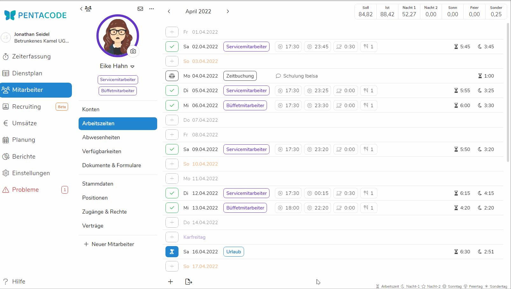

Sollten Sie sich dazu entschieden haben zu Pentacode zu wechseln um ihre gesamte Personalplanung unter einem Dach zu haben, kommt früher oder später der Punkt an dem Sie die Urlaubsrestbestände ihrer Mitarbeiter übertragen müssen. Zum Glück ist das in wenigen Klicks getan - im Folgenden erkläre ich Ihnen das ganze Anhand eines Beispieles.

## Warum Urlaubsansprüche übertragen?

Pentacode ermöglicht es Ihnen auch [Urlaube](/hilfe/handbuch/mitarbeiter/abwesenheiten) von Mitarbeitern zu handhaben und damit direkt in ihre Personalplanung einzubeziehen. So wissen Sie immerc, wer wann wie einplanbar ist. Da mit einem Wechsel zu Pentacode natürlich nicht alle Uhren auf null gestellt sind, Pentacode aber erst zum Vertragsbeginn ihres Mitarbeiters beginnen kann dessen Urlaubsanspruch zu zählen müssen Ansprüche und Altlasten übertragen werden.

## Urlaub gutschreiben

 Um das Urlaubskonto ihrer Mitarbeiter zu korrigieren verwenden Sie die [Urlaubsbuchungsfunktion](/hilfe/handbuch/mitarbeiter/arbeitszeiten/Urlaubsbuchungen). unter dem Reiter **Arbeitszeiten**. Dazu wählen Sie den gewünschten Mitarbeiter aus, gehen auf den Reiter **Arbeitszeiten**, klicken auf das **+-Symbol** in der unteren linken Ecke und anschließend auf **Urlaubsbuchung**. Wählen Sie bei Datum am besten den in Pentacode festgelegten Vertragsbeginn und bei Betrag **Gutschrift** um dem Mitarbeiter Urlaubsansprüche zuzuschreiben. Zum Verrechnen von negativen Urlaubstagen wählen Sie **Abbuchung** und wählen den Regler bei 'bezahlt' ab. 

 ## Beispiel positiver Übertrag

 Um den Prozess noch einmal zu verdeutlichen ein Beispiel zum Übertragen von Urlaubsansprüchen:
 Frau Hahn hat einen **jährlichen Gesamturlaubsanspruch von 27 Tagen**. Zum ersten April wechseln Sie nun zu Pentacode und beginnen Frau Hahns Vertragsverhältnis in Pentacode ebenfalls zum **ersten April**. Zusätzlich hat Frau Hahn in den ersten drei Monaten bereits **drei Urlaubstage** in Anspruch genommen.

 Pentacode wird nun (sofern Sie einen [monatlichen Urlaubszuwachs](/hilfe/handbuch/mitarbeiter/vertrag/#Urlaubszuwachs) festgelegt haben) zu Beginn eines jeden Monats Frau Hahn 2,25 Tage Urlaubsanspruch verbuchen (jährlicher Gesamtanspruch geteilt durch 12). Ohne Übertrag würden nun aber weder der Anspruch der drei Monate Januar - März (vor dem Wechsel auf Pentacode) noch die drei genommenen Urlaubstage in das Urlaubskonto mit einfließen. Normalerweise sollten wir aus einer vorherigen Software oder händisch ausgerechnet den Urlaubsanspruch zu Ende März bereits berechnet haben, wenn nicht können wir ihn aber auch aus unseren [Angaben berechnen](#übertrag-händisch-berechnen). Bei Frau Hahn kommen wir schließlich auf eine Urlaubsgutschrift von 3,75 Tagen welche wir wie [hier](#urlaub-gutschreiben) beschrieben übertragen. 





### Übertrag händisch berechnen
Um den überstehenden Urlaubsanspruch zu errechnen, ermitteln wir erst den monatlichen Urlaubsanspruch indem wir den jährlichen Gesamtanspruch durch 12 teilen **(27/12 = 2,25 pro Monat)**. Anschließend multiplizieren wir diesen mit drei, um den Anspruch für Januar bis März zu erhalten **(2,25x3 = 6,75)**. Anschließend subtrahieren wir noch den bereits genommenen Urlaub **(6,75-3 = 3,75)** um auf den Übertrag zu kommen. Wir wissen nun also, dass +3,75 Tage zusätzlicher Urlaubsanspruch in Pentacode zu verbuchen sind. 

## Urlaubsvortragsberechnung
Bittet ein Mitarbeiter um eine Vortragsberechnung, um seinen Urlaub besser planen zu können, können wir auch diese mit Hilfe von Pentacode einfach errechnen. Der Einfachkeit halber sollte dazu der Übertrag schon verrechnet sein. Nun müssen wir nur noch den momentanen Urlaubsanspruch in Pentacode mit dem zu Erwarteten bis zur Vortragsberechnung addieren. ???
