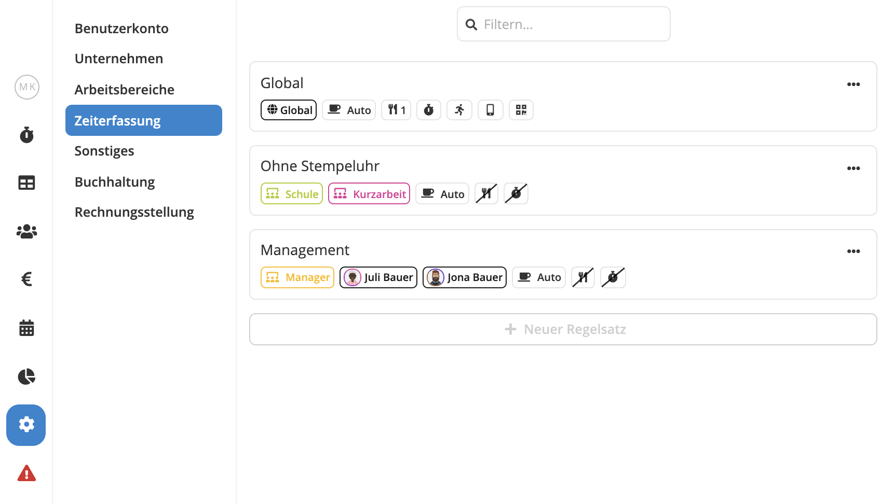
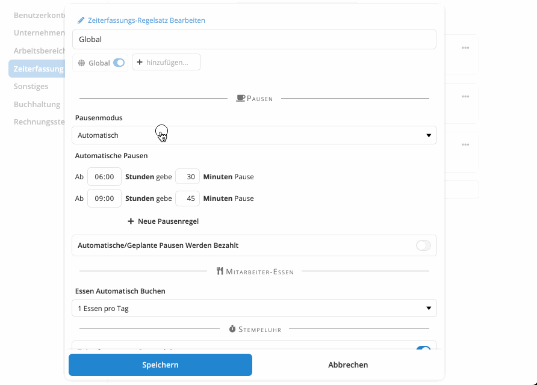

Es ist wiedermal Zeit für ein größeres Update! Pentacode v1.18 bringt Verbesserungen im Bereich der **Zeiterfassungseinstellungen**, ein **überarbeitetes Arbeitszeitkonto** und eine **neue Möglichkeit der Pausenerfassung**!

## Komplexe Zeiterfassungsregeln Leicht Gemacht

Egal wie sie Ihre Arbeitszeiten erfassen - ob manuell, über die **digitale Stempeluhr** oder per **Mitarbeiter-App**,
Pentacode bietet eines der mächtigsten und flexibelsten Zeiterfassungssysteme auf dem Markt. Mit einer Vielzahl von
Einstellungsmöglichkeiten wie der automatischen Pausenberechnung, detaillierten Stempeluhr-Regeln und mehr haben Sie
nicht nur volle Kontrolle darüber, wie Arbeitszeiten in Ihrem Unternehmen erfasst werden, sondern können über
individuelle Einstellungen für Standorte, Abteilungen und Mitarbeiter genau bestimmen, für wen welche Regeln gelten.

Leider bringt diese enorme Flexibilität auch eine gewisse Komplexität mit sich, und in der Vergangenheit war es oft
schwierig nachzuvollziehen, welche Regeln für einen bestimmten Arbeitseinsatz zur Anwendung kommen. In Pentacode v1.18
haben wir uns diesem Problem angenommen und eine neue, **bessere Art der Verwaltung von Zeiterfassungeinstellungen**
entwickelt.

<figure caption="Zeiterfassungs-Regelsätze geben Ihnen maximale Flexibiliät bei besserer Übersichtlichkeit und einfacherer Verwaltung." class="centered">

</figure>

### Zeiterfassungs-Regelsätze

Wo sie vorher abweichende Zeiterfassungsregeln für jede(n) Standort, Abteilung oder Mitarbeiter einzeln definieren
mussten können Sie nun bestimmte Einstellungen in sogenannten **Zeiterfassungs-Regelsätzen** zusammenfassen und
Arbeitsbereichen oder einzelnen Mitarbeitern beliebig zuweisen. So können Sie mehrere unterschiedliche
Zeiterfassungseinstellungen bequemer verwalten und behalten den Überblick, für wen wann welche Regeln gelten. Die neuen
Zeiterfassungs-Regelsätze finden Sie unter **Einstellungen / Zeiterfassung**. Und keine Sorge - für Arbeitsbereiche oder
Mitarbeiter, für die Sie bereits abweichende Zeiterfassungs-Einstellungen definiert haben, haben wir bereits automatisch
die entsprechenden Regelsätze mit der korrekten Zuweisung für Sie generiert. Mehr Informationen zu den neuen
Zeiterfassungs-Regelsätzen finden sie im entsprechenden [Hilfeartikel](/hilfe/handbuch/einstellungen/zeiterfassung).

### Regel-Vorschau

Bei Betrieben, die mehrere unterschiedliche Zeiterfassungsregeln für verschiedene Arbeitsbereiche und Mitarbeiter
definiert haben, konnte es bisher manchmal schwierig sein nachzuvollziehen, welche Einstellungen bei einer bestimmten
Schicht Anwendung finden. Dieses Problem gehört nun der Vergangenheit an! Ein Klick auf eine Schicht im Dienstplan zeigt
Ihnen auf einen Blick, welcher Regelsatz bei dieser Schicht zur Anwendung kommt. Und mit einem weiteren Klick landen Sie
direkt in der Bearbeitungsansicht des Regelsatzes, wo Sie Details einsehen und Änderungen vornehmen können!

<figure caption="Die neuen Pausenmodi 'Geplant' und 'Geplant + Manuell' geben Ihnen noch mehr Kontrolle bei der Dienstplanung!" class="float-right">

</figure>

## Pausen Planen

Für die Erfassung von Pausen bietete Ihnen Pentacode bisher drei Möglichkeiten:

- **Manuelles Erfassen** per Stempeluhr oder Mitarbeiter-App
- **Automatische Berechnung** abhängig von der Arbeitszeit
- Eine **Kombination** der beiden oben genannten Varianten

Während diese Optionen mehr als ausreichend für die meisten Betriebe sind, gibt es doch einige Fälle in denen sie nicht
ausreichend Flexibilität bieten - z.B. wenn es besondere Abmachungen für bestimmte Arbeitszeiten oder Positionen gibt.

Die neuen Pausenmodi **"Geplant"** und **"Geplant + Manuell"** schaffen hier Abhilfe! Wenn eine dieser beiden Optionen
gewählt ist, können Sie bei der Dienstplanung zusätzlich zur Start- und Endzeit auch eine geplante Pausendauer
eingegeben werden! Diese wir dann analog zur automatisch berechneten Pause beim Abschluss der Schicht übernommen. Ist
der Modus **"Geplant + Manuell"** gewählt, können Mitarbeiter zusätzlich Pausen manuell über die Stempeluhr oder
Mitarbeiterapp erfassen, welche dann zu der geplanten Pause hinzugerechnet werden. Und das Beste: Geplante Pausen werden
sowohl in Dienstplanvorlagen als auch in Schichtvorschlägen mit berücksichtigt! So genießen Sie eine noch größere
Flexibiliät in der Schichtplanung mit nur minimalem Mehraufwand!

## Verbessertes Arbeitszeitblatt

In [Pentacode v1.15](/hilfe/aenderungsprotokoll/#1150) haben wir einen großen Schritt nach Vorne gemacht und die
Dienstplanerstellung in Pentacode mit neuen innovativen Features wie **Keyboard-Shortcuts**, erweitertem **Drag & Drop**
und intelligenten **Schichtvorschlägen** auf den nächsten Level gehoben. Wir freuen uns, Ihnen diese Features nun auch
im Bereich "Arbeitszeiten" der einzelnen Mitarbeiter bieten zu können! Die überarbeitete Bedienoberfläche ist nun
einheitlich mit der Schichtbearbeitung im Dienstplan gestaltet und bietet Ihnen viele der gleichen Funktionen! Falls Sie
bereits mit dem Dienstplan gearbeitet haben werden Sie sich vermutlich sofort zurecht finden. Falls Sie mehr über die
neue Bedienweise erfahren möchten, finden Sie detaillierte Informationen in unserem [Hilfeartikel](/hilfe/handbuch/mitarbeiter/arbeitszeiten/#das-arbeitszeitblatt).

## ... Und Mehr!

Die oben genannten Änderungen sind nur ein Teil der Verbesserungen, die wir in dieser Version vorgenommen haben. Für
eine Ausführliche Auflistung der Änderungen, werfen Sie gerne einen Blick in unser
[Änderungsprotokoll](/hilfe/aenderungsprotokoll/)!
