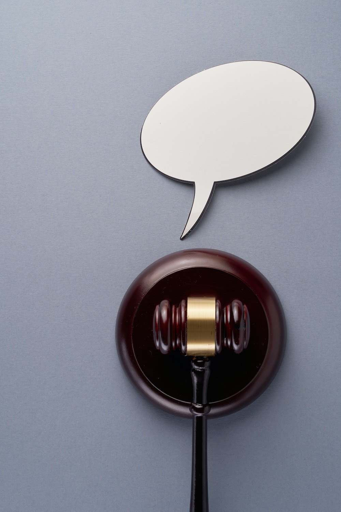

Im Mai 2019 fällte der Europäische Gerichtshof als Reaktion auf die Klage einer spanischen Gewerkschaft ein
beträchtliches Urteil zum Thema Arbeitszeiterfassung: **Jeder EU-Mitgliedsstaat wird dazu verpflichtet, gesetzlich dafür
zu sorgen, dass jeder Arbeitgeber ein Echtzeit-System zur Arbeitszeiterfassung der Angestellten einführt.** Auch deutsche
Unternehmer und Gastronomen sind zukünftig verpflichtet, ein solches System anzuwenden. Bevor wir dazu kommen, was Sie
konkret erwartet, hier eine Kurzauffrischung der Basics.

## Die bisherige Situation rund um Zeiterfassung und was sich durch das Urteil ändert





Bisher waren Arbeitgeber verpflichtet, die Arbeitszeit über acht Stunden am Tag und die von „Minijobbern“ zu
protokollieren und mindestens zwei Jahre aufzuheben. Mit dem „Stechuhr-Urteil“ des EuGH sollen nun auch die Arbeitszeit
jedes „normalen“ Mitarbeitenden genau festgehalten werden. Das Ziel: die Regelungen des Arbeitszeitgesetzes (siehe
unten) zum gesundheitlichen Schutz der Mitarbeitenden einhalten. Laut Urteil ist die Sicherstellung des
Arbeitszeitgesetzes nur möglich, wenn ein „[…] objektives, verlässliches und zugängliches System“ die Arbeitszeiten in
Echtzeit verfolgt.

Das Arbeitszeitgesetzt erfordert, dass…

> - die Normalarbeitszeit max. acht Std. & die tägliche max. Arbeitszeit zehn Std. nicht überschreitet
> - min. zehn Std. Ruhezeit zwischen zwei Schichten liegt
> - min. 30 Min. Pause bei mehr als 6 Std. Arbeit gegeben wird & 45 Min. bei über neun Std.

## Ein objektives System – was genau bedeutet das eigentlich?

Noch muss der deutsche Gesetzgeber bestimmen, wie ein System zur Zeiterfassung genau auszusehen hat. Im EuGH Urteil sind
jedoch schon einige Bedingungen klar erkenntlich. **Objektiv ist ein System dann, wenn es extern ist und Beginn und Ende
der Arbeitszeit aufzeichnet**. Dieses könnte analog zum Beispiel als Stechuhr oder digital als Software auf dem
Arbeitsrechner installiert sein. Wichtig dabei: Nicht nur die gearbeiteten Stunden werden aufgezeichnet, sondern das
System stellt auch sicher, dass außerhalb der aufgezeichneten Zeit nicht gearbeitet wird. Außerdem muss ein solches
System den Arbeitgeber in Echtzeit über die Arbeitszeiten informieren, damit Schichten rechtzeitig abgebrochen werden
können, sollten sie gegen das Arbeitszeitgesetz verstoßen.

## Verlässlichkeit und Zugänglichkeit schafft 100-prozentige Transparenz

Verlässlich ist ein System dann, wenn es manipulationssicher ist, der Arbeitnehmer sich also nicht einfach Überstunden
ein oder der Arbeitgeber diese wieder austragen kann. Veränderungen dürfen also nur zweistimmig geregelt werden. Der
Arbeitgeber hat keine alleinige „Macht“ über das System. Zugänglich bedeutet schließlich, dass die Arbeitszeiten
jederzeit vom Arbeitnehmer sowie von kontrollierenden Instanzen einsehbar sein müssen. So ist klar nachvollziehbar, ob
ein Betrieb sich an das geltende Arbeitszeitgesetz hält. Zusätzlich hat der Arbeitnehmer nun auch ein objektives
Beweismittel, sollte es zu Streitigkeiten rund um Überstunden kommen.

## Besser heute als morgen: Sicher ist, wer ein System zur Zeiterfassung etabliert





Durch die sogenannte „Horizontalwirkung“ des EuGh ist Deutschland streng genommen ab sofort dazu verpflichtet, ein
Gesetz zu verabschieden. Da das bisher noch nicht passiert ist, es aber bisher einige Rechtsprechungen in
Vergütungsprozessen gab, dessen Urteile jedoch widersprüchlich sind, ist die Lage schwammig. Es ist davon auszugehen,
dass mit behördlichen Kontrollen oder Klagen der Belegschaft noch nicht zu rechnen ist. In Prozessen zur Vergütung von
Überstunden könnte das Urteil jedoch bereits gegen den Arbeitnehmer ausgelegt werden, wenn er noch kein System zur
Zeiterfassung etabliert hat. **Auch ist bald mit einem konkreten deutschen Gesetz zu rechnen. Spätestens dann müssen alle
Betriebe ein geeignetes System nutzen, um Strafen und Klagen zu vermeiden.** Ein wenig Spielraum bietet der EuGh
Unternehmen mit speziellen Umständen – beispielsweise sehr kleinen Unternehmen. Sie dürfen ein weniger aufwendiges
System nutzen. Also zum Beispiel ein persönliches, schriftliches An- und Abmelden. Da die genauen Umstände für solche
Einzelfälle nicht festgelegt sind und ein „Zettelwirtschaft-Chaos“ spätere Probleme vorprogrammiert, ist von einer
solchen „Halblösung“ abzuraten.

## Zeiterfassung als Chancen nutzen & versteckte Potentiale freilegen

Alles in allem werden Sie als Unternehmer\*in um ein System zur lückenlosen Arbeitszeiterfassung kaum herumkommen. Die
neue Regelung richtet sich zwar deutlich zugunsten der Belegschaft und belastet den Arbeitnehmer, sie kann aber auch als
Chance genutzt werden. Noch wird nämlich nichts so heiß gegessen, wie es gekocht wird. Die Rechtslage erlaubt dem
Unternehmer noch viel „Beinfreiheit“, die er zu seinem erheblichen wirtschaftlichen Vorteil nutzen kann. Mehr hierzu
erfahren Sie in unserem nächsten Artikel „Wie elektronische Zeiterfassung den Gewinn erhöht“.
