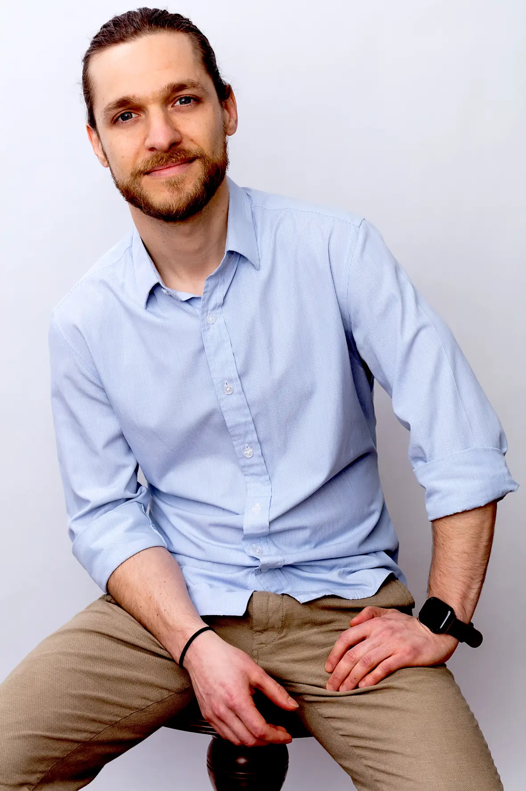

Wie arbeitet eigentlich ein App Entwickler? Welche Fragen und Herausforderungen
stellt er oder sie sich im Arbeitsalltag? Wie geht man die stetige
Weiterentwicklung und Optimierung eines technisch so herausfordernden Produktes
an und wie schafft man es, den ständigen Wandel der Wirtschaft in seinem Produkt
aufzugreifen, um immer am Zahn der Zeit zu bleiben und vor allem die Bedürfnisse
der Kunden vorwegzunehmen? Pentacode Chefentwickler und Mitgründer Martin
Kleinschrodt hat uns im Interview einen Einblick in seine Arbeit gegeben. Und
dabei herausgestellt: An der technischen Entwicklung des Produktes
arbeiten er und sein Team zwar federführend. Aber nie ganz alleine. Ein ganz
entscheidender Faktor, der Pentacode als App so lückenlos, verlässlich und
erfolgreich macht: Der enge Austausch mit den Kunden.

_**Julia Tomski: Ein Entwickler - das ist derjenige, der die Ideen anderer
technisch zum Leben erweckt. War das für dich immer schon ein Traumberuf?**_

**Martin Kleinschrodt:** Ja und nein. Durch meinen Vater - selbst schon seit Jahrzehnten
selbständiger Softwareentwickler und Unternehmer - wurde ich sehr früh an das
Thema Computer und Software herangeführt. So wurde die Softwareentwicklung
schon in meinen Teenagerjahren zur Leidenschaft und es dauerte nicht lange, bis
ich mit meinem “Hobby” nicht nur mein Taschengeld aufbessern, sondern auch mein
Studium finanzieren konnte. Softwareentwicklung als berufliche Laufbahn einzuschlagen
war bis dahin eigentlich nie der Plan - aber spätestens gegen Ende meines Studiums waren
für mich alle Zweifel aus dem Weg geräumt. Das Programmieren liegt mir und ich mache es sehr
gerne. Was Software-Entwicklung für mich aber so befriedigend macht, ist die Wirkung, die
gute Software auf das Leben anderer Menschen haben kann.





_**JT: Was meinst Du mit Wirkung im Genauen?**_

**MK:** Nun ja, Software ist in der Lage, selbst hochkomplexe Sachprobleme
schnell und effizient zu lösen. Indem sie auf Probleme die richtigen Antworten
findet, kann sie die Produktivität eines Unternehmens deutlich steigern und
damit ein entscheidender Faktor für dessen Erfolg sein. Sie macht aber auch etwas
mit dem Menschen selbst, der vorher diesen Problemen ausgesetzt war.

_**JT: Es ist klar, dass ein gelöstes Problem den Verantwortlichen erleichtert.**_

**MK:** Nicht nur. Natürlich ist eine Software bei der Lösung einer
komplizierten Sachaufgabe dem Menschen überlegen und wenn ein immer
wiederkehrendes Problem jedes Mal erneut und aufwändig gelöst werden muss, dann
ist es für den Verantwortlichen natürlich eine riesen Erleichterung, wenn die
Arbeit durch ein Programm „von Zauberhand“ erledigt wird. Aber wirklich gute
Software hinterlässt beim dem Anwender etwas - nennen wir es ein "gutes
Gefühl".

_**JT: Natürlich ist es ein gutes Gefühl, wenn ein Job schnell und korrekt erledigt werden kann.**_

**MK:** Klar, aber das meine ich nicht. Viele Entwickler denken ja, dass das
Problem einer Software der Anwender ist, der vor dem Bildschirm sitzt. Die
sprechen dann vom DAU, dem dümmsten anzunehmenden Anwender. Wenn jemand mit
einem komplexen Programm nicht zurecht kommt, ist es der Fehler des Nutzers und
nicht der des Entwicklers. Ich bin aber der Meinung, dass Software dem Menschen
dienen muss und nicht umgekehrt. Nicht nur, indem sie seinen Job erleichtert,
sondern dem Nutzer außerdem das Gefühl gibt, selbstwirksam und kompetent zu sein.

_**JT: Sprechen Programmierer echt vom dümmsten anzunehmenden Anwender?**_

**MK:** Natürlich nicht alle - aber welche Haltung ein Entwickler hat, muss er
für sich selbst beantworten. Der Nutzer einer Software ist im Regelfall ja kein
IT-Fachmann. Er ist ein Mensch mit einer Vielzahl unterschiedlicher
Aufgaben und Fachmann in vielen Bereichen. Für ihn ist Software nur ein
Werkzeug. Also sollte man bei der Entwicklung davon ausgehen, dass er
wenig bis sehr wenig Ahnung von der Bedienung hat. Die Frage ist hier eher, ob
ich ihn von oben herab betrachte oder ihm auf Augenhöhe begegne.

_**JT: Wie kann man als Programmierer erreichen, dass sich ein Anwender kompetent fühlt?**_

**MK:** Indem das Programm am besten selbsterklärend ist, Prozesse möglichst
vollständig automatisiert und in den Bereichen, in denen tatsächlich noch etwas
getan werden muss, die Arbeit intuitiv und spielerisch von der Hand geht. Das
gibt das Gefühl, dass man die Software beherrscht und nicht von ihr beherrscht
wird.





_**JT: Was bedeutet das für Deine Arbeit?**_

**MK:** Dass der Mensch, also der Anwender im Mittelpunkt steht. Aber das
setzt natürlich auch immer voraus, dass die Maschine im Hintergrund einwandfrei
funktioniert und ihre Aufgaben korrekt löst.

_**JT: Wie bist du zu Pentacode gekommen? Was hat dich überzeugt ein Teil davon zu werden?**_

**MK:** Dafür gibt es mehrere Gründe. Einer davon war die Herausforderung an
mich als Entwickler. Bei Pentacode geht es ja nicht um rein rechnerische
Lösungen. Hinter Personalmanagement und -organisation steht schließlich ein
Riesenkomplex von rechtlichen, steuerlichen und wirtschaftlichen Aspekten.
Pentacode gab es vor meinem Dazukommen bereits als Prototyp, bei dem jedoch
klar war, dass er nicht skalierbar und damit letzten Endes nicht zukunftsfähig
war. Das alles nun in eine Anwendung zu packen, die alle diese Aspekte
berücksichtigt, die entsprechenden Aufgaben löst und dem Unternehmer dabei
trotzdem das „gute Gefühl“ gibt, war allein schon extrem reizvoll.

_**JT: Und welche Gründe gab es noch?**_

**MK:** Das Team mit seiner immensen Erfahrung und Kompetenz in den eben
genannten Bereichen. Mein Partner Lorenz zum Beispiel ist ein Experte, wenn es
um wirtschaftliche und rechtliche Zusammenhänge geht und verfügt über viel
Erfahrung, die in die Entwicklung des Produkts einfließt und die
nicht-technische, also inhaltliche Komponente der Software ausmacht. Diese
Kompetenz steht dem Anwender dann nicht nur als Software zur Verfügung, sondern
auch im unmittelbaren Austausch zwischen dem Kunden und unserem Support-Team.
Ein weiterer Grund für meinen Einstieg war außerdem die Einstellung zum Kunden,
die meinen eigenen Ansichten entspricht.

_**JT: Damit meinst Du den Menschen vor dem Bildschirm als Mittelpunkt, richtig?**_

**MK:** Ja. Pentacode ist „Software As a Service“ und bei solchen Produkten
bleiben die Anwender in der Regel sehr früh sich selbst überlassen und müssen
sich erst einmal einarbeiten. Bei uns erbringt das Support-Team
Dienstleistungen, die – zumindest aus meiner Sicht als Entwickler – oft weit
über das Produkt hinausgehen. Unsere Supportmitarbeiter legen sich richtig ins
Zeug, um Pentacode in einem Betrieb sehr schnell und sehr wirksam zum Laufen zu
bringen. „Customer Success“ steht bei uns in der Priorisierung ganz weit oben.
Das hebt uns von den meisten anderen Anbietern ab und macht einen großen Teil
unseres eigenen Erfolgs aus.





_**JT: Kommt der Kunde auch zur Sprache, wenn es um die Weiterentwicklung von Pentacode geht?**_

**MK:** Ja, absolut! Es ist ja gerade der Dialog mit den Kunden, der dazu
geführt hat, dass die Software so wirksam ist. Viele Features basieren auf
Kundenfeedback und konkreten Anregungen. Diese werden von unseren
Support-Mitarbeitern aufgenommen, weitergegeben und dann überlegen wir im Team
ob es Sinn macht, ein bestimmtes Feature umzusetzen.

_**JT: Wie reagiert dann ein Kunde, wenn ein Wunsch nicht erfüllt wird?**_

**MK:** In den meisten Fällen sehr verständnisvoll, weil wir unsere
Entscheidungen auch immer begründen können. Es hilft ja
niemandem, wenn eine Software 1000 Sonderwünsche erfüllt, der Anwender aber zehnmal
klicken muss, um zu einer bestimmten Funktion zu kommen. Am Ende kennt sich dann
nur noch der Programmierer wirklich aus. In der Entwicklung nennen wir das
„Feature Bloat“. Man muss also bei aller Kundenorientiertheit auch immer
aufpassen, dass man nicht den Fokus verliert. Und das heißt leider, dass man
auch ab und zu mal "nein" sagen muss. Einen guten Kompromiss finden zwischen
zuhören, Anregungen aufnehmen, aber auch die eigene Vision nicht zu vergessen -
das ist unsere Aufgabe in der Produktentwicklung.

_**JT: Und was ist Eure Vision?**_

**MK:** Eine Software, die alle Aspekte des HR-Managements durch weitestgehend
vollständige Automatisierung abdeckt, absolut leichtverständlich und spielerisch
in der Anwendung ist und dazu noch technologisch belastbar, performant und
stabil. Diese Vision haben wir in großen Teilen bereits verwirklicht, sie bleibt
aber die Grundlage unseres Denkens und Handelns und wir tun unser Bestes, diese
so auch in die Zukunft zu tragen.

_**JT: Vielen Dank, Martin, für diesen interessanten Einblick in deine und eure Arbeit.**_
