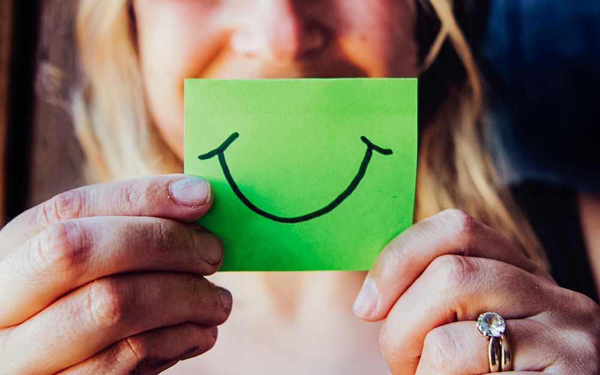
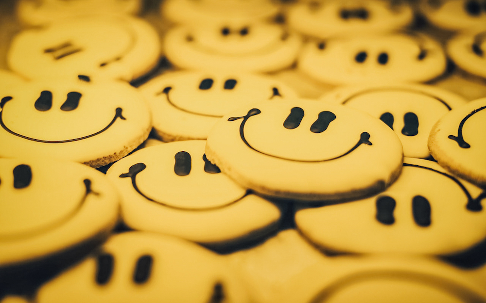

Lächeln ist die wohl allen bekannte Taktik der Einschmeichelung und der sozialen Beeinflussung. Untersuchungen haben die
allgemeine Kulturweisheit, die das Lächeln betrifft, bestätigt und dabei herausgefunden, **dass lächelnde Menschen als
attraktiver, aufrichtiger, geselliger und kompetenter empfunden werden**, als nicht lächelnde Menschen [^4]. Die
zwischenmenschliche Wirkung von Lächeln lässt die Vermutung zu, **dass Kellner ihr Trinkgeld erhöhen können, indem sie
ihre Gäste anlächeln**. Titt und Lockard haben diese Möglichkeit in einer Cocktaillounge in Seattle getestet [^5].





## Breites und schmales Lächeln – ein Trinkgeld-Unterschied von 140%

Als Testsubjekte wurden Gäste ausgewählt, die ohne Begleitung in der Lounge saßen. Die Kellnerin hat nach dem
Zufallsprinzip die Hälfte dieser Gäste ausgewählt und sie mit einem breiten und offenen Lächeln begrüßt, die andere
Hälfte mit einem nur kleinen Lächeln bei geschlossenem Mund. **Die Gäste, die mit einem schmalen Lächeln begrüßt wurden,
haben durchschnittlich ein Trinkgeld von 20 Cents gegeben, während jene Gäste, die mit einem breiten, die Zähne
zeigenden Lächeln begrüßt wurden, im Durchschnitt 48 Cents Trinkgeld gaben - dies entspricht einem Unterschied von 140
Prozent.**

## Studien belegen: Emotionale Ansprache hat einen Effekt





Es ist schwierig, vorherzusagen, welchen Effekt dies auf Restaurantkellner hat, da die durchschnittliche Rechnung in
Restaurants typischerweise höher und das Trinkgeld des Einzelgastes größer ist, als in Cocktaillounges. Die erzielten
Resultate lassen jedoch vermuten, **dass Kellner und Kellnerinnen ihr Trinkgeld durch ein offenes und fröhliches Lächeln
deutlich erhöhen können**. Neben dem trinkgeldfördernden Verhalten der [persönlichen Vorstellung mit Namen](../tipps_for_tips_1/)
und dem [in die Hocke gehen](../tipps_for_tips_2/), ist also auch das ein ganz konkreter, durch Studien
belegter Tipp, wie man als Servicemitarbeiter nicht nur mehr Umsatz macht, sondern auch dafür sorgt, dass sich die Gäste
wohl- sowie emotional angesprochen fühlen und gerne wiederkommen. Wie sieht es aber aus, wenn der Kellner oder die
Kellnerin noch einen Schritt weiter geht? Wie sich beiläufiger Körperkontakt auf das Trinkgeldverhalten des Gastes
auswirkt, behandeln wir in unserem nächsten Artikel der Kurzrubrik „Tipps für Tips“.

[^4]: Harry T Reis et al., „ What Is Smiling Is Beautiful and Good“, European Journal of Social Psychology, Vol. 20 (1990), pp. 259-267
[^5]: Kathi L.Tidd and Joan S. Lockard, „ Monetary Significance of the Affiliative Smile: A Case for Reciprocal Altruism „ Bulletin of the Psychonomic Society, Vol. 11, No. 6 ( 1978 ) , pp 344- 346
[^6]: Jakob Hornik, „ Tactile Stimulation and Consumer Research“ Journal of Consumer Research Vol. 19 ( December 1992 ), pp. 449 - 458
