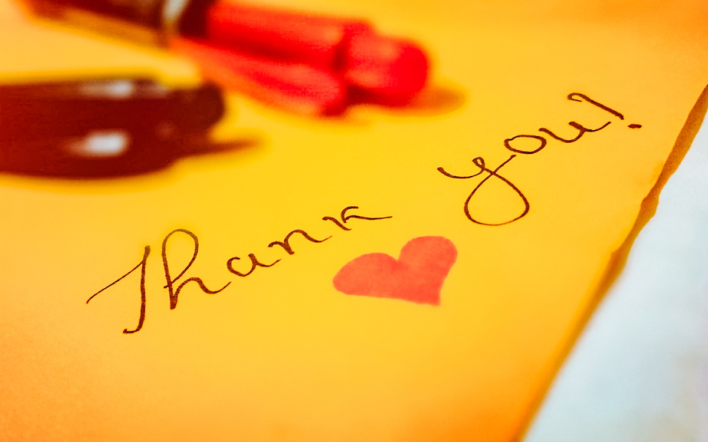
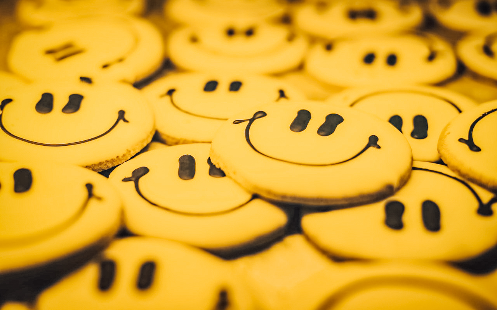
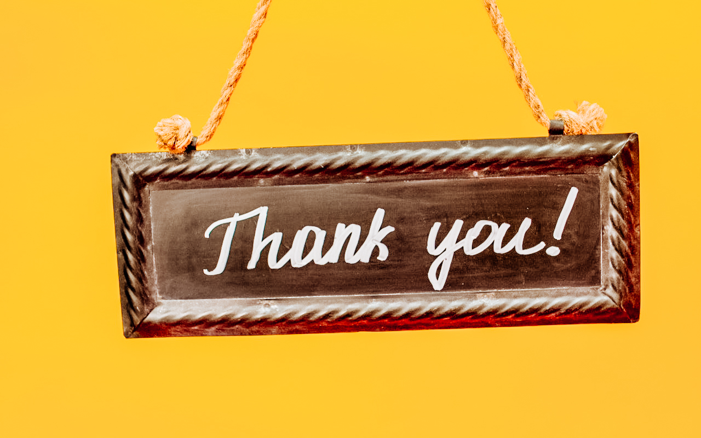

Manche Kellner schreiben „Vielen Dank“ auf die Rechnung und unterzeichnen diese
mit Ihrem Namen, bevor sie dem Gast die Rechnung an den Tisch bringen. **Dieser
Ausdruck von Dankbarkeit könnte beim Gast die Wahrnehmung von Freundlichkeit
erhöhen, die wiederum zur Erhöhung des Trinkgeldes führt.** Darüber hinaus könnte
dies den Gast zum Gefühl zwingen, diese Dankbarkeit durch ein höheres Trinkgeld
zu entlohnen. Was auch immer der Mechanismus sein mag, der dahinter steht: der
handschriftliche Ausdruck von Dankbarkeit scheint die Wahrscheinlichkeit zu
erhöhen, mehr Trinkgeld zu verdienen. Aber ist das auch tatsächlich der Fall?

## Minimal aber messbar: Mehr Trinkgeld bei persönlicher Notiz





Rind und Bordia haben diese These in einem gehobenen Restaurant in Philadelphia
getestet [^1]. In ihrer Studie wurden einer Kellnerin nach dem Zufallsprinzip
drei Klassen von Mittagsgästen zugeteilt. Auf die Rechnung schrieb sie

1. nichts
2. „Vielen Dank“ oder
3. „Vielen Dank“ und ihre Unterschrift.

Die Kellnerin erhielt ein durchschnittliches Trinkgeld von 16%, wenn sie nichts
auf die Rechnung schrieb, und 18%, wenn sie „Vielen Dank“ schrieb. Das
Hinzufügen der Unterschrift zu „Vielen Dank“ hat keine weitere Erhöhung des
Trinkgelds verursacht.

## Ein Lächeln verzaubert - auch auf der Rechnung?

Dass ein [lächelndes und aufgeschlossenes Gegenüber](../tipps_for_tips_3/) im
Service den Gast dazu bringt, mehr Trinkgeld zu geben, ist wissenschaftlich
erwiesen. Aber wie sieht es hiermit aus? Manche Kellner zeichnen einen Smiley
auf die Rechnung. Diese Zeichnungen haben wahrscheinlich mehrere Wirkungen. Sie
können

1. den Kellner für den Gast persönlicher machen
   und dabei den Sympathiefaktor erhöhen,
2. dem Gast mitteilen, daß der Kellner gern für ihn gearbeitet hat und
3. den Gast selbst zum Lächeln bringen und dabei seine Stimmung verbessern.

Diese möglichen Effekte lassen vermuten, daß ein von Hand aufgezeichneter Smiley
auf der Rechnung das Trinkgeld erhöhen wird. Rind und Bordia haben diese
Möglichkeit in einer Feldstudie im gleichen Restaurant, in welchem die „Vielen
Dank“-Untersuchung durchgeführt wurde, in Philadelphia getestet [^2].





## Wissenschaftliche Tests mit Kellner und Kellnerin

Ein Kellner und eine Kellnerin gaben der Hälfte ihrer Mittagsgäste eine
Rechnung, auf der ein Smiley aufgezeichnet war. Der anderen Hälfte gaben sie
eine Rechnung ohne Zeichnung. Welcher Tisch welchen Rechnungstyp erhielt, wurde
bestimmt, wenn die Gäste bei Serviceende nach der Rechnung verlangten. Der
Kellner hat dann nach dem Zufallsprinzip entschieden, welcher Tisch einen Smiley
und welcher Tisch keinen enthielt. Die Kellnerin erhielt einen
durchschnittlichen Tip von 28%, wenn sie nichts auf die Rechnung malte und 33%,
wenn sie einen Smiley aufmalte. Das Aufmalen eines Smiley’s hat das Trinkgeld
der Kellnerin um 18% verbessert.





## Überraschend: Männliche Kellner kommen schlechter weg

Der männliche Kellner hat keinen vergleichbaren Effekt erzielt und könnte
tatsächlich sein Trinkgeld verringert haben. Er erhielt einen durchschnittlichen
Tip von 21%, wenn er nichts auf die Rechnung malte, und nur 18%, wenn er einen
Smiley aufmalte. Obwohl die Abnahme des Trinkgeldes statistisch nicht
bemerkenswert war, läßt es die Vermutung zu, daß bei einem Smiley, der von
Männern gemalt wird, der Schuss nach hinten losgeht. Wahrscheinlich wird dies
von den Gästen als zu emotional und weiblich empfunden. Als Mann sollte man im
Service also lieber auf eine der [anderen Strategien](../tipps_for_tips_1/)
setzen, die dem Gast eine persönliche Verbindung vermitteln und
so das Trinkgeld erhöhen.

[^1]: Bruce Rind and Prashant Bordia, „ Effect of Server’s ‘ Thank you’ and Personalization on Restaurant Tipping“, Journal of Applied Social Psychology, Vol. 25, No. 9 ( 1995 ) , pp 745 - 757
[^2]:
    Bruce Rind and Prashant Bordia, „ Effect on Restaurant Tipping of Male and Female Servers,
    Drawing a Happy, Smiling Face on the Backs of Customers’ Checks“ in press
