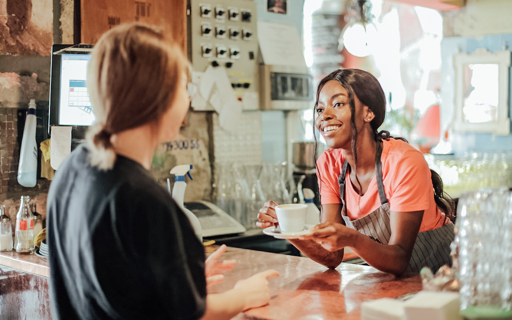

Es ist uns im Alltag selten bewusst. Aber neben dem **was** wir sagen, beeinflussen wir unser Gegenüber maßgeblich damit
**wie** wir es sagen. Unsere Körpersprache ist ein mächtiges Tool – und je sensibler wir dafür sind, wie wir auf andere
wirken, desto eher können wir lenken, wie sie uns wahrnehmen. Wertvoll ist das nahezu für jeden Menschen. Eben auch für
diejenigen, die im Service arbeiten. Denn wer einen „Fremden“ als Gastgeber begrüßt, ist auf die eigene Fähigkeit
angewiesen, möglichst schnell eine Vertrauensbasis aufzubauen. **Man könnte sich zum Beispiel zum Gast hinunterbeugen oder
sogar in die Hocke gehen.** Und so die Beziehung „auf Augenhöhe“ suggerieren. **Aber wird das vom Gast gut angenommen? Ja,
wird es** – das beweist eine Studie aus den USA.





## Aussagekräftige Studien liefern die Basis

**Die Höhe des Trinkgeldes hängt in den meisten Fällen von der Freundlichkeit des Kellners ab.** Oder besser gesagt: von der
Wahrnehmung der Freundlichkeit durch den Gast. Umfangreiche Feldstudien, durchgeführt von Verhaltenspsychologen und
Verbraucherforschern in den Jahren 1993 bis 1996 in den USA haben einige Verhaltensweisen untersucht, die beim Gast die
Wahrnehmung vermeintlich besonderer Zuwendungen und persönlicher Aufmerksamkeiten erhöhen. In unserer sechsteiligen
Kurzrubrik [„Tipps für Tips“](#../tipps_for_tips) wollen wir einzelne Verhaltensweisen und deren Einfluss auf die Zufriedenheit des Gastes und
die damit verbundene Zahlung von Trinkgeld beleuchten.

## Nähe erzeugen – in die Hocke gehen

Die meisten Kellner stehen während des Gesprächs mit dem Gast im Service. Manche jedoch beugen sich vornüber oder gehen
neben dem Tisch in die Hocke, wenn sie mit dem Gast interagieren oder sprechen. **In die Hocke gehen hat verschiedene
positive Auswirkungen**:

1. Es erhöht die **Übereinstimmung der Körperhaltung** zwischen Kellner und Gast.
2. Es **erleichtert den Augenkontakt** durch die gleiche Augenhöhe.
3. Es **bringt das Gesicht näher** an das des Gastes.





Untersuchungen über non-verbale Kommunikation haben herausgefunden, dass eine Übereinstimmung der Körperhaltung,
Augenkontakt und körperliche Nähe mit Beziehung und Zuneigung zu tun haben [^1]. Nachdem Gäste häufig berichten, dass sie
sympathischen Kellnern mehr Trinkgeld geben, sollte das in die Hocke gehen am Tisch das Trinkgeld eines Kellners
erhöhen. Michel Lynn und Kirby Mynier haben diese These in 2 Restaurants in Houston getestet [^2]. Ein weißer Kellner in
einem mexikanischen Restaurant und eine asiatische Kellnerin in einem chinesischen Restaurant haben jeweils durch das
Werfen einer Münze bestimmt, ob sie beim ersten Besuch an einem Tisch in die Hocke gehen oder stehen bleiben. Davon
abgesehen haben beide Kellner versucht, alle Tische gleich zu behandeln.

## Drei Prozent mehr Trinkgeld für die Probanden





**Wie erwartet hat sich das Trinkgeld beider Kellner erheblich erhöht, wenn sie am Tisch in die Hocke gehen**. Der Kellner
erhielt einen durchschnittlichen Tip von 5,80 $ (15 \%), wenn er stehen blieb und 6,40 $ (18 %), wenn er beim ersten
Besuch am Tisch in die Hocke ging. Bei der asiatischen Kellnerin stieg das Trinkgeld von 2,56 $ (12 %) (stehend) auf
3,28 $ (15 \%) (hockend). Insgesamt erhielten beide Kellner ungefähr 1 $ mehr, wenn sie in die Hocke
gingen. Wer im Service arbeitet und an einem guten Trinkgeld oder vielleicht mehr noch an einer effizienten
Beziehungsarbeit mit dem Gast interessiert ist, geht also zukünftig einfach mal zwischendurch beim Gespräch in die
Hocke. Natürlich ist zu vermuten, dass auch hier – ähnlich wie bei der Vorstellung mit Namen beim Gast – gilt: **Sie
müssen sich damit als Kellner oder Kellnerin auch wohlfühlen**. Eine gespielte Freundlichkeit beziehungsweise eine
aufgesetzte Bemühung um die Gunst des Gastes wird dieser merken. Und es ist davon auszugehen, dass sich das dann auch
auf das Trinkgeldverhalten negativ auswirkt. **Und wie sieht es mit beiläufigen Berührungen** aus? Diesem Aspekt widmen wir
uns im nächsten Beitrag unserer Kurzrubrik „Tipps für Tips“.

[^1]: Michael Argyle, „Bodily Communication“ ( New York: Methuen, 1988 ), pp. 88-92
[^2]: Michael Lynn and Kirby Mynier, „ Effect of Server Posture on Restaurant Tipping.“ Journal of Applied Social Psychology, Vol. 23, No. 8, pp: 678 - 685
