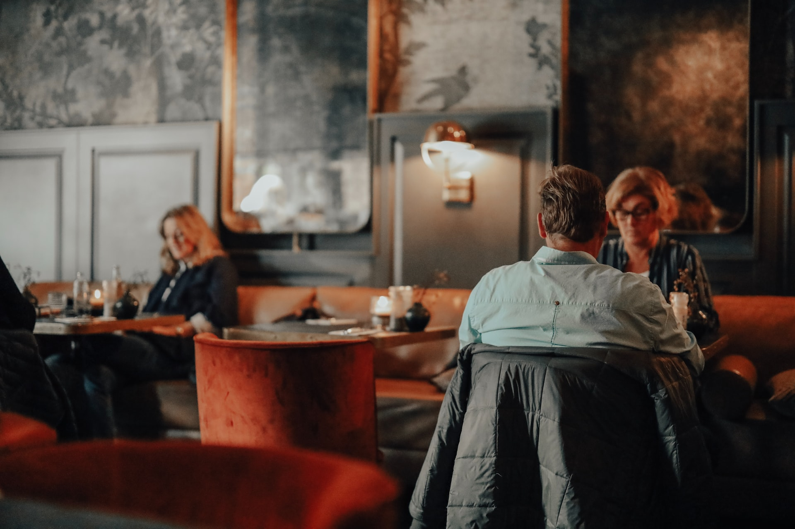
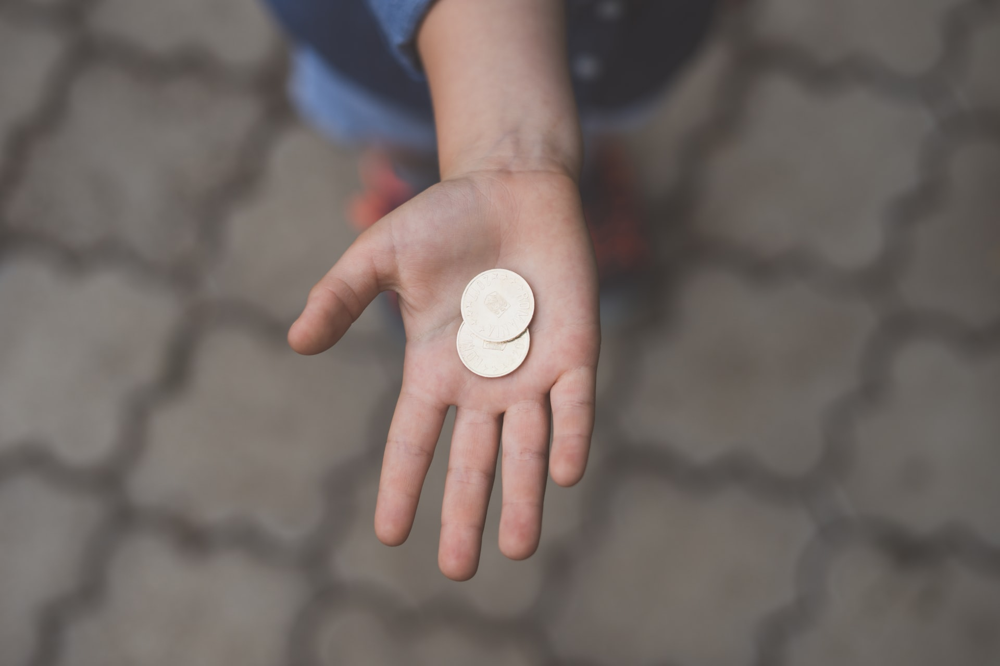

Körperliche Berührung ist der wirksamste Ausdruck der zwischenmenschlichen
Beziehung und kann Zuneigung, Anerkennung und Aggression, sozialen Halt und
vieles andere bedeuten, immer abhängig vom Gesamtzusammenhang. **Auf kommerziellen
Schauplätzen hat sich gezeigt, dass Konsumenten, die berührt werden, mehr Zeit in
einem Geschäft verbringen, mehr kaufen und das Geschäftslokal positiver bewerten**
[^1]. Diese positiven Wirkungen lassen vermuten, daß die körperliche Berührung
auch das Trinkgeldverhalten der Gäste in Restaurant, Café oder Bar positiv
beeinflußt.

## Wissenschaftliche Untersuchung mit zwei Gästegruppen





Cusco und Wetzel haben diese Möglichkeit in zwei Restaurants in Oxford,
Mississippi getestet [^2]. Drei Kellnerinnen in beiden Restaurants wurden
wahllos Gäste zugeteilt, die unterschiedlich berührt wurden. Eine Gästegruppe
wurde nicht berührt, die zweite ungefähr eine Sekunde lang gelegentlich an der
Schulter. Die Kellnerinnen haben die Gäste einmal während des Gespräches berührt
und ein zweites Mal, als sie Wechselgeld zurückbrachten.

## Kurze Berührung, immenser Effekt

**Die Wirkung der Manipulation durch Berührung war erheblich.** Gäste haben einen
durchschnittlichen Tip von 12% hinterlassen, wenn sie nicht berührt wurden, 14%,
wenn sie einmal an der Schulter und 17%, wenn Sie bei Herausgabe von Wechselgeld
an der Handfläche berührt wurden. Darauffolgende Untersuchungen durch Forscher
haben bewiesen, dass die gelegentliche Berührung von Gästen das Trinkgeld sowohl
von männlichen, als auch weiblichen Gästen erhöht, und der Effekt am stärksten
ist, wenn männliche Kellner weibliche Gäste berühren [^3].

## Ein völlig unbewusster Vorgang





Manche Mitarbeiter werden sich bei dieser Empfehlung unbehaglich fühlen; sie
werden befürchten, dass Gäste etwas gegen Berührung haben. Forscher haben jedoch
herausgefunden, dass Testpersonen, deren Verhalten durch Berührung beeinflußt
wurde, oft nicht bewußt war, dass sie überhaupt berührt wurden [^3]. **Um wirksam
zu sein, dürfen Berührungen durch Kellner und Kellnerinnen (Kontakt kürzer als
eine Sekunde!) jedoch nicht aufdringlich sein (Kein Augenkontakt!).** Gäste, die
von Kellnern berührt werden, bewerten das Restaurant grundsätzlich positiver als
jene Gäste, die nicht berührt werden. Manager und Kellner werden herausfinden,
dass der Vorteil durch Berührung von Gästen das kleine Risiko, das man dabei
eingeht, weit überwiegt. Und damit ebenso wirksam ist, wie beispielsweise die
[Vorstellung mit Namen](../tipps_for_tips_1/) oder das [Anlächeln von
Gästen](../tipps_for_tips_3/).

[^1]:
    Jakob Hornik, „Tactile Stimulation and Consumer Research“ Journal of
    Consumer Research Vol. 19 ( December 1992 ), pp. 449 - 458

[^2]:
    April H. Crusco
    and Christopher G. Wetzel, „The Midas Touch: The Effects of Interpersonal Touch
    on Restaurant Tipping“. Personality and Social Psychology Bulletin, Vol.10, No.4
    ( December 1984). pp. 512 - 517

[^3]:
    Hornik, pp. 449-458; and Renee Stephen and
    Richard L. Zweigenhaf, „The Effect on Tipping of a Waitress Touching Male and
    Female Customers“, Journal of Social Psycholog , Vol. 126, Mp. 1 (1986), pp. 141
    -142.
