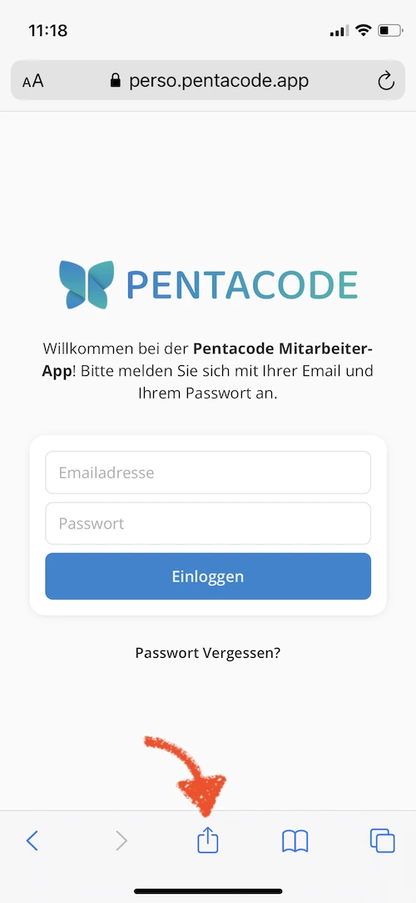
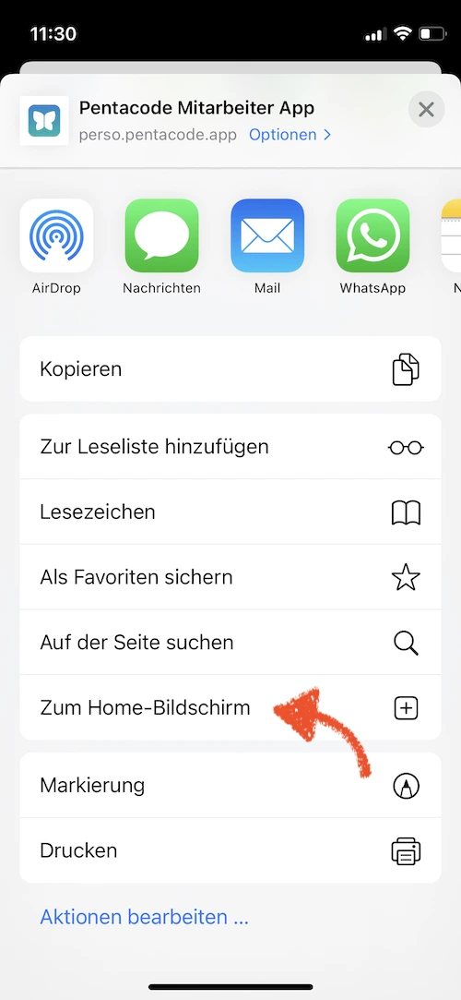
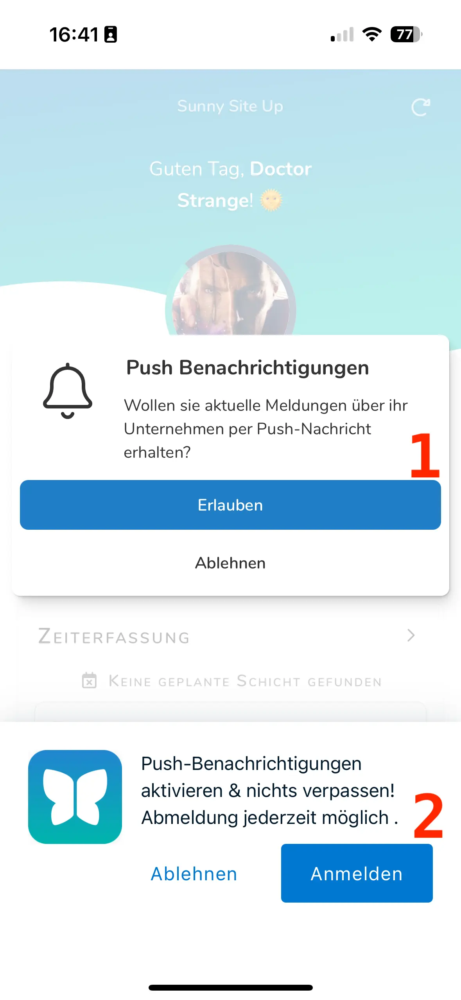
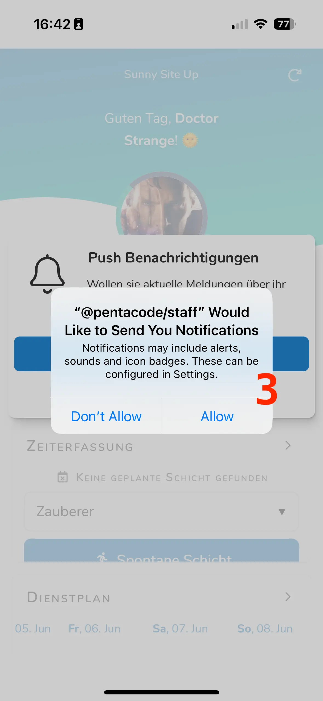
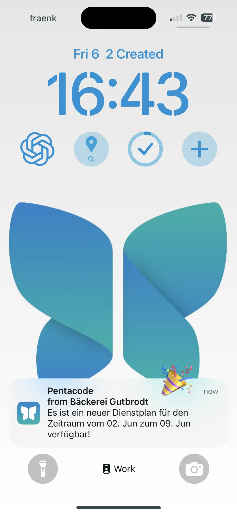
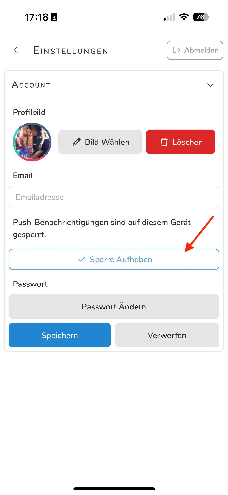
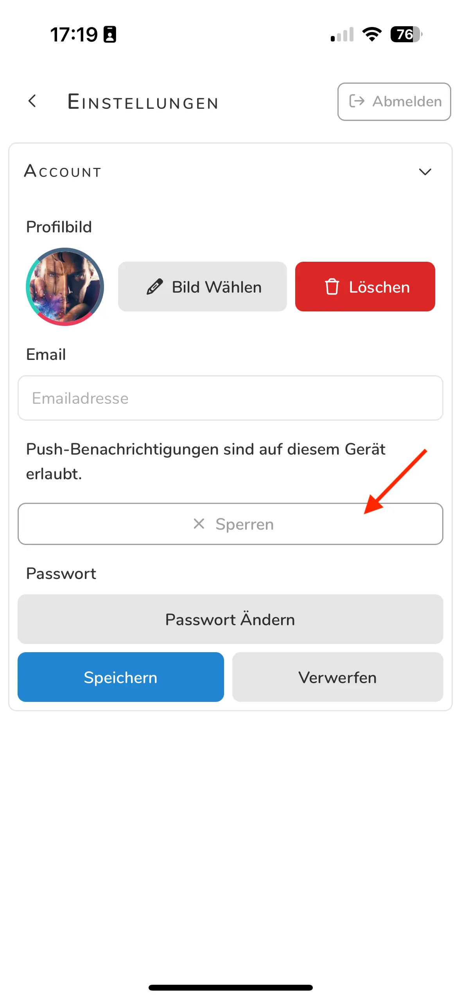
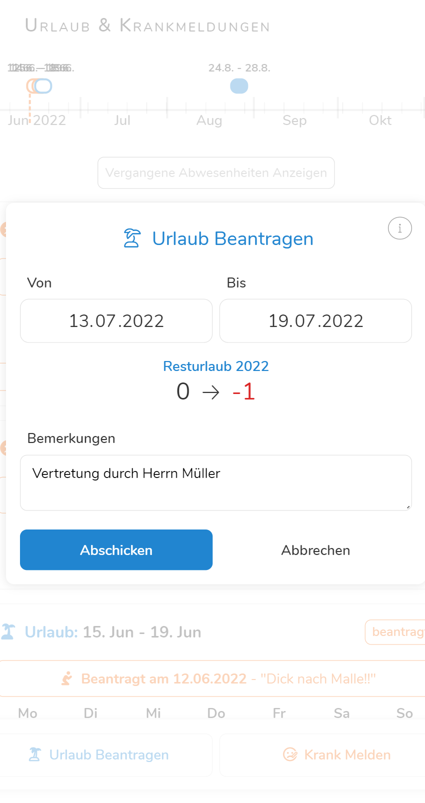

Vom persönlichen Dienstplan bis hin zu Urlaubsanträgen, Arbeitszeiterfassung und
mehr - mit der **Pentacode Mitarbeiter-App** haben Sie immer und überall Zugriff
auf die wichtigsten Informationen und Funktionen.

Die Pentacode Mitarbeiter App ist über die URL https://perso.pentacode.app
verfügbar.

>  Sollten Sie eine der im Folgenden
> beschriebenen Funktionen **nicht vollständig nutzen** können, sprechen Sie
> ihren Personaler an. Teile der Mitarbeiterapp können für einen Teil der
> Belegschaft **de- oder reaktiviert** werden. Darunter zählen das Tauschen von
> Schichten, das Beantragen von Urlauben, als auch das direkte Krankmelden über
> die App.

## App Installieren

Die Pentacode Mitarbeiter app ist eine Webapplikation und erfordert keine
Installation im herkömmlichen Sinne. Sowohl iOS als auch Android bieten
allerdings die Möglichkeit, Webapplikationen von dieser Art "zum Homebildschirm
hinzuzufügen". Dies fügt die App nicht nur zur Bibliothek auf Ihrem Handy hinzu,
wo sie sie wie eine normale App öffnen können - die App wird dann auch in Ihren
eigenen Fenster angezeigt und ist somit in Erscheinung und Funktion identisch
mit einer "normalen" App.





### Android

So installieren Sie die Mitarbeiter-App auf Ihrem Android-Gerät:

>  **Hinweis:** Die Nutzung der App erfordert eine
> Androidversion von 4.4 oder neuer und den [Google Chrome
> Browser](https://play.google.com/store/apps/details?id=com.android.chrome) (In
> den meisten Fällen bereits vorinstalliert)!

1. Öffnen Sie den **Google Chrome Browser** (falls noch nicht installiert können
   Sie Ihn
   [hier](https://play.google.com/store/apps/details?id=com.android.chrome)
   herunterladen).
2. Geben Sie folgenden Adresse in die URL-Leiste ein:
   https://perso.pentacode.app
3. Tippen Sie auf das -Symbol auf der rechten
   Seite der URL-Leiste
4. Wählen Sie die Option **"App Installieren"** bzw **"Zum Homebildschirm
   Hinzufügen"**
5. Bestätigen Sie, dass Sie die App installieren möchten.

### iOS

So installieren Sie die Mitarbeiter-App auf Ihrem iOS-Gerät:

>  **Hinweis:** Die Nutzung App erfordert eine
> iOS-Version von 12.4 oder neuer!

1. Öffnen Sie den **Safari Browser** (ist auf Apple-Geräten vorinstalliert).
2. Geben Sie folgenden Adresse in die URL-Leiste ein:
   https://perso.pentacode.app
3. Tippen Sie auf das  Symbol am unteren Rand
   des Bildschirms.
4. Wählen Sie die Option **"Zum Homebildschirm "**
5. Wenn Sie möchten können Sie nun noch einen benutzerdefinierten Anzeigenamen
   wählen. Tippen Sie auf **"Hinzufügen"** um den Vorgang abzuschließen.

   
   
   

   
   
   

## Push Notifications anschalten 

>  Push Notifications sind aktuell ein Feature, das nur für Beta nutzer zur Verfügung steht!

Mit Push Notifications bleiben Sie automatisch über alles was in ihrem Betrieb passiert informiert – ganz ohne aktiv in die App schauen zu müssen.

## Welche Push Notifications gibt es?

Zum Start werden Mitarbeitende über folgende Ereignisse benachrichtigt:

- Neue Dienstpläne
- Änderungen an bestehenden Dienstplänen

## Voraussetzungen

Damit Push Notifications auf Ihrem Endgerät funktionieren, sind mehrere Schritte notwendig:

1. **Zweifache Zustimmung in der App**  
   Beim ersten Start der App nach einem Update werden Sie zweimal gefragt, ob Sie Push Notifications aktivieren möchten.

2. **Erlaubnis auf Betriebssystemebene**  
   Sie müssen der App erlauben, Benachrichtigungen anzuzeigen. Diese Abfrage erfolgt durch das Betriebssystem (iOS oder Android) und muss separat bestätigt werden.

>  Wird die Erlaubnis an dieser Stelle verweigert, kann die App keine Push Notifications senden. Eine erneute Abfrage ist nur über die Geräteeinstellungen möglich.

   
   
   

   
   
   

3. **iOS: App auf dem Home-Bildschirm installieren**  
   Auf Apple-Geräten funktionieren Push Notifications **nur**, wenn die Mitarbeiter-App über Safari auf dem [**Home-Bildschirm installiert**](#app-installieren) wurde.


   


## Hinweise zur Nutzung

- Push Notifications werden nur an Geräte gesendet, auf denen die App korrekt eingerichtet wurde.
- Wenn Mitarbeitende keine Benachrichtigungen erhalten, prüfen Sie bitte gemeinsam:
  - Ob die Zustimmung in der App erteilt wurde.
  - Ob die Benachrichtigungsberechtigung auf Systemebene aktiv ist.
  - Ob bei iOS die App auf dem Home-Bildschirm installiert wurde.

>  Eine Nutzung der App ohne Push Notifications ist weiterhin problemlos möglich. In diesem Fall erhalten Mitarbeitende neue Dienstpläne wie gewohnt per Email
oder können diese aktiv in der App prüfen.

## Zustimmung neu gewähren oder entziehen

Sollten Sie Ihre Entscheidung ändern wollen, finden Sie unter **Einstellungen** eine entsprechende Möglichkeit, um eine **erteilte Sperre aufzuheben** oder eine **Sperre zu erteilen**, damit 
Sie keine weiteren Benachrichtigungen erhalten. Natürlich können Sie die Benachrichtigungen auch über das Betriebssystem ihres Endgeräts blockieren.

   
   
   

   
   
   

Nachdem Sie eine Sperre aufgehoben haben, werden Sie, sobald Sie in den Hauptbildschirm navigieren, erneut nach der Zustimmung zu Push Notifications gefragt. 

## Kamerazugriff gewähren

Um die Funktion 'QR-Code scannen' beim [Einstempeln](#einstempeln) zu verwenden, müssen Sie der Pentacode App Zugriff auf ihre Kamera gewähren. Einmal durchgeführt wird diese Einstellung gespeichert. 

>  Die Pentacode App wird **nie** die Kamera ihres Handys für andere Zwecke verwenden!

### Android 

Mit einem Androidhandy gehen Sie so vor:

1. Einstellungen öffnen: Tippen Sie auf das Zahnrad-Symbol in Ihrem App-Menü oder ziehen Sie die Schnellleiste von oben nach unten und tippen Sie auf das Zahnrad.

2. Apps auswählen: Scrollen Sie nach unten und wählen Sie "Apps" oder "Anwendungsmanager".

3. Pentacode App finden: Suchen Sie in der Liste der installierten Apps nach der Pentacode App und tippen Sie darauf.

4. Berechtigungen verwalten: Tippen Sie auf "Berechtigungen".

5. Kamera aktivieren: Schalten Sie den Schalter neben "Kamera" auf "Ein", um der App den Zugriff zu erlauben.

### IOS 

Mit einem iPhone gehen Sie so vor: 

1. Einstellungen öffnen: Tippen Sie auf das Zahnrad-Symbol auf Ihrem Startbildschirm.

2. Datenschutz & Sicherheit auswählen: Scrollen Sie nach unten und tippen Sie auf "Datenschutz & Sicherheit".

3. Kamera auswählen: Tippen Sie auf "Kamera".

4. Pentacode App finden: Suchen Sie in der Liste nach der Pentacode App.

5. Zugriff erlauben: Schalten Sie den Schalter neben der App auf "Ein", um den Kamerazugriff zu gestatten.

## Einloggen

Nachdem ihr Arbeitergeber Sie wie unter [Zugänge
& Rechte](/hilfe/handbuch/mitarbeiter/zugaenge-rechte) beschrieben per Email
eingeladen hat und Sie sich registriert haben, können Sie sich in die
Mitarbeiterapp einloggen. Hierzu rufen Sie die Mitarbeiterapp unter
https://perso.pentacode.app auf und geben ihre Email Adresse, sowie das
selbstgewählte Passwort ein. Worauf Sie in die **Übersicht** der Mitarbeiterapp
gelangt.





## Übersicht

In der Übersicht sehen Sie ganz oben ihr aktuelles Profilbild, den Namen ihres
Unternehmens sowie ihre Stunden, Überstunden und Resturlaub. **Stunden** zeigt
Ihnen an, wie viele der vertraglich vereinbarten Stunden sie diesen Monat
bereits abgearbeitet haben. **Überstunden** zeigt Ihnen ihr Pensum an
Überstunden an, wobei ein **rotes Minus** vor der Zahl für negative und ein
**grünes Plus** für positive Überstunden steht. **Resturlaub** gibt die
restlichen Tage gesetzlich geregelten Urlaubs für das laufende Jahr an. Alle
Angaben werden regelmäßig auf den aktuellen Monat aktualisiert.

## Zeiterfassung

Unter dem Reiter Zeiterfassung können Sie die Mitarbeiterapp auch als
**Stempeluhr** nutzen. So können Sie sich zu aktuellen Schichten einstempeln.
Sowie für **Pausen** kurzzeitig und zu Schichtende dauerhaft ausstempeln. Auch
können Sie spontane Schichten übernehmen, sollte der Bedarf bestehen. Welche der
folgenden Funktionen Sie über die Mitarbeiterapp nutzen können, wird vom ihrem
Personaler verwaltet. Klären Sie deshalb im Vorfeld ab **welche Form der
Zeiterfassung** Sie in ihrem Betrieb nutzen und wie mit Pausen und spontanen
Schichten umzugehen ist. Alternativ zur Zeiterfassung über die Mitarbeiterapp
ist auch das Anmelden über unsere **digitale Stempeluhr vor Ort** (siehe
[hier](/hilfe/handbuch/stempeluhr)) oder das Führen manueller Einträge möglich.

### Einstempeln

Je nach Vereinbarung mit ihrem Personaler benötigen sie entweder einen vor Ort
angebrachten QR Code, um ihre Schicht zu beginnen oder Sie können auf diesen
verzichten.

>  Um den QR Code zu scannen, müssen Sie der Pentacode App [den Zugriff zu Ihrer Kamera](#kamerazugriff-gewähren) gewährt haben. 

1. Klicken Sie auf den Reiter **Zeiterfassung**
2. Nun sehen Sie ihre bevorstehende Schicht. Klicken Sie auf .
3. Bestätigen Sie die Auswahl mit einem weiteren Klick auf 
4. **Optional** Scannen Sie den QR Code vor Ort ein, um ihre Schicht zu
   beginnen.

An dem grünen  Zeichen ist zu
erkennen, dass ihre Schicht nun läuft.

### Pausen stempeln

Pausen können entweder **automatisch** oder **manuell** verrechnet werden. Wenn
ihre Pausen **automatisch** erfasst werden müssen Sie sich um nichts kümmern -
lassen Sie ihre Stempeluhr ganz normal bis zum Schichtende weiterlaufen. Haben
Sie sich mit ihrem Personaler auf **manuelle** Pausen geeinigt, müssen Sie diese
wie folgend beginnen:

1. Erst müssen Sie zu einer Schicht **aktiv [eingestempelt](#einstempeln)**
   sein.
2. Klicken Sie nun auf den orangenen  Button
3. Bestätigen Sie die Pause mit einem weiteren Klick auf 

Nun wird Ihnen neben der Schicht ein Timer mit der Länge der aktuellen Pause
angezeigt. Um diese wieder zu beenden klicken Sie auf  und bestätigen die Auswahl wieder.

Sie können sich im **manuellen Pausenmodus** mehrere Male in die Pause begeben.
Der Timer für die Pause addiert dabei die Pausenzeiten für die aktuelle Schicht
auf.





### Spontane Schicht beginnnen

Sollten Sie sich mit ihrem Vorgesetzten darauf geeinigt haben auch spontane
Schichten zu übernehmen, können Sie diese auch unter Zeiterfassung starten.
Vorraussetzung ist, dass Sie im gleichen Zeitfenster **keine geplante Schicht**
vorliegt und Sie die Berechtigung zum Erfassen von spontanen Schichten haben.
Das Prozedere zum Ein- und Ausstempeln sowie zum Stempeln der Pausen ist dabei
nahezu identisch zu normalen Schichten.

1. Öffnen Sie den Reiter Zeiterfassung
2. Wählen Sie im **Drop-down Menü** über  die Abteilung aus, in der Sie arbeiten werden.
3. Klicken Sie auf  und
   bestätigen Sie die Auswahl.
4. **Optional** Scannen Sie den vor Ort hinterlegten QR Code ein, um die Schicht zu beginnen.

### Ausstempeln

Das Ausstempeln mit der Mitarbeiterapp verläuft genauso einfach wie das
Einstempeln. Mussten Sie beim Einstempeln einen QR Code scannen, werden Sie auch
zum Ausstempeln aufgefordert diesen **noch einmal zu scannen**.

1. Klicken Sie während einer aktiven Schicht auf 
2. Bestätigen Sie die Auswahl durch einen erneuten Klick auf 
3. **Optional** Scannen Sie erneut den QR Code ein, um ihre Schicht zu beenden.

> Sollten Sie einmal **vergessen sich auszustempeln** werden Sie automatisch
> nach einer vorbestimmten Zeit ausgestempelt. Da ihre wahren Stunden dann aber
> nicht mehr mit den über Pentacode datierten Stunden übereinstimmen, müssen Sie
> ihrem Personaler eine Nachricht schreiben, damit dieser die Stunden
> korrigiert.

## Dienstplan

Unter dem Reiter Dienstplan können Sie ihre Schichten einsehen, zum Tausch
anbieten oder weitere übernehmen. Die aktuelle Woche sehen Sie standardmäßig
ein, wenn Sie auf den Reiter klicken. Mit den **Pfeilen** unten rechts und
links, können Sie in vergangene und kommende Wochen wechseln. Wollen Sie schnell
wieder in die aktuelle Woche zurückwechseln klicken Sie einfach auf den -**Button**. Unter dem jeweiligen Datum ist stets die
Abteilung, die Start- sowie Endzeit ihrer Schicht angegeben.

### Schichten tauschen

Wenn Sie zu bestimmten Schichten **verhindert sind**, können Sie auch Schichten
freistellen, damit Kollegen diese übernehmen können. Diese werden dann allen
Kollegen mit passender Qualifikation und Schichtplan angezeigt. Achten Sie
jedoch darauf, dass, wenn **kein Kollege die Schicht übernimmt, Sie weiterhin
eingetragen bleiben**.

So können Sie ihren Kollegen Schichten zum Tausch anbieten:

1. Klicken Sie auf den Reiter **Dienstplan** in der Mitarbeiterapp
2. Wählen Sie ein Schicht aus, indem Sie ihren Cursor über diese bewegen
3. Klicken Sie auf 
4. Bestätigen Sie die Aktion mit einem weiteren Klick auf 

  



### Schichten übernehmen

Wenn ihr Manager Ersatz oder zusätzliches Personal in ihrer Position benötigt
oder ihre Kollegen gerne eine Schicht tauschen würden, erhalten Sie die
Möglichkeit diese zu übernehmen. Diese Schichten sind gestrichelt umrahmt und
tragen die Anmerkung . Sie sind erst für diese
Schichten eingetragen, wenn Sie sie **freiwillig übernehmen**.

So übernehmen Sie eine freie Schicht:

1. Wählen Sie eine freie Schicht aus, indem Sie ihren Cursor über diese bewegen.
2. Klicken Sie auf .
3. Bestätigen Sie die Aktion mit einem weiteren Klick auf .

Sie werden anschließend für diese Schicht eingetragen und sie wird anderen
Mitarbeitern nicht mehr angezeigt.

> **Tipp:** Pentacode bietet Ihnen nur freie Schichten an, die nicht in Konflikt
> mit ihren Pflichtschichten stehen - Sie müssen sich also keine Gedanken über
> Überschneidungen machen.

## Urlaub & Krankmeldungen





Über die Mitarbeiterapp können Sie auch schnell und einfach Urlaubsanträge und
Krankschreibungen an die Personalabteilung weiterleiten und deren Genehmigung
und Ablehnung direkt einsehen.

### Urlaub beantragen

So stellen Sie einen neuen Urlaubsantrag:

1. Klicken Sie auf den Reiter **Urlaub & Krankmeldungen**.
2. Drücken Sie unten links auf .
3. Wählen Sie im angezeigten Fenster ein Start- sowie Enddatum für ihren
   gewünschten Urlaub aus.
4. **Optional** Fügen Sie eine Bemerkung für ihren Personaler hinzu.
5. Mit **Urlaub beantragen** schicken Sie ihre Anfrage direkt an die
   Personalabteilung.

> **Ihnen wird beim Erstellen des Urlaubsantrags direkt gezeigt wie viele ihrer
> Urlaubstage Ihnen verbleiben, wenn der Urlaub genehmigt wird.**

### Krank melden

So melden Sie sich krank:

1. Klicken Sie auf den Reiter **Urlaub & Krankmeldungen**.
2. Drücken Sie unten rechts auf .
3. Wählen Sie im angezeigten Fenster ein Start- sowie Enddatum für ihre
   Krankmeldung aus.
4. **Optional** Fügen Sie eine Bemerkung für ihren Personaler hinzu.
5. Mit **Abschicken** schicken Sie ihre Anfrage direkt an die Personalabteilung.

> Sie können keine Krankmeldungen für vergangene Tage stellen - schicken Sie
> deshalb stets eine Krankmeldung über Pentacode am gleichen Tag, selbst wenn
> Sie ihren Personaler auf anderem Wege kontaktiert haben.

## Verfügbarkeiten

Unter Verfügbarkeiten können Sie mitteilen an welchen Tagen Sie bevorzugt
arbeiten, nicht verfügbar sind oder gerne frei hätten. Sie sollten stets ihre
Verfügbarkeiten angeben, damit ihre Präferenzen in den nächsten Schichtplan mit
einfließen können.

Klicken Sie auf den Reiter **Verfügbarkeiten** gelangen Sie in die Übersicht,
diese ist zuerst in der aktuelle Woche, um weiter zu planen nutzen Sie die
**Pfeile** unten rechts und links. Klicken Sie auf ,
gelangen Sie in die aktuelle Woche zurück.

### Neue Verfügbarkeit





Klicken Sie auf einen Tag öffnet sich ein Dialogfenster mit folgenden
Einstellungen:

**Art der Verfügbarkeit** Pentacode stellt Ihnen vier verschiedene Arten von
Verfügbarkeiten zur Verfügung:

-  **Verfügbar**
-  **Nicht Verfügbar**
-  **Bevorzugt**
-  **Wunschfrei**

**Häufigkeit** Standardmäßig wird die Verfügbarkeit nur einmalig eingetragen,
sie können jedoch mit einem Klick auf das  Symbol
auch eine **wöchentliche, monatliche oder jährliche** Regelmäßigkeit auswählen.

**Zeitspanne** Standardmäßig ist die Verfügbarkeit für den ganzen Tag geplant,
durch Abwählen des Schiebers neben **ganztägig** und Eingeben einer Start- und
Endzeit in die erscheinenden Felder, können Sie auch Wünsche zu speziellen
Schichten äußern.

**Kommentar** Zuletzt haben Sie noch die Möglichkeit ihre Verfügbarkeitsangabe
mit einem Kommentar zu versehen, etwa um aufkommende Fragen bereits im Vorfeld
zu klären.

Mit  schicken Sie ihren Wunsch nun direkt an den
Personalplaner und dieser versucht ihn in den Arbeitsplan einzuarbeiten.

## Dokumente

Unter Dokumente können Sie die Dateien einsehen, die ihnen zugeteilt wurden.

### Dokumente speichern

So speichern Sie ein Dokument auf ihrem Gerät ab:

1. Öffnen Sie den Reiter Dokumente.
2. Öffnen Sie ein Dokument, indem Sie darauf klicken.
3. Klicken Sie auf den -**Button** in der rechten oberen Ecke.

## Einstellungen

Unter Einstellungen können Sie ihr Bild, ihre Email Adresse sowie ihr Passwort
für den Log in ändern, sowie ihre Benachrichtigungen deaktivieren.

### Profilbild Ändern

So ändern Sie ihr Profilbild:

1. Klicken Sie unter **Einstellungen** auf den Reiter **Account**.
2. Klicken Sie auf .
3. Klicken Sie im aufpoppenden Dialogfenster auf **zulassen**, wenn Sie gefragt
   werden, ob Sie Pentacode Zugriff auf ihre Kamera gewähren wollen.
4. Es öffnet sich die Ansicht der Innenkamera - nun können Sie ein neues Bild
   machen oder per Klick auf  ein vorhandenes Bild von ihrem
   Gerät verwenden.

### Profilbild Löschen

So löschen Sie ihr Profilbild:

1. Klicken Sie unter **Einstellungen** auf den Reiter **Account**.
2. Klicken Sie auf .

### Passwort ändern

So ändern Sie ihr Passwort für den Mitarbeiterzugang:

1. Klicken Sie unter **Einstellungen** auf den Reiter **Account**.
2. Klicken Sie auf **Passwort ändern**.
3. Geben Sie ihr neues Wunsch Passwort in beide Felder ein - das Wiederholen
   dient der Sicherheit.
4. Klicken Sie auf **Speichern** um das neue Passwort zu aktivieren.

### Benachrichtigungen deaktivieren

So deaktivieren Sie die Benachrichtigungen über Dienstplanänderungen an ihre
Email:

1. Klicken Sie unter **Einstellungen** auf den Reiter **Benachrichtigungen**.
2. Klicken Sie auf den Schieber neben **Dienstplanänderungen**.
3. Klicken Sie auf **Speichern** um die Auswahl zu bestätigen.

Um die Benachrichtigungen zu reaktivieren, folgen Sie einfach den gleichen
Schritten wie zum deaktivieren.

## Hilfe

Unter der Hilfefunktion können Sie sich noch einmal genauer mit den Funktionen
der Mitarbeiterapp befassen sollten Sie noch einmal etwas nachlesen müssen. Es
wird, nachdem Sie auf den **Hilfe-Button** gedrückt haben ein Pop-up Fenster
erscheinen, in welchem dieser Artikel noch einmal aufgeführt ist.
