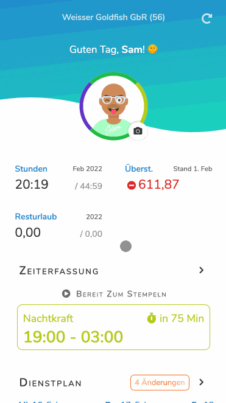
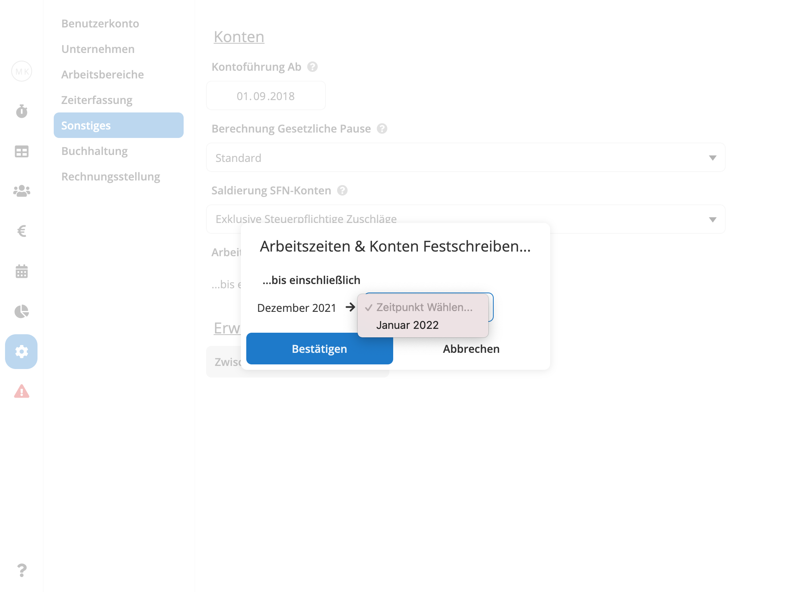

Es ist uns immer wieder eine Freude, große und kleine Neuerungen und Verbesserungen an unserer Software vorzustellen!
Auch version 1.21 bringt wieder mal einige tolle neue Features:

## Verfügbarkeiten





Das Planen von Arbeitszeiten kann eine enorm komplizierte Aufgabe sein, gerade in Betrieben mit volatilen Arbeitszeiten
und vielen Aushilfs- und Teilzeitkräften. Es reicht meist nicht zu wissen, wann wie viele Arbeitskräfte benötigt werden ‒
für eine effektive Dienstplanung is es außerdem hilfreich (oder gar zwingend notwendig!), die Verfügbarkeiten und
Präferenzen Ihrer Mitarbeiter zu kennen.

Mit den neuen [Verfügbarkeiten](http://localhost:1313/hilfe/handbuch/mitarbeiter/verf%C3%BCgbarkeiten/) können
Sie nun schnell und bequem erfassen, welche Tage und Uhrzeiten von Ihren Mitarbeitern bevorzugt werden, welche
Mitarbeiter an bestimmten Tagen nicht arbeiten können, wer eventuell an manchen Tagen früher gehen muss und vieles mehr!
**Die gespeicherten Informationen werden dann automatisch im Dienstplan angezeigt** und dienen Ihnen dort als intuitive und
leicht zugängliche Planungshilfe.

Pentacode stellt Ihnen vier verschiedene Arten von Verfügbarkeiten zur Verfügung:

-  **Verfügbar**
-  **Nicht Verfügbar**
-  **Bevorzugt**
-  **Wunschfrei**

Und der beste Teil: **Über die Pentacode [Mitarbeiter-App](/hilfe/handbuch/mitarbeiter-app) können Mitarbeiter ihre
eigenen Verfügbarkeiten selbst einsehen und bearbeiten!** Alles was Sie tun müssen, ist die entsprechende Berechtigung
frei zu schalten und schon haben Ihre Mitarbeiter eine schnelle und unkomplizierte Möglichkeit, Ihnen ihre Verfügbarkeiten und
Präferenzen mitzuteilen!

Verfügbarkeiten dienen lediglich als Hinweis für die Dienstplanung und **können jederzeit ausgeblendet oder ignoriert
werden**. Ob Sie Verfügbarkeiten selbst erfassen oder Ihre Mitarbeiter diese über die Mitarbeiter-App eingeben, sie
behalten immer das letzte Wort.

## Festschreibung von Arbeitzzeiten & Konten

Einer der großen Vorteile der Arbeitszeitdokumentation in Pentacode ist der Umstand, dass Sie jederzeit "in die
Vergangenheit reisen" und Korrekturen an bereits erfassten Arbeitszeiten vornehmen können. Pentacode berechnet dabei
automatisch alle betroffenen Lohnabrechnungen und Konten neu und liefert damit jederzeit eine **in sich stimmige,
wiederspruchsfreie Dokumentation**.

Diese Flexibilität bringt allerdings auch Gefahren mit sich. So kann zum Beispiel die Änderung an einer Arbeitszeit in
an einem bereits abgeschlossenen Monat schnell zu Unstimmigkeiten mit bereits durchgeführten Lohnabrechnungen führen.
Desweiteren können Änderungen an bestimmten Vertragsdaten oder Zeiterfassungs-Einstellungen ebenfalls zu einer
ungewünschten, rückwirkenden Neuberechnung von Konten und Lohnabrechungen führen.

**Deshalb bietet Ihnen Pentacode nun die Möglichkeit, [Arbeitszeiten, Konten und Lohnabrechnungen festzuschreiben](/hilfe/handbuch/einstellungen/sonstiges/#arbeitszeiten--konten-festschreiben)**. Dazu
wählen Sie einfach aus, bis zu welchem Monat die Festschreibung gelten soll. Arbeitszeiten bis zu diesem Zeitpunkt sind
dann durch niemanden mehr bearbeitbar und Konten und Lohnabrechnungen bleiben unverändert, selbst wenn Sie Änderungen an
Mitarbeiterverträgen oder Zeiterfassungs-Regelsätzen vornehmen.





## ... Und Mehr!

Die oben genannten Änderungen sind nur ein Teil der Verbesserungen, die wir in dieser Version vorgenommen haben. Für
eine Ausführliche Auflistung der Änderungen, werfen Sie gerne einen Blick in unser
[Änderungsprotokoll](/hilfe/aenderungsprotokoll/)!
