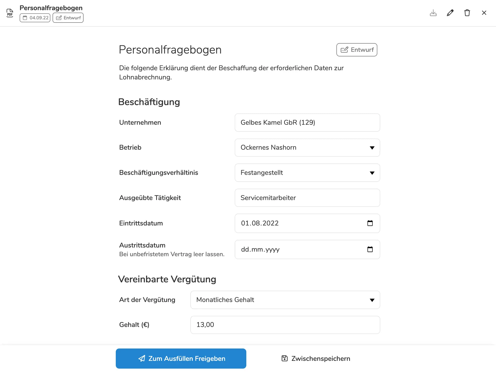
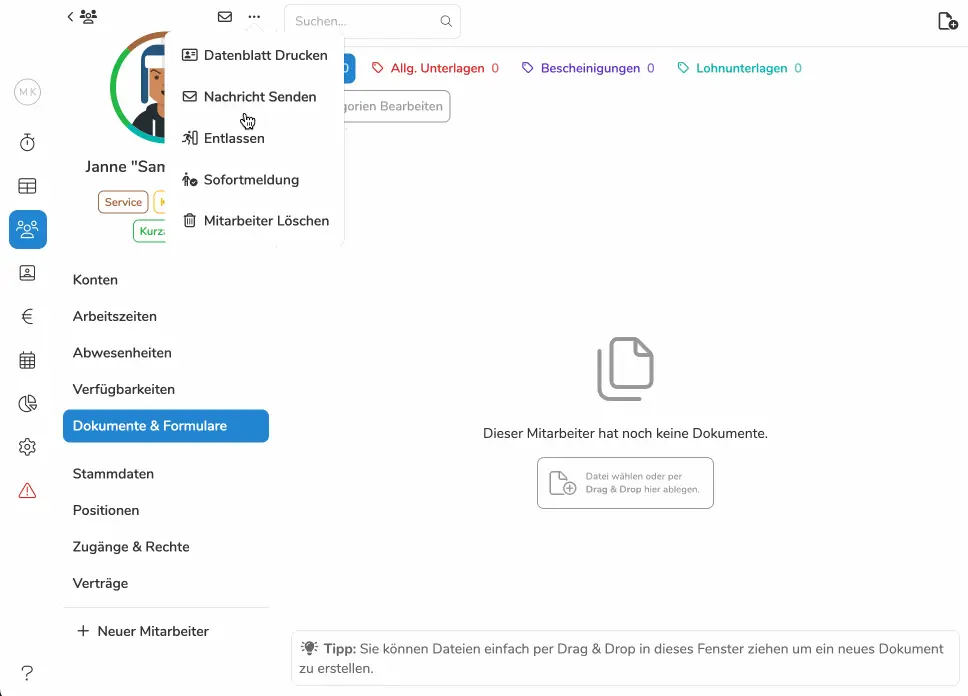

In vielen Branchen ist das stetiges Kommen und Gehen vieler Mitarbeiter der
Normalfall - das bedeutet aber nicht nur viel frische Luft im Team, sondern auch
eine ganze Menge Arbeit mit Meldebescheinigungen. Denn es gilt: Jeder
Angestellte muss vor dem ersten Arbeitseinsatz gemeldet sein.  Für das Update
v1.23 haben wir uns also entschieden: Es dreht sich alles um das schnelle
Einholen der Lohndaten und Übertragen an die Rentenversicherung. Dazu führen wir
die neuen **Personalfragebögen** ein, welche das Sammeln der Lohndaten
automatisieren. Sowie die **Sofortmeldefunktion**, welche das Weiterleiten der
Daten an die Rentenvericherung so einfach wie noch nie macht. Zwei Funktionen,
ein Ziel: Nie wieder Stress mit Sozialversicherungsnummern und kompletten
Seelenfrieden bei Kontrollen.

## Personalfragebögen

Bei jedem neuen Mitarbeiter heißt auch wieder: Eine neue Sozialversicherungnummer, sowie neue
Lohn- und Adressdaten. Doch die Zeiten, in denen Sie diesen hinterher rennen und
aufwändig händisch in das Archiv übertragen mussten, sind vorbei. Nun erstellen
Sie einfach über Pentacodes
[Dokumentenarchiv](/hilfe/handbuch/mitarbeiter/dokumentenarchiv)
einen neuen Personalfragebogen, lassen diesen automatisch mit den in Pentacode
gespeicherten Firmendaten ausfüllen und schicken ihn ihrem neuen Mitarbeiter.
Dieser füllt ihn aus und Pentacode speichert die Daten nach einer
kleinen Überprüfung ihrerseits ab. Nerviges Nachhaken nach fehlenden Daten und
fehleranfälliges abtippen von Daten gehört damit der Vergangenheit an. So sparen
Sie sich wertvolle Zeit und endlosen Stress. Eine genaue Anleitung wie Sie
die neuen Personalfragebögen erstellen und die Daten vom Mitarbeiter einfordern
können, finden Sie
[hier](/hilfe/handbuch/mitarbeiter/dokumente/#personalfragebogen). 





## Sofortmeldung

Nun haben Sie zwar die Lohndaten mit Hilfe des Personalfragebogens blitzschnell
eingesammelt - doch diese müssen noch an die Deutsche Rentenversicherung
gelangen, damit der Mitarbeiter auch korrekt gemeldet ist und Sie jeder
Kontrolle trotzen können. Pentacode automatisiert nun auch diesen
Schritt, denn mit der neuen **Sofortmeldungfunktion** werden die **durch den Personalfragebogen erfassten Daten direkt an die Rentenversicherung weitergeleitet**. Durch den Unterhalt der Schnittstelle zum Deutschen
Rentenversicherung müssen wir zwar eine geringe Gebühr für jede Meldung
verlangen - Doch auch hier gilt: **Sie sparen sich wervolle Zeit und haben die klare Sicherheit, dass Ihnen im Meldeprozess kein Fehler unterlaufen ist.** Wie
Sie genau Mitarbeiter melden können, können Sie
[hier](/hilfe/mitarbeiter/allgemein) nachlesen. 

<figure class="border,centered">asd<figcaption>Meldung bei der Rentenversicherung in nur 10 Sekunden? Pentacode v1.23 macht es möglich!</figcaption></figure>
  

 Wir hoffen Sie können die neuen Automatisierungsfeatures gut in ihrem
 Onboarding Prozess anwenden und ihre frei gewordene Zeit sinnvoller nutzen -
 zum Beispiel indem Sie die letzten schönen Sommertage genießen!

 Der Personalfragebogen und Sofortmeldungen sind nur ein kleiner Teil der
 Verbesserungen in diesem Update! Ein komplette Liste aller Neuigkeiten
 und Bugfixes finden Sie in unserem
 [Änderungsprotokoll](/hilfe/aenderungsprotokoll/).

 Ihr Pentacode Team