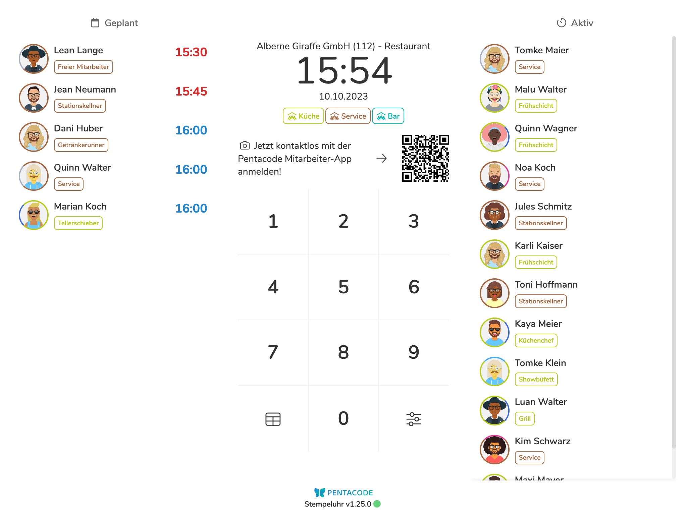
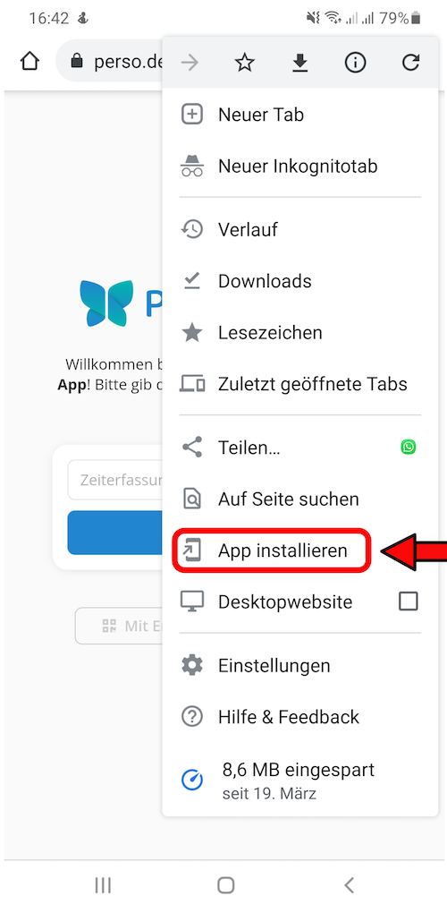
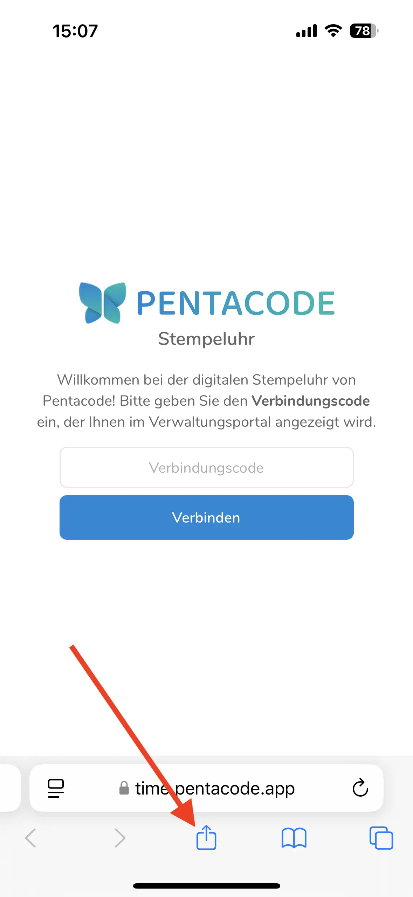
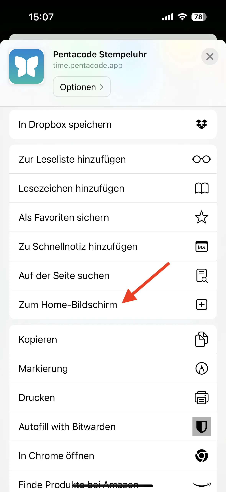
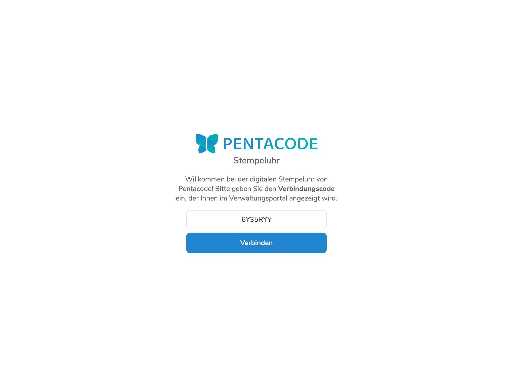
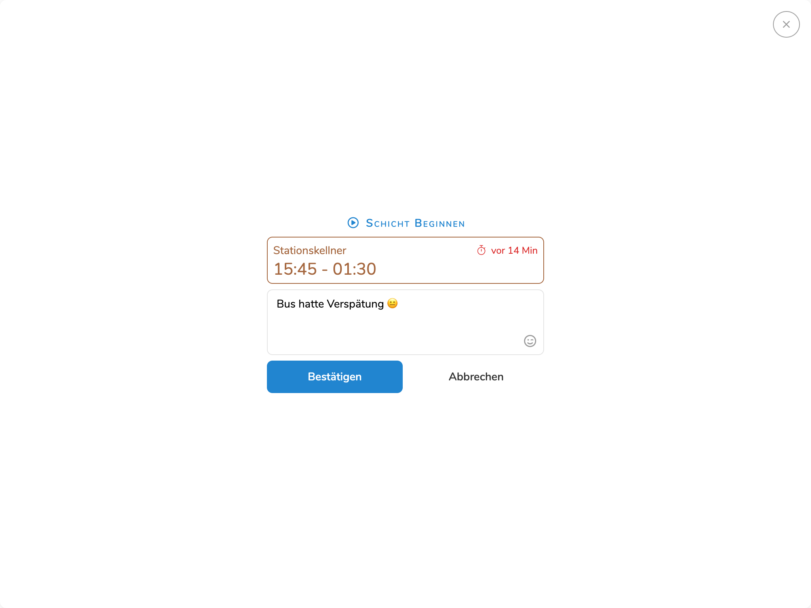
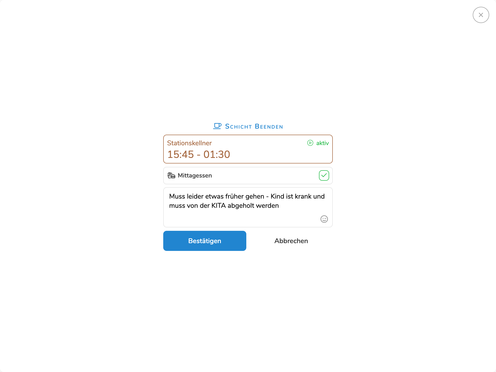

Die digitale Stempeluhr ist eine Webapp, die auf jedes beliebige Tablet, Smartphone oder Desktopgerät geladen werden kann. Das eingerichtete Endgerät steht dann am Arbeitsplatz zur selbstständigen Erfassung von Arbeitszeiten, Pausen und Mahlzeiten zur Verfügung.

Abhängig von der auf dem Endgerät verfügbaren Bildschirmgröße werden neben dem Zahlenpad außerdem geplante und aktive Schichten angezeigt. Diese können allerdings über die [Anzeigeoptionen](/hilfe/handbuch/zeiterfassung/#stempeluhren-verwalten) ausgeblendet werden.

Mitarbeiter beginnen jede Interaktion mit der Stempeluhr mit der Eingabe der persönlichen Zeiterfassungs-PIN, welche zur Verifizierung und Authentifizierung des Mitarbeiters dient. Nachdem sich der Mitarbeiter durch die Eingabe der PIN identifiziert hat, kann er nun zwischen verschiedenen Optionen wählen. Welche Optionen dem Mitarbeiter zur Verfügung stehen ist in den [Zeiterfassungs-Einstellungen](/hilfe/handbuch/einstellungen/zeiterfassung) definiert.

>  Die **Zeiterfassungs-PIN** eines Mitarbeiters können Sie in der [Stammdaten-Ansicht](/hilfe/handbuch/mitarbeiter/stammdaten/) des Mitarbeiters einsehen und bearbeiten.

<figure>

<figcaption>Die digitale Stempeluhr ist eine Webapp, die auf allen handelsüblichen Tablets, Smartphones und Dektop-Computern geladen werden kann.</figcaption>
</figure>

## Stempeluhr-App Installieren

Die Pentacode Stempeluhr ist eine Webapplikation und erfordert keine Installation im herkömmlichen Sinne. Sowohl iOS als auch Android bieten allerdings die Möglichkeit, Webapplikationen von dieser Art "zum Homebildschirm hinzuzufügen". Dies fügt die App nicht nur zur Bibliothek auf Ihrem Handy hinzu, wo sie sie wie eine normale App öffnen können - die App wird dann auch in Ihren eigenen Fenster angezeigt und ist somit in Erscheinung und Funktion identisch mit einer "normalen" App.





### Android

So installieren Sie die Stempeluhr auf Ihrem Android-Gerät:

>  **Hinweis:** Die Nutzung der App erfordert eine
> Androidversion von 4.4 oder neuer und den [Google Chrome
> Browser](https://play.google.com/store/apps/details?id=com.android.chrome) (In
> den meisten Fällen bereits vorinstalliert)!

1. Öffnen Sie den **Google Chrome Browser** (falls noch nicht installiert können
   Sie Ihn
   [hier](https://play.google.com/store/apps/details?id=com.android.chrome)
   herunterladen).
2. Geben Sie folgenden Adresse in die URL-Leiste ein:
   https://time.pentacode.app
3. Tippen Sie auf das -Symbol auf der rechten
   Seite der URL-Leiste
4. Wählen Sie die Option **"App Installieren"** bzw **"Zum Homebildschirm
   Hinzufügen"**
5. Bestätigen Sie, dass Sie die App installieren möchten.

### iOS

So installieren Sie die Stempeluhr auf Ihrem iOS-Gerät:

>  **Hinweis:** Die Nutzung App erfordert eine
> iOS-Version von 12.4 oder neuer!

1. Öffnen Sie den **Safari Browser** (ist auf Apple-Geräten vorinstalliert).
2. Geben Sie folgenden Adresse in die URL-Leiste ein:
   https://time.pentacode.app
3. Tippen Sie auf das  Symbol am unteren Rand
   des Bildschirms.
4. Wählen Sie die Option **"Zum Homebildschirm "**
5. Wenn Sie möchten können Sie nun noch einen benutzerdefinierten Anzeigenamen
   wählen. Tippen Sie auf **"Hinzufügen"** um den Vorgang abzuschließen.

>  **Achtung:** Verbinden Sie die Stempeluhr erst **nach der Installation der App** auf dem Endgerät,
> da diese sonst zurückgesetzt wird und die Verbindung verliert!

   
   
   

   
   
   

## Stempeluhr Einrichten

Bevor die Stempeluhr App einsatzbereit ist, muss sie zunächst mit dem Server verbunden werden. Hierfür benötigen Sie einen **Verbindungscode**. Wie Sie diesen Code erhalten, erfahren Sie [hier](/hilfe/handbuch/zeiterfassung/#stempeluhr-einrichten).

<figure>

<figcaption>Geben Sie den Verbindungscode aus dem Verwaltungsportal ein, um die Stempeluhr zu verbinden.</figcaption>
</figure>

## Schicht Beginnen

So können Mitarbeiter eine neue Schicht beginnen:

1. Geben Sie Ihre **4-stellige Zeiterfassungs-PIN** über das Zahlenpad ein.
2. Falls eine geplante Schicht vorliegt, wird diese nun angezeigt. Klicken/tippen Sie auf . Falls keine geplante Schicht vorliegt, so können Sie eine spontane Schicht beginnen, falls in den Zeiterfassungs-Einstellungen die Option [Spontane Schichten Erlauben](/hilfe/handbuch/einstellungen/zeiterfassung/#spontane-schichten) gesetzt ist. In diesem Fall klicken Sie auf .
3. Falls vom Arbeitgeber so eingestellt, wird nun automatisch ein "Beweisfoto" ausgelöst. Achten Sie in diesem Fall darauf, dass Ihr Gesicht auf dem Foto zu erkennen ist.
4. Sie haben nun die Möglichkeit, eine optionale Nachricht hinzuzufügen. Falls es sich um eine spontane Schicht handelt, können Sie hier außerdem noch die gewünschte Position wählen.
5. Klicken Sie auf , um die Schicht zu beginnen.

<figure>

<figcaption>Mitarbeiter können bei jeder Aktion auch eine optionale Nachricht hinterlassen, die dann im Zeiterfassungsprotokoll angezeigt wird.</figcaption>
</figure>

## Pause Beginnen

So können Mitarbeiter eine Pause beginnen:

>  Diese Option ist nur dann verfügbar, falls in den Zeiterfassungs-Einstellungen als [Pausenmodus](/hilfe/handbuch/einstellungen/zeiterfassung/#pausenmodus) die Option "Manuell", "Automatisch + Manuell" oder "Geplant + Manuell" gewählt ist.

1. Geben Sie Ihre **4-stellige Zeiterfassungs-PIN** über das Zahlenpad ein.
2. Falls eine aktive Schicht vorliegt, wird diese nun angezeigt. Klicken Sie den Button . Selbstverständlich ist diese Option nur dann verfügbar, wenn vorher eine Schicht begonnen wurde.
3. Falls vom Arbeitgeber so eingestellt, wird nun automatisch ein "Beweisfoto" ausgelöst. Achten Sie in diesem Fall darauf, dass Ihr Gesicht auf dem Foto zu erkennen ist.
4. Sie haben nun die Möglichkeit, eine optionale Nachricht hinzuzufügen.
5. Klicken Sie auf , um die Pause zu beginnen.

## Pause Beenden

So können Mitarbeiter eine Pause beenden:

1. Geben Sie Ihre **4-stellige Zeiterfassungs-PIN** über das Zahlenpad ein.
2. Falls eine aktive Schicht vorliegt, wird diese nun angezeigt. Klicken Sie den Button . Selbstverständlich ist dies Option nur dann verfügbar, wenn vorher eine Pause begonnen wurde.
3. Falls vom Arbeitgeber so eingestellt, wird nun automatisch ein "Beweisfoto" ausgelöst. Achten Sie in diesem Fall darauf, dass Ihr Gesicht auf dem Foto zu erkennen ist.
4. Sie haben nun die Möglichkeit, eine optionale Nachricht hinzuzufügen.
5. Klicken Sie auf , um die Pause zu beenden.

## Schicht Beenden

So können Mitarbeiter eine aktive Schicht beenden:

1. Geben Sie Ihre **4-stellige Zeiterfassungs-PIN** über das Zahlenpad ein.
2. Falls eine aktive Schicht vorliegt, wird diese nun angezeigt. Klicken Sie den Button . Selbstverständlich ist dies Option nur dann verfügbar, wenn zuvor eine Schicht begonnen wurde.
3. Falls vom Arbeitgeber so eingestellt, wird nun automatisch ein "Beweisfoto" ausgelöst. Achten Sie in diesem Fall darauf, dass Ihr Gesicht auf dem Foto zu erkennen ist.
4. Sie haben nun die Möglichkeit, eine optionale Nachricht hinzuzufügen.
5. Klicken Sie auf  um die Schicht zu beenden.

<figure>

<figcaption>Falls in den Zeiterfassungs-Einstellungen vorgesehen, können Sie beim Beenden der Schicht angeben, ob Sie ein Mitarbeiteressen zu sich genommen haben.</figcaption>
</figure>

## Dienstplan Anzeigen

Um den Dienstplan anzuzeigen, klicken Sie den  Button auf dem Zahlenpad.

>  Diese Option ist nur verfügbar, falls nicht in den [Anzeigeeinstellungen](/hilfe/handbuch/zeiterfassung/#anzeige) der Stempeluhr deaktiviert.

## Stempeluhr Trennen

So können Sie die Verbindung zur Stempeluhr vom Endgerät aus trennen:

1. Klicken Sie auf den  Button auf dem Zahlenpad.
2. Wählen Sie die Option .
3. Bestätigen Sie die Aktion mit dem  Button.